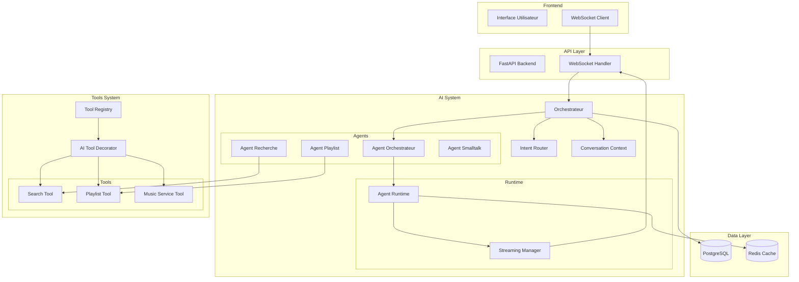

# Documentation du Système d'Agents IA SoniqueBay

## Table des matières

- [Vue d'ensemble](#vue-densemble)
- [Architecture](#architecture)
- [Composants principaux](#composants-principaux)
- [Guide de développement](#guide-de-développement)
- [Exemples d'utilisation](#exemples-dutilisation)
- [Configuration RTCROS](#configuration-rtcros)
- [Monitoring et debugging](#monitoring-et-debugging)
- [Performance et optimisation RPi4](#performance-et-optimisation-rpi4)
- [Tests](#tests)
- [Migration](#migration)

## Vue d'ensemble

Le système d'agents IA SoniqueBay est une architecture modulaire et performante conçue pour fonctionner efficacement sur Raspberry Pi 4. Elle permet de créer des agents spécialisés dans la gestion musicale avec :

- **Sécurité renforcée** : Validation des agents et des tools
- **Streaming optimisé** : Bufferisation intelligente pour RPi4
- **Construction RTCROS** : Prompt système structuré
- **Monitoring avancé** : Santé des agents et statistiques en temps réel
- **Tests complets** : Couverture > 90% avec tests unitaires et d'intégration

## Architecture



## Composants principaux

### 1. Décorateur @ai_tool

Le décorateur principal pour créer des tools IA sécurisés :

```python
from backend.ai.utils.decorators import ai_tool

@ai_tool(
    name="search_tracks",
    description="Recherche des pistes musicales",
    allowed_agents=["search_agent", "playlist_agent"],
    requires_session=True,
    timeout=30,
    category="search",
    tags=["music", "search"],
    validate_params=True,
    track_usage=True
)
async def search_tracks(query: str, session: AsyncSession):
    """Recherche des pistes selon critères."""
    # Implementation
    pass
```

**Fonctionnalités :**
- Validation des paramètres d'entrée
- Contrôle d'accès par agent
- Timeout et gestion d'erreurs
- Monitoring et statistiques
- Logging structuré

### 2. Agent Builder (RTCROS)

Construction complète des agents avec spécification RTCROS :

```python
from backend.ai.agents.builder import build_agent
from backend.api.models.agent_model import AgentModel

# Création d'un modèle d'agent
agent_model = AgentModel(
    name="search_agent",
    model="phi3:mini",
    role="Agent spécialisé dans la recherche musicale",
    task="Trouver des pistes selon critères musicaux",
    constraints="Ne pas inventer de morceaux inexistants",
    rules=["Toujours vérifier l'existence des morceaux", "Utiliser les tools appropriés"],
    output_schema='{"tracks": "list", "count": "int"}',
    state_strategy="Maintenir le contexte de recherche",
    tools=["search_tracks", "get_similar_tracks"],
    temperature=0.2,
    top_p=0.9,
    num_ctx=2048
)

# Construction de l'agent
agent = build_agent(agent_model)
```

**Champs RTCROS :**
- **ROLE** : Rôle de l'agent
- **TASK** : Tâche principale
- **CONSTRAINTS** : Contraintes opérationnelles
- **RULES** : Règles de fonctionnement
- **OUTPUT_SCHEMA** : Format de sortie attendu
- **STATE_STRATEGY** : Stratégie de gestion d'état

### 3. Runtime d'agent

Gestion avancée du streaming et des états :

```python
from backend.ai.runtime import AgentRuntime

runtime = AgentRuntime("my_agent", agent)

# Exécution standard
result = await runtime.run("message", context)

# Streaming avec bufferisation
async for chunk in runtime.stream("message", context):
    if chunk.type == AgentMessageType.TEXT:
        print(f"Texte: {chunk.content}")
    elif chunk.type == AgentMessageType.TOOL_CALL:
        print(f"Tool: {chunk.payload['tool']}")
```

**Fonctionnalités :**
- Bufferisation intelligente
- Gestion d'erreurs avec retry
- Monitoring de la santé
- Optimisation mémoire RPi4

### 4. Orchestrateur

Cerveau du système avec sélection intelligente d'agents :

```python
from backend.ai.orchestrator import Orchestrator

orchestrator = Orchestrator(session)

# Gestion standard
result = await orchestrator.handle("Je cherche de la musique énergique")

# Streaming
async for chunk in orchestrator.handle_stream("Crée moi une playlist"):
    yield chunk

# Monitoring
health_report = orchestrator.get_health_report()
performance = orchestrator.get_performance_metrics()
```

**Fonctionnalités :**
- Détection d'intention avec fallback
- Sélection d'agents avec scoring
- Gestion d'erreurs robuste
- Apprentissage adaptatif
- Monitoring en temps réel

## Guide de développement

### Création d'un nouvel agent

1. **Créer le modèle en base de données** :
```sql
INSERT INTO ai_agents (name, model, role, task, enabled) 
VALUES ('my_new_agent', 'phi3:mini', 'Role description', 'Task description', true);
```

2. **Créer les tools associés** :
```python
@ai_tool(
    name="my_tool",
    description="Description du tool",
    allowed_agents=["my_new_agent"],
    requires_session=True
)
async def my_tool(param: str, session: AsyncSession):
    # Implementation
    pass
```

3. **Configurer l'agent** :
```python
agent_model = AgentModel(
    name="my_new_agent",
    model="phi3:mini",
    role="Nouveau rôle",
    task="Nouvelle tâche",
    tools=["my_tool"],
    # ... autres champs RTCROS
)
```

4. **Tester et déployer** :
```python
# Validation
validation = validate_agent_configuration(agent_model)
print(validation)

# Construction
agent = build_agent(agent_model)

# Test
result = await agent.run("test message", context)
```

### Création d'un nouveau tool

1. **Décorer la fonction** :
```python
@ai_tool(
    name="new_tool",
    description="Nouvel outil",
    allowed_agents=["specific_agent"],
    requires_session=True,
    timeout=60,
    category="category_name",
    tags=["tag1", "tag2"]
)
async def new_tool(param1: str, param2: int, session: AsyncSession):
    """Description de la fonction."""
    # Validation des paramètres
    if not param1:
        raise ValueError("param1 est requis")
    
    # Logique métier
    result = await process_data(param1, param2, session)
    
    return result
```

2. **Ajouter aux agents concernés** :
```python
# Mettre à jour le modèle d'agent
agent_model.tools.append("new_tool")
```

3. **Tester le tool** :
```python
# Test unitaire
from tests.test_ai_tool_decorator import TestAIToolDecorator

# Test d'intégration
result = await new_tool("test", 42, session)
```

## Exemples d'utilisation

### Exemple 1 : Agent de recherche musicale

```python
# 1. Création des tools
@ai_tool(
    name="search_by_genre",
    description="Recherche par genre musical",
    allowed_agents=["search_agent"],
    requires_session=True
)
async def search_by_genre(genre: str, session: AsyncSession):
    query = select(Track).join(Artist).where(Artist.genre == genre)
    result = await session.execute(query)
    return result.scalars().all()

@ai_tool(
    name="search_by_bpm",
    description="Recherche par tempo",
    allowed_agents=["search_agent"],
    requires_session=True
)
async def search_by_bpm(min_bpm: int, max_bpm: int, session: AsyncSession):
    query = select(Track).where(
        Track.bpm >= min_bpm,
        Track.bpm <= max_bpm
    )
    result = await session.execute(query)
    return result.scalars().all()

# 2. Configuration de l'agent
search_agent_model = AgentModel(
    name="search_agent",
    model="phi3:mini",
    role="Expert en recherche musicale",
    task="Trouver des morceaux selon critères précis",
    constraints="Ne retourner que des morceaux existants",
    rules=[
        "Toujours utiliser les tools appropriés",
        "Vérifier la disponibilité des morceaux",
        "Retourner un maximum de 20 résultats"
    ],
    output_schema='{"tracks": "list", "total": "int", "filters_used": "list"}',
    tools=["search_by_genre", "search_by_bpm"],
    temperature=0.1,
    top_p=0.8
)

# 3. Utilisation
agent = build_agent(search_agent_model)
result = await agent.run("Cherche-moi de la musique electro entre 120 et 130 BPM", context)
```

### Exemple 2 : Agent de création de playlist

```python
# 1. Tools pour la playlist
@ai_tool(
    name="create_playlist",
    description="Crée une nouvelle playlist",
    allowed_agents=["playlist_agent"],
    requires_session=True
)
async def create_playlist(name: str, description: str, session: AsyncSession):
    playlist = Playlist(name=name, description=description)
    session.add(playlist)
    await session.commit()
    return playlist

@ai_tool(
    name="add_tracks_to_playlist",
    description="Ajoute des morceaux à une playlist",
    allowed_agents=["playlist_agent"],
    requires_session=True
)
async def add_tracks_to_playlist(playlist_id: int, track_ids: list, session: AsyncSession):
    # Logique d'ajout de tracks
    pass

# 2. Agent de playlist
playlist_agent_model = AgentModel(
    name="playlist_agent",
    model="phi3:mini",
    role="Spécialiste des playlists musicales",
    task="Créer et gérer des playlists selon les préférences",
    constraints="Respecter les goûts de l'utilisateur",
    rules=[
        "Diversifier les styles",
        "Éviter les doublons",
        "Adapter la durée à la demande"
    ],
    output_schema='{"playlist_id": "int", "tracks_added": "int", "duration": "int"}',
    tools=["create_playlist", "add_tracks_to_playlist"],
    temperature=0.3
)

# 3. Utilisation en streaming
async def create_user_playlist(user_request: str):
    agent = build_agent(playlist_agent_model)
    
    async for chunk in agent.stream(user_request, context):
        if chunk.type == AgentMessageType.TEXT:
            yield f"Message: {chunk.content}"
        elif chunk.type == AgentMessageType.TOOL_CALL:
            yield f"Action: {chunk.payload['tool']}"
```

## Configuration RTCROS

### Format des champs

#### ROLE
Définit le rôle de l'agent dans le système.

```yaml
role: |
  Expert en découverte musicale
  Spécialisé dans l'analyse des préférences utilisateur
  Connaissant un large catalogue musical
```

#### TASK
Description de la tâche principale.

```yaml
task: |
  Comprendre les préférences musicales de l'utilisateur
  Proposer des découvertes pertinentes
  Expliquer les choix musicaux
```

#### CONSTRAINTS
Limites opérationnelles.

```yaml
constraints: |
  - Ne jamais inventer d'artistes ou de morceaux inexistants
  - Toujours vérifier la disponibilité dans la bibliothèque
  - Respecter les goûts et limites de l'utilisateur
  - Ne pas suggérer de contenu inapproprié
```

#### RULES
Règles de fonctionnement spécifiques.

```yaml
rules: |
  1. Poser des questions pour affiner les préférences
  2. Proposer 3-5 suggestions maximum
  3. Expliquer chaque suggestion brièvement
  4. Adapter le ton à l'humeur détectée
  5. Proposer des alternatives si refus
```

#### OUTPUT_SCHEMA
Format de sortie structuré.

```yaml
output_schema: |
  {
    "suggestions": [
      {
        "artist": "string",
        "title": "string",
        "reason": "string",
        "similarity_score": "float"
      }
    ],
    "total_found": "int",
    "filters_used": ["string"]
  }
```

#### STATE_STRATEGY
Stratégie de gestion d'état.

```yaml
state_strategy: |
  Maintenir le contexte des préférences utilisateur
  Se souvenir des refus et likes
  Adapter les futures suggestions
  Gérer les clarifications nécessaires
```

## Monitoring et debugging

### Monitoring des agents

```python
from backend.ai.utils.registry import ToolRegistry

# Statistiques générales
stats = ToolRegistry.get_statistics()
print(f"Total tools: {stats['total_tools']}")
print(f"Taux de succès: {stats['success_rate']:.2%}")

# Santé d'un agent spécifique
runtime = orchestrator._get_or_create_runtime("search_agent")
health = runtime.get_health_status()
print(f"Agent healthy: {health['is_healthy']}")
print(f"Erreurs consécutives: {health['consecutive_errors']}")
```

### Debugging

```python
# Activer le logging détaillé
import logging
logging.getLogger('backend.ai').setLevel(logging.DEBUG)

# Debug d'un agent spécifique
agent = build_agent(agent_model)
agent.debug = True  # Si implémenté

# Inspection du contexte
print(f"Context size: {len(context.messages)}")
for msg in context.messages[-5:]:  # Derniers messages
    print(f"- {msg['role']}: {msg['content'][:50]}...")
```

### Dashboard de monitoring

```python
# Endpoint pour le monitoring (à implémenter)
@app.get("/api/ai/monitoring")
async def get_monitoring_data():
    return {
        "orchestrator": orchestrator.get_health_report(),
        "agents": {name: runtime.get_health_status() 
                  for name, runtime in orchestrator._runtime_cache.items()},
        "registry": ToolRegistry.get_statistics()
    }
```

## Performance et optimisation RPi4

### Optimisations spécifiques

1. **Gestion mémoire** :
```python
# Buffer limité pour RPi4
buffer = StreamingBuffer()
buffer.max_buffer_size = 50  # Réduit par rapport à 100

# Cleanup régulier
import gc
gc.collect()  # Appel explicite du garbage collector
```

2. **Timeouts adaptés** :
```python
# Timeout plus courts pour RPi4
@ai_tool(timeout=15)  # Au lieu de 30s
async def fast_tool():
    pass
```

3. **Optimisation CPU** :
```python
# Éviter les traitements lourds en parallèle
semaphore = asyncio.Semaphore(2)  # Limiter les concurrences

async def process_with_limit():
    async with semaphore:
        return await heavy_processing()
```

### Monitoring RPi4

```python
import psutil

def get_rpi4_stats():
    return {
        "cpu_percent": psutil.cpu_percent(),
        "memory_percent": psutil.virtual_memory().percent,
        "disk_percent": psutil.disk_usage('/').percent,
        "temperature": get_cpu_temperature()  # À implémenter
    }

# Alertes performance
stats = get_rpi4_stats()
if stats["cpu_percent"] > 80:
    logger.warning("CPU RPi4 usage high", extra=stats)
```

## Tests

### Structure des tests

```
tests/
├── test_ai_tool_decorator.py     # Tests du décorateur
├── test_rtcros_construction.py   # Tests RTCROS
├── test_streaming_optimization.py # Tests streaming
├── test_orchestrator.py          # Tests orchestrateur
├── test_registry.py              # Tests registry
└── integration/                  # Tests d'intégration
    ├── test_full_workflow.py
    └── test_performance.py
```

### Exécution des tests

```bash
# Tests unitaires
pytest tests/ -v

# Tests avec couverture
pytest tests/ --cov=backend.ai --cov-report=html

# Tests spécifiques RPi4
pytest tests/ -m "not slow"

# Tests de performance
pytest tests/integration/ -k "performance"
```

### Bonnes pratiques de test

```python
class TestMyAgent:
    @pytest.fixture
    async def agent_setup(self):
        # Setup agent
        agent = build_agent(test_model)
        yield agent
        # Cleanup
    
    @pytest.mark.asyncio
    async def test_agent_success(self, agent_setup):
        result = await agent_setup.run("test", context)
        assert result is not None
    
    @pytest.mark.asyncio
    async def test_agent_error_handling(self, agent_setup):
        with pytest.raises(Exception):
            await agent_setup.run("invalid", context)
    
    @pytest.mark.asyncio
    async def test_agent_streaming(self, agent_setup):
        chunks = []
        async for chunk in agent_setup.stream("test", context):
            chunks.append(chunk)
        assert len(chunks) > 0
```

## Migration

### Migration d'agents existants

1. **Audit des agents existants** :
```python
# Script d'audit
from backend.ai.loader import AgentLoader

loader = AgentLoader(session)
agents = await loader.load_enabled_agents()

for name, agent in agents.items():
    validation = validate_agent_configuration(agent.model)
    print(f"{name}: {'OK' if validation['is_valid'] else 'NEEDS UPDATE'}")
```

2. **Migration progressive** :
```python
# Migration par étape
async def migrate_agent(agent_name: str):
    # 1. Backup
    backup_agent_config(agent_name)
    
    # 2. Update model
    updated_model = await update_agent_to_rtcros(agent_name)
    
    # 3. Validate
    validation = validate_agent_configuration(updated_model)
    if not validation["is_valid"]:
        raise ValueError(f"Migration failed: {validation['issues']}")
    
    # 4. Deploy
    new_agent = build_agent(updated_model)
    
    # 5. Test
    await test_agent_functionality(new_agent)
    
    return new_agent
```

3. **Rollback strategy** :
```python
async def rollback_agent(agent_name: str):
    # Restaurer configuration backup
    restore_agent_config(agent_name)
    
    # Recharger agent
    loader = AgentLoader(session)
    agent = await loader.load_agent_by_name(agent_name)
    
    return agent
```

### Validation de migration

```python
async def validate_migration():
    """Valide la migration complète."""
    
    # 1. Vérification des agents
    loader = AgentLoader(session)
    agents = await loader.load_enabled_agents()
    
    for name, agent in agents.items():
        # Test de base
        try:
            result = await agent.run("test", context)
            assert result is not None
        except Exception as e:
            logger.error(f"Agent {name} failed migration: {e}")
            return False
    
    # 2. Vérification des tools
    registry_stats = ToolRegistry.get_statistics()
    assert registry_stats["success_rate"] > 0.95
    
    # 3. Vérification performance
    performance = orchestrator.get_performance_metrics()
    assert performance["avg_response_time"] < 5.0  # < 5s
    
    return True
```

## Conclusion

Cette documentation couvre l'ensemble du système d'agents IA SoniqueBay, de la création d'agents à la migration complète. Le système est conçu pour être :

- **Robuste** : Gestion d'erreurs complète et fallbacks intelligents
- **Performant** : Optimisé pour Raspberry Pi 4 avec monitoring avancé
- **Maintenable** : Architecture modulaire avec tests complets
- **Évolutif** : Facile à étendre avec nouveaux agents et tools

Pour toute question ou problème, consultez les logs détaillés et utilisez les endpoints de monitoring pour diagnostiquer les issues.