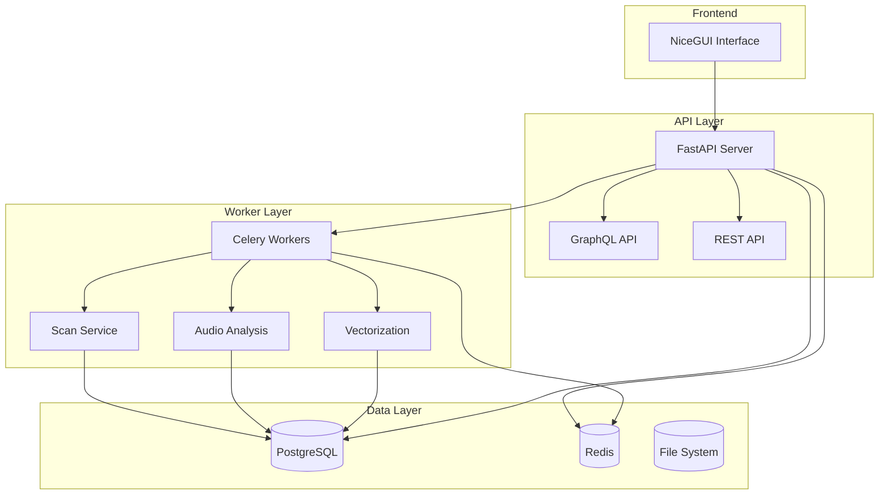
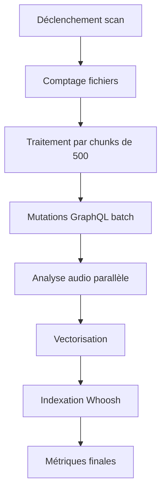
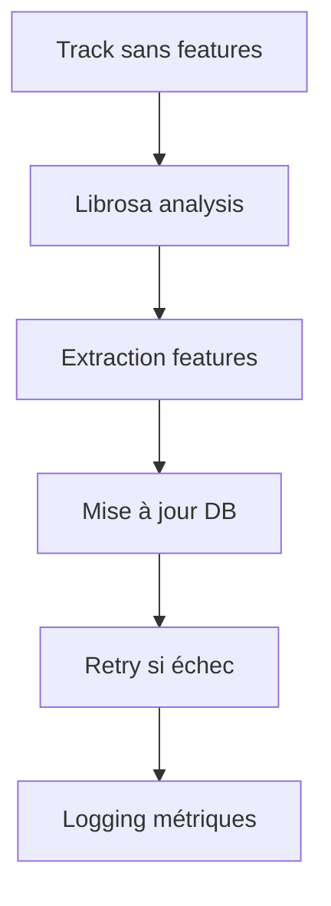
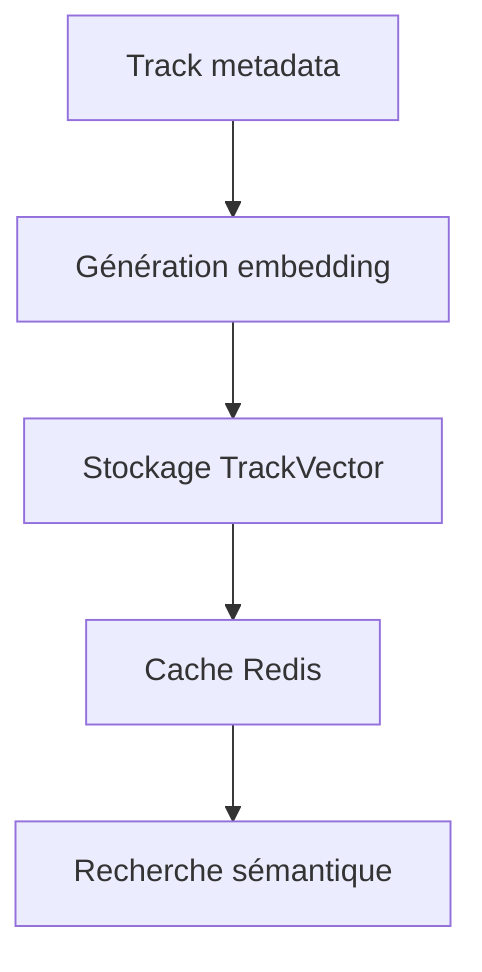

# Architecture de SoniqueBay - Version Optimisée

## Vue d'ensemble

SoniqueBay est une application de gestion de bibliothèque musicale avec une architecture moderne utilisant FastAPI, GraphQL, Celery et PostgreSQL/SQLite.

## Architecture générale



## Composants principaux

### 1. API FastAPI
- **Endpoints REST** : Gestion CRUD des entités
- **GraphQL API** : Requêtes complexes et mutations batch
- **WebSocket** : Communications temps réel
- **Middleware** : CORS, logging, health checks

### 2. Workers Celery
- **Scan Worker** : Indexation des fichiers musicaux
- **Audio Analysis Worker** : Extraction des caractéristiques audio
- **Vectorization Worker** : Génération des embeddings
- **Enrichment Worker** : Enrichissement des métadonnées

### 3. Services métier
- **TrackService** : Gestion des pistes
- **ArtistService** : Gestion des artistes
- **AlbumService** : Gestion des albums
- **VectorizationService** : Gestion des vecteurs
- **AudioFeaturesService** : Analyse audio

## Optimisations implementées

### 1. Traitement par lots (Batch Processing)
- **GraphQL Mutations** : `create_artists`, `create_albums`, `create_tracks`
- **Chunk Size** : 500 éléments par lot (vs 200 précédemment)
- **Async/Await** : Traitement asynchrone complet

### 2. Index de base de données
```sql
-- Index optimisés pour les scans
CREATE INDEX idx_tracks_path ON tracks(path);
CREATE INDEX idx_tracks_artist_album ON tracks(track_artist_id, album_id);
CREATE INDEX idx_tracks_mb_id ON tracks(musicbrainz_id);
CREATE INDEX idx_tracks_missing_audio ON tracks(bpm, key);
CREATE INDEX idx_track_vectors_track_id ON track_vectors(track_id);
```

### 3. Métriques de performance
- **Temps de scan** : Mesuré par chunk et total
- **Débit** : Fichiers/seconde
- **Utilisation mémoire** : Monitoring des workers
- **Taux d'erreur** : Suivi des échecs

### 4. Gestion d'erreurs améliorée
- **Retry logic** : Mécanisme de reprise automatique
- **Circuit breaker** : Protection contre les pannes
- **Logging structuré** : Traces détaillées pour debugging

## Nouveaux endpoints

### API Track Vectors
```
POST   /api/track-vectors/          # Créer un vecteur
GET    /api/track-vectors/{id}      # Récupérer un vecteur
PUT    /api/track-vectors/{id}      # Mettre à jour un vecteur
DELETE /api/track-vectors/{id}      # Supprimer un vecteur
GET    /api/track-vectors/          # Lister les vecteurs
```

### API Audio Analysis
```
POST   /api/tracks/analyze-audio           # Lancer l'analyse audio
PUT    /api/tracks/{id}/features          # Mettre à jour les features
```

### GraphQL Mutations optimisées
```graphql
mutation CreateArtists($artists: [ArtistCreateInput!]!) {
    create_artists(data: $artists) {
        id
        name
        musicbrainz_artistid
    }
}

mutation CreateTracks($tracks: [TrackCreateInput!]!) {
    create_tracks(data: $tracks) {
        id
        title
        path
        bpm
        key
    }
}
```

## Workflows optimisés

### 1. Scan de bibliothèque


### 2. Analyse audio


### 3. Vectorisation


## Configuration

### Variables d'environnement
```bash
# API
API_URL=http://backend:8001
GRAPHQL_URL=http://backend:8001/api/graphql

# Worker
CELERY_BROKER_URL=redis://redis:6379/0
CELERY_RESULT_BACKEND=redis://redis:6379/0

# Vectorisation
EMBEDDING_MODEL=mock-v1
EMBEDDING_DIMENSION=384

# Scan
CHUNK_SIZE=500
SCAN_TIMEOUT=300
```

### Indexes recommandés
```sql
-- Performance scan
CREATE INDEX CONCURRENTLY idx_tracks_scan_perf ON tracks(date_added, path);

-- Recherches fréquentes
CREATE INDEX CONCURRENTLY idx_tracks_search ON tracks(title, artist_name, album_title);

-- Vectorisation
CREATE INDEX CONCURRENTLY idx_track_vectors_search ON track_vectors USING ivfflat (vector_data vector_cosine_ops);
```

## Monitoring et observabilité

### Métriques collectées
- `scan_duration_seconds` : Durée totale du scan
- `scan_files_processed_total` : Nombre de fichiers traités
- `scan_chunks_processed_total` : Nombre de chunks traités
- `audio_analysis_duration_seconds` : Durée d'analyse audio
- `vectorization_duration_seconds` : Durée de vectorisation
- `api_request_duration_seconds` : Latence des API

### Événements WebSocket
```json
{
  "type": "scan_progress",
  "data": {
    "current": 150,
    "total": 1000,
    "percent": 15,
    "step": "Processing files...",
    "metrics": {
      "avg_chunk_time": 2.3,
      "files_per_second": 217.8
    }
  }
}
```

## Tests et validation

### Tests d'intégration
- **test_graphql_batch_operations** : Validation GraphQL batch
- **test_vectorization_workflow** : Workflow complet vectorisation
- **test_scan_performance_metrics** : Métriques de performance
- **test_chunk_size_optimization** : Optimisation chunks

### Benchmarks cibles
- **Scan performance** : 500+ fichiers/minute
- **Audio analysis** : 50+ fichiers/minute
- **Vectorization** : 100+ fichiers/minute
- **Memory usage** : < 2GB pour 1000 fichiers
- **Error rate** : < 5%

## Évolutivité

### Scaling horizontal
- **Workers Celery** : Ajout de workers pour + de parallélisation
- **Database** : PostgreSQL avec pgvector pour scaling
- **Cache** : Redis cluster pour haute disponibilité

### Optimisations futures
- **GPU acceleration** : Pour l'analyse audio intensive
- **Distributed processing** : Apache Spark pour gros volumes
- **Real-time indexing** : Elasticsearch pour recherche instantanée

---

*Document mis à jour le 20 septembre 2025 - Optimisations d'intégration DB et scan*
