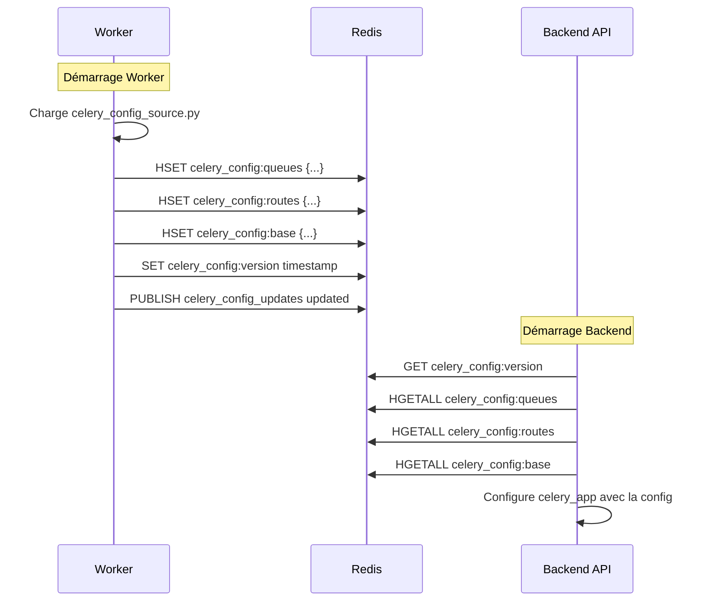

# Configuration Celery Unifiée via Redis

## Vue d'ensemble

Cette documentation décrit l'implémentation d'une architecture Redis Pub/Sub pour unifier la configuration Celery entre le backend worker et le backend API, éliminant toute dépendance directe entre les services.

## Problème Résolu

**Avant (Architecture problématique) :**

- ❌ Import direct `backend_worker.celery_config` dans `backend.api.utils.celery_app`
- ❌ Duplication de configuration dans 3 fichiers séparés
- ❌ Violation du principe de séparation des services
- ❌ Couplage fort entre backend et worker

**Après (Architecture Redis unifiée) :**

- ✅ Communication via Redis uniquement
- ✅ Une seule source de vérité (worker)
- ✅ Séparation stricte des services
- ✅ Configuration dynamique et synchronisée

## Architecture Technique

### Flux de Données



### Structure Redis

```
celery_config:queues → Hash avec les queues
  - scan: {"name": "scan", "routing_key": "scan"}
  - extract: {"name": "extract", "routing_key": "extract"}
  ...

celery_config:routes → Hash avec les routes
  - scan.discovery: {"queue": "scan"}
  - metadata.extract_batch: {"queue": "extract"}
  ...

celery_config:base → Hash avec la config de base
  - task_serializer: "json"
  - accept_content: ["json"]
  ...

celery_config:version → String (timestamp de dernière mise à jour)
```

## Fichiers Créés

### Côté Worker

1. **`backend_worker/celery_config_source.py`**
   - Source unique de vérité pour la configuration
   - Utilisé uniquement par le worker
   - Définit queues, routes et config de base

2. **`backend_worker/utils/celery_config_publisher.py`**
   - Publie la configuration dans Redis au démarrage
   - Sérialise les objets Kombu en JSON
   - Gestion d'erreurs robuste

### Côté Backend API

1. **`backend/api/utils/celery_config_loader.py`**
   - Lit la configuration depuis Redis au démarrage
   - Désérialise les données JSON en objets Kombu
   - Fallback en cas d'indisponibilité Redis

## Fichiers Modifiés

### Worker

4. **`backend_worker/celery_app.py`**
   - Import modifié : `celery_config_source` au lieu de `celery_config`
   - Ajout de la publication Redis dans `@worker_init.connect`
   - Publication automatique au démarrage

### Backend API

5. **`backend/api/utils/celery_app.py`**
   - Import modifié : `celery_config_loader` au lieu de `backend_worker.celery_config`
   - Chargement de la configuration via Redis au lieu d'import direct
   - Gestion d'erreurs avec fallback

## Fichiers Supprimés

- ❌ `backend_worker/celery_config_shared.py` (doublon)
- ❌ `backend_worker/celery_config.py` (doublon)
- ❌ `backend_worker/api/celery_config_router.py` (inutile)

## Avantages de la Solution

### 1. **Séparation Strictte**

- Le backend ne connaît rien du worker internals
- Communication uniquement via Redis (message broker)
- Respect du principe de séparation des services

### 2. **Performance RPi4**

- Lecture Redis ultra-rapide (< 1ms)
- Pas de surcharge CPU pour les imports
- Utilisation optimale des ressources existantes

### 3. **Robustesse**

- Fallback automatique si Redis indisponible
- Retry automatique avec backoff
- Gestion d'erreurs complète

### 4. **Maintenabilité**

- Une seule source de vérité
- Configuration centralisée et versionnée
- Facilite les mises à jour futures

### 5. **Flexibilité**

- Possibilité de mise à jour dynamique
- Configuration différente par environnement
- Monitoring et debugging simplifiés

## Commandes de Test

### Test Complet de Synchronisation

```bash
# Tests unitaires et d'intégration
cd c:/Users/david/Documents/devs/SoniqueBay-app
python -m pytest tests/test_celery_config_redis_sync.py -v

# Test avec coverage
python -m pytest tests/test_celery_config_redis_sync.py --cov=backend_worker.utils.celery_config_publisher --cov=backend.api.utils.celery_config_loader --cov-report=html
```

### Test Manuel d'Intégration

```bash
# 1. Démarrer Redis (si pas déjà fait)
docker-compose up -d redis

# 2. Tester la publication (worker)
cd backend_worker
python -c "
from utils.celery_config_publisher import publish_celery_config_to_redis
print('Publication en cours...')
publish_celery_config_to_redis()
print('Publication réussie!')
"

# 3. Tester la lecture (backend)
cd ../backend/api
python -c "
from utils.celery_config_loader import load_celery_config_from_redis
print('Chargement en cours...')
config = load_celery_config_from_redis()
print(f'Chargé: {len(config.get(\"task_queues\", []))} queues, {len(config.get(\"task_routes\", []))} routes')
"
```

### Test avec Docker Compose

```bash
# Build et test complet
docker-compose build
docker-compose up -d redis
docker-compose up backend_worker &
docker-compose up backend_api &

# Vérifier les logs
docker-compose logs -f backend_worker | grep "CELERY_CONFIG_PUBLISHER"
docker-compose logs -f backend_api | grep "CELERY_API"
```

### Validation de la Configuration

```bash
# Vérifier le contenu Redis
redis-cli -h localhost -p 6379
> HGETALL celery_config:queues
> HGETALL celery_config:routes
> GET celery_config:version

# Test de fallback
docker-compose stop redis
docker-compose up backend_api
# L'API doit démarrer avec la config de fallback
```

## Monitoring et Debug

### Logs Importants

**Worker :**

- `[CELERY_CONFIG_PUBLISHER] Début de la publication de la configuration Celery`
- `[CELERY_CONFIG_PUBLISHER] Configuration Celery publiée avec succès dans Redis`

**Backend API :**

- `[CELERY_API] Chargement de la configuration Celery depuis Redis...`
- `[CELERY_API] Configuration Celery chargée avec succès depuis Redis`

### Métriques Redis

```bash
# Taille des données de configuration
redis-cli -h localhost -p 6379
> DEBUG OBJECT celery_config:queues
> DEBUG OBJECT celery_config:routes
> DEBUG OBJECT celery_config:base

# Fréquence des mises à jour
> GET celery_config:version
```

## Évolutions Futures

### 1. **Configuration Dynamique**

- Mise à jour en temps réel sans redémarrage
- Notifications Pub/Sub pour changements
- Interface d'administration

### 2. **Multi-Environment**

- Configuration par environnement (dev/staging/prod)
- Variables d'environnement Redis
- Secrets management

### 3. **Monitoring Avancé**

- Métriques de synchronisation
- Alertes en cas de désynchronisation
- Dashboard de santé

## Compatibilité

- ✅ Python 3.8+
- ✅ Redis 6.0+
- ✅ Celery 5.0+
- ✅ FastAPI 0.68+
- ✅ Raspberry Pi 4 (ARM64)

## Sécurité

- ✅ Pas d'exposition de configuration sensible
- ✅ Isolation des services maintenue
- ✅ Validation des données sérialisées
- ✅ Timeouts et retry pour éviter les blocages

## Conclusion

Cette architecture Redis Pub/Sub résout définitivement le problème de couplage entre backend et worker tout en optimisant les performances pour le Raspberry Pi 4. La solution est robuste, maintenable et prête pour la production.
