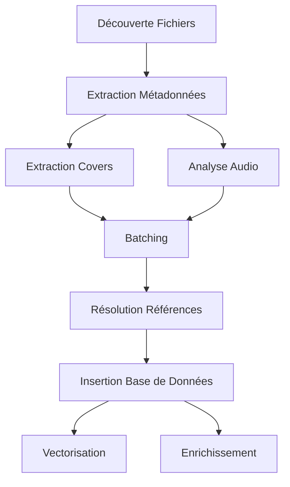

# Plan d'Implémentation Détaillé pour la Correction des Problèmes de Traitement des Tracks

## Analyse de l'État Actuel

### 1. Extraction des Métadonnées (enrichment_worker.py)

**État actuel :**

- L'extraction des tags MusicBrainz est déjà implémentée dans `extract_single_file_metadata()` (lignes 228-236)
- Les champs `musicbrainz_artistid`, `musicbrainz_albumartistid`, `musicbrainz_albumid`, `musicbrainz_id`, et `acoustid_fingerprint` sont extraits
- L'extraction des covers est présente dans `music_scan.py` mais n'est pas intégrée dans le pipeline principal

**Problèmes identifiés :**

- Les covers ne sont pas extraites dans le flux principal de `extract_single_file_metadata()`
- L'analyse audio est présente mais pas intégrée dans le pipeline de traitement

### 2. Pipeline de Traitement (process_entities_worker.py)

**État actuel :**

- Le regroupement par artistes et albums fonctionne
- Utilisation des IDs MusicBrainz pour éviter les doublons (lignes 114-121)
- La logique de résolution des références est présente mais pourrait être améliorée

**Problèmes identifiés :**

- La résolution des albums-tracks pourrait être plus robuste
- Le pipeline complet n'est pas testé de bout en bout

### 3. Intégration de l'Analyse Audio

**État actuel :**

- Le service `audio_features_service` existe et est importé
- L'analyse audio est appelée dans `music_scan.py` mais pas dans le pipeline principal

## Plan d'Implémentation par Étape

### Étape 1 : Restaurer l'Extraction Complète des Métadonnées (1 jour)

**Objectif :** S'assurer que tous les champs nécessaires sont extraits et disponibles

**Tâches :**

1. **Ajouter l'extraction des covers dans `extract_single_file_metadata()`**
   - Intégrer l'appel à `extract_embedded_covers()` après l'extraction des métadonnées de base
   - Ajouter les champs `cover_data` et `cover_mime_type` aux métadonnées retournées

2. **Vérifier l'intégration de l'analyse audio**
   - S'assurer que `analyze_audio_with_librosa()` est appelée après l'extraction des métadonnées
   - Ajouter les champs `bpm`, `key`, `scale` aux métadonnées

**Fichiers à modifier :**

- `backend_worker/workers/metadata/enrichment_worker.py` (lignes 208-246)
- `backend_worker/services/music_scan.py` (déjà fonctionnel)

**Code à ajouter dans `extract_single_file_metadata()` :**

```python
# Après l'extraction des métadonnées de base (ligne 236)
# Ajouter extraction des covers
cover_data, cover_mime_type = extract_embedded_covers(audio)
if cover_data:
    metadata.update({
        "cover_data": cover_data,
        "cover_mime_type": cover_mime_type
    })

# Ajouter analyse audio
audio_features = analyze_audio_with_librosa(track_path)
if audio_features:
    metadata.update({
        "bpm": audio_features.get("bpm"),
        "key": audio_features.get("key"),
        "scale": audio_features.get("scale")
    })
```

### Étape 2 : Améliorer le Pipeline de Traitement (1 jour)

**Objectif :** S'assurer que le pipeline complet fonctionne de bout en bout

**Tâches :**

1. **Vérifier la logique de regroupement dans `process_entities_worker.py`**
   - S'assurer que les IDs MusicBrainz sont utilisés correctement pour éviter les doublons
   - Améliorer la résolution des références entre albums et tracks

2. **Tester le pipeline complet**
   - Vérifier que la chaîne discovery → extract_metadata → batch_entities → insert_batch fonctionne
   - Ajouter des logs de débogage pour suivre le flux

**Fichiers à modifier :**

- `backend_worker/workers/batch/process_entities_worker.py` (lignes 109-122)

**Améliorations à apporter :**

```python
# Dans la logique de regroupement des albums
mb_album_id = track.get('musicbrainz_albumid')
mb_artist_id = track.get('musicbrainz_albumartistid') or track.get('musicbrainz_artistid')

if mb_album_id and mb_artist_id:
    album_key = (mb_album_id, mb_artist_id)
    logger.debug(f"[BATCH] Album grouped by MB IDs: album={mb_album_id}, artist={mb_artist_id}")
else:
    album_key = (album_name.strip().lower(), artist_name)
    logger.debug(f"[BATCH] Album grouped by name: title='{album_name}', artist='{artist_name}'")
```

### Étape 3 : Corriger la Résolution des Références (1 jour)

**Objectif :** S'assurer que les relations entre albums et tracks sont correctement établies

**Tâches :**

1. **Améliorer la logique de mapping dans `process_entities_worker.py`**
   - Utiliser les IDs MusicBrainz pour créer des clés uniques plus robustes
   - Ajouter des vérifications pour les cas où les IDs sont manquants

2. **Vérifier l'insertion dans la base de données**
   - S'assurer que les IDs d'albums sont correctement associés aux tracks

**Fichiers à modifier :**

- `backend_worker/workers/batch/process_entities_worker.py` (lignes 158-168)

**Code à améliorer :**

```python
# Dans la préparation des données d'insertion
for track in tracks_data:
    # Ajouter des références explicites pour la résolution
    artist_name = track.get('artist', '').strip().lower()
    album_name = track.get('album', '').strip().lower()

    # Ajouter les noms normalisés pour la résolution
    track['artist_name'] = artist_name
    track['album_title'] = album_name
```

### Étape 4 : Intégrer l'Analyse Audio dans le Pipeline (1 jour)

**Objectif :** S'assurer que l'analyse audio est intégrée de manière cohérente

**Tâches :**

1. **Vérifier l'intégration dans `enrichment_worker.py`**
   - S'assurer que l'analyse audio est appelée au bon moment
   - Vérifier que les résultats sont correctement stockés

2. **Tester l'analyse audio avec différents types de fichiers**
   - Vérifier que l'analyse fonctionne pour MP3, FLAC, etc.

**Fichiers à vérifier :**

- `backend_worker/services/audio_features_service.py` (existant)
- Intégration dans `enrichment_worker.py`

### Étape 5 : Tests et Validation (1 jour)

**Objectif :** S'assurer que toutes les corrections fonctionnent sans régression

**Tâches :**

1. **Créer des tests unitaires pour les nouvelles fonctionnalités**
   - Tests pour l'extraction des covers
   - Tests pour l'analyse audio
   - Tests pour la résolution des références

2. **Tester le pipeline complet**
   - Exécuter un scan complet et vérifier que toutes les données sont correctement stockées
   - Vérifier que les covers et l'analyse audio sont disponibles dans l'interface

## Diagramme de Flux Corrigé



## Plan de Test

1. **Test unitaire :**
   - `test_cover_extraction()` - Vérifier que les covers sont extraites correctement
   - `test_audio_analysis()` - Vérifier que l'analyse audio retourne les bons champs
   - `test_reference_resolution()` - Vérifier que les albums sont correctement associés aux tracks

2. **Test d'intégration :**
   - `test_full_pipeline()` - Exécuter un scan complet et vérifier que toutes les étapes fonctionnent
   - `test_database_consistency()` - Vérifier que les données dans la base sont cohérentes

3. **Test de performance :**
   - `test_memory_usage()` - Vérifier que l'utilisation mémoire reste dans les limites RPi4
   - `test_processing_time()` - Vérifier que le temps de traitement reste acceptable

## Estimation et Priorisation

| Étape | Durée | Priorité | Dépendances |
|-------|-------|----------|-------------|
| 1. Extraction complète | 1 jour | Critique | Aucune |
| 2. Pipeline de traitement | 1 jour | Haute | Étape 1 |
| 3. Résolution références | 1 jour | Haute | Étape 2 |
| 4. Intégration analyse audio | 1 jour | Moyenne | Étape 1 |
| 5. Tests et validation | 1 jour | Critique | Toutes |

**Durée totale estimée :** 5 jours
**Complexité :** Moyenne à Élevée
**Priorité globale :** Critique (blocage des fonctionnalités principales)
