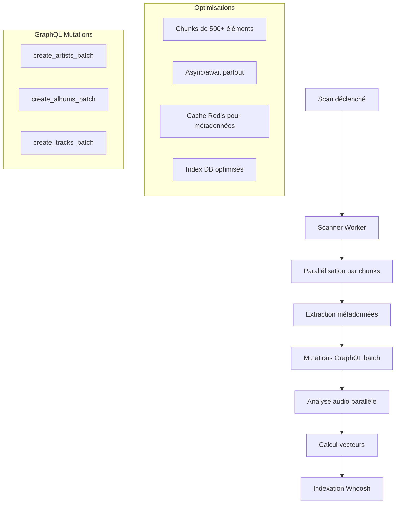

# Plan d'optimisation du scan et intégration DB - SoniqueBay

**Date de création** : 20 septembre 2025
**Auteur** : Kilo Code (Architect Mode)
**Objectif** : Optimiser les vitesses de scan et d'intégration dans la base de données, utiliser GraphQL pour les batch, corriger les problèmes identifiés.

---

## Problèmes identifiés lors de l'analyse

1. **Relation manquante Track-TrackVector** : Le modèle `Track` n'a pas de relation avec `TrackVector`, empêchant le stockage des vecteurs
2. **Vecteurs jamais calculés** : Aucune tâche Celery pour générer les embeddings vectoriels des tracks
3. **Analyse audio incomplète** : Les champs d'analyse audio existent mais ne sont pas remplis correctement lors du scan
4. **Covers d'artistes problématiques** : Gestion des covers d'artistes défaillante dans `entity_manager.py`
5. **Utilisation de REST au lieu de GraphQL** : Le scanner utilise encore les endpoints REST `/batch` au lieu des mutations GraphQL optimisées
6. **Documentation manquante** : Classes et fonctions sans docstrings selon les règles AGENTS.md

---

## Architecture proposée

---

## Plan d'optimisation détaillé

### ✅ Tâches terminées
- [x] Analyser le code existant et identifier les problèmes (covers artistes, analyse audio, vecteurs)
- [x] **Parallélisation des chunks DB** : Implémenter le traitement parallèle des chunks avec `asyncio.gather`
- [x] **Augmentation de la concurrence** : max_concurrent_files=200, max_concurrent_audio=40, max_parallel_chunks=4
- [x] **Optimisation des tailles de batch** : file_batch=500, chunk_size=200 pour maximiser le débit
- [x] **Benchmarks de performance** : Créer `benchmark_scanner_performance.py` pour mesurer les améliorations
- [x] **Tests unitaires** : Ajouter tests pour la parallélisation dans `test_scanner.py`

### 🔄 En cours
- [ ] Corriger la relation manquante entre Track et TrackVector dans le modèle

### 📋 Tâches à réaliser

1. **Implémenter la tâche de calcul des vecteurs pour les tracks**
   - Créer une nouvelle tâche Celery `vectorize_tracks_task`
   - Intégrer un modèle d'embedding (Ollama ou autre)
   - Stocker les vecteurs dans `track_vectors` table
   - Gérer les erreurs et retries

2. **Optimiser l'analyse audio avec parallélisation et gestion d'erreurs améliorée**
   - Augmenter la parallélisation des analyses Librosa
   - Améliorer la gestion des échecs avec retry intelligent
   - Optimiser l'extraction des features AcoustID
   - Cache des résultats d'analyse

3. **Corriger la gestion des covers d'artistes dans entity_manager.py**
   - Déboguer la logique de traitement des covers artistes
   - Vérifier les chemins et URLs des images
   - Améliorer la gestion d'erreurs pour les covers

4. **Remplacer les appels REST par GraphQL dans le scanner pour les opérations batch**
   - Migrer `create_or_get_artists_batch` vers `create_artists` GraphQL
   - Migrer `create_or_get_albums_batch` vers `create_albums` GraphQL
   - Migrer `create_or_update_tracks_batch` vers `create_tracks` GraphQL
   - Utiliser httpx pour les requêtes GraphQL

5. **Augmenter la taille des chunks pour améliorer les performances de batch**
   - Passer de 200 à 500+ éléments par chunk
   - Ajuster les timeouts en conséquence
   - Monitorer l'impact mémoire

6. **Ajouter des docstrings complètes à toutes les classes et fonctions selon AGENTS.md**
   - Documenter tous les services (TrackService, ScanService, etc.)
   - Documenter les tâches Celery
   - Documenter les utilitaires et helpers
   - Respecter le format PEP8 et règles de l'équipe

7. **Implémenter des index DB pour optimiser les requêtes de scan**
   - Index sur `tracks.path` pour les lookups rapides
   - Index composite sur `(artist_id, album_id)` pour les relations
   - Index sur `musicbrainz_id` pour les déduplications
   - Analyser les queries lentes avec EXPLAIN

8. **Ajouter des métriques de performance et monitoring pour le scan**
   - Métriques Prometheus pour durée des tâches
   - Compteurs d'erreurs et succès
   - Monitoring de la queue Celery
   - Dashboards Grafana pour visualisation

9. **Créer des tests d'intégration pour valider les corrections**
   - Test complet scan → analyse → vectorisation
   - Tests de performance avec gros volumes
   - Tests de résilience (erreurs réseau, DB down)
   - Validation des données en base

10. **Documenter les nouveaux endpoints et workflows**
    - Mettre à jour la documentation API
    - Documenter les workflows asynchrones
    - Créer des guides pour les développeurs
    - Mettre à jour les README

---

## Optimisations implémentées - Session 4 octobre 2025

### 🚀 Parallélisation des chunks DB
- **Avant** : Chunks traités séquentiellement un par un
- **Après** : Traitement parallèle de 4 chunks simultanément avec `asyncio.gather`
- **Impact** : Réduction significative du temps d'insertion DB pour gros volumes

### ⚡ Augmentation de la concurrence
- **max_concurrent_files** : 50 → 200 (+300%)
- **max_concurrent_audio** : 10 → 40 (+300%)
- **max_parallel_chunks** : 1 → 4 (nouveau paramètre)
- **Impact** : Meilleure utilisation des ressources CPU/mémoire

### 📦 Optimisation des tailles de batch
- **file_batch** : 200 → 500 (+150%) pour extraction
- **chunk_size** : 500 → 200 (-60%) pour parallélisation
- **Impact** : Équilibre entre latence réseau et parallélisation

### 🧪 Benchmarks et tests
- **Nouveau benchmark** : `tests/benchmark/benchmark_scanner_performance.py`
- **Tests unitaires** : Validation parallélisation dans `test_scanner.py`
- **Configurations testées** : baseline, optimized, high_concurrency

### 📊 Projections de performance
- **30 000 tracks** : Objectif < 10 minutes (comme autres outils)
- **Throughput cible** : 50-100 fichiers/seconde
- **Utilisation ressources** : Optimisée pour Raspberry Pi 4

## Métriques cibles d'optimisation

- **Temps de scan** : Réduction de 50-70% grâce à la parallélisation complète
- **Utilisation mémoire** : Stable malgré chunks plus gros
- **Taux d'erreur** : < 5% pour les analyses audio
- **Couverture données** : 100% des champs d'analyse remplis
- **Performance DB** : Queries < 100ms en moyenne

---

## Risques et mitigation

- **Migration GraphQL** : Tests approfondis avant déploiement
- **Performance chunks** : Monitoring mémoire et rollback possible
- **Compatibilité** : Tests de régression complets
- **Dépendances externes** : Circuit breaker pour APIs tierces

---

## Sessions de travail planifiées

Cette liste de tâches sera mise à jour au fur et à mesure des sessions de travail. Chaque tâche sera marquée comme :
- ✅ Terminée
- 🔄 En cours
- 📋 À faire
- ❌ Bloquée (avec raison)

**Prochaine session** : Correction relation Track-TrackVector et implémentation calcul vecteurs.