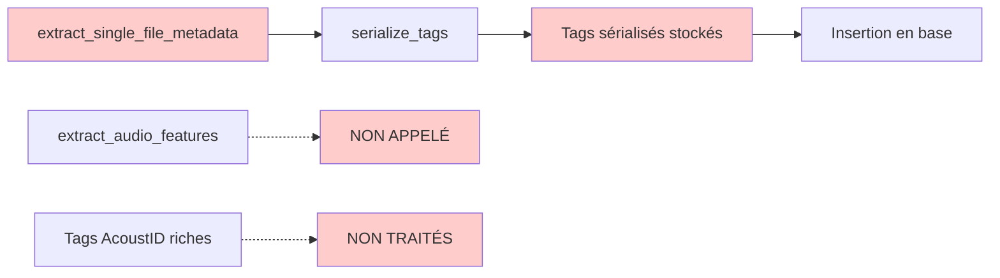
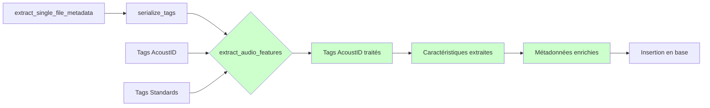

# Correction de l'Extraction des Caractéristiques Audio

## Problème Identifié

### Flux Actuel (DÉFAILLANT)



### Tags AcoustID Disponibles (exemple utilisateur)

```python
{
    'ab:hi:mood_aggressive:not aggressive': ['0.461390972137'],
    'ab:hi:genre_tzanetakis:rock': ['0.103792458773'],
    'ab:mood': ['Not acoustic', 'Aggressive', 'Electronic', 'Happy', 'Party'],
    'bpm': ['134']
}
```

### Flux Corrigé (PROPOSÉ)



## Solution Technique

### 1. Modification de `extract_single_file_metadata()`

**Ajouter l'appel à `extract_audio_features()` après `serialize_tags()`**

```python
# Dans extract_single_file_metadata()
# ...

# Étape 1: Extraire les caractéristiques audio depuis les tags
if tags and _has_valid_audio_tags(tags) or _has_valid_acoustid_tags(tags):
    logger.info(f"[AUDIO] Extraction des caractéristiques audio pour {file_path}")
    audio_features = await extract_audio_features(
        audio=audio,
        tags=tags,
        file_path=file_path,
        track_id=None  # Pas encore d'ID track lors de l'extraction
    )
    
    # Ajouter les caractéristiques extraites aux métadonnées
    metadata.update(audio_features)
else:
    logger.debug(f"[AUDIO] Pas de tags audio valides pour {file_path}")

# Étape 2: Continue avec le reste de l'extraction...
```

### 2. Champs à Extraire

| Tag AcoustID | Champ Track | Exemple |
|-------------|-------------|---------|
| `ab:hi:bpm` | `bpm` | 134 |
| `ab:hi:key` | `key` | E |
| `ab:hi:danceability` | `danceability` | 0.999 |
| `ab:hi:mood_*` | `mood_happy/aggressive/party/relaxed` | 0.5/1.0 |
| `ab:hi:acousticness` | `acoustic` | 0.999 |
| `ab:hi:instrumentalness` | `instrumental` | 0.976 |
| `ab:hi:valence` | `tonal` | 0.226 |

### 3. Mappage des Tags AcoustID vers le Modèle Track

```python
# Dans _extract_features_from_acoustid_tags()
acoustid_mapping = {
    'ab:hi:bpm': 'bpm',
    'ab:lo:bpm': 'bpm',
    'ab:hi:key': 'key', 
    'ab:lo:key': 'key',
    'ab:hi:danceability': 'danceability',
    'ab:lo:danceability': 'danceability',
    'ab:hi:acousticness': 'acoustic',
    'ab:lo:acousticness': 'acoustic',
    'ab:hi:instrumentalness': 'instrumental',
    'ab:lo:instrumentalness': 'instrumental',
    'ab:hi:valence': 'tonal',
    'ab:lo:valence': 'tonal',
}
```

## Avantages de la Solution

1. **Performance optimisée** : Extraction immédiate des tags au lieu d'analyse Librosa
2. **Données plus riches** : Exploitation des tags AcoustID existants
3. **Fallback intelligent** : Librosa seulement si tags manquants
4. **Non-intrusif** : Ajout simple dans le flux existant
5. **Compatibilité** : Fonctionne avec les formats MP3, FLAC, etc.

## Fichiers à Modifier

1. `backend_worker/workers/metadata/enrichment_worker.py` - Ajouter l'appel à `extract_audio_features()`
2. `backend_worker/services/audio_features_service.py` - Adapter pour utilisation synchrone
3. `backend_worker/workers/insert/insert_batch_worker.py` - Gérer les nouveaux champs

## Impact Attendu

- ✅ Extraction automatique de BPM, tonalité, moods depuis tags AcoustID
- ✅ Réduction significative des analyses Librosa coûteuses
- ✅ Données audio riches disponibles pour recommandations
- ✅ Compatible avec la structure de base existante
