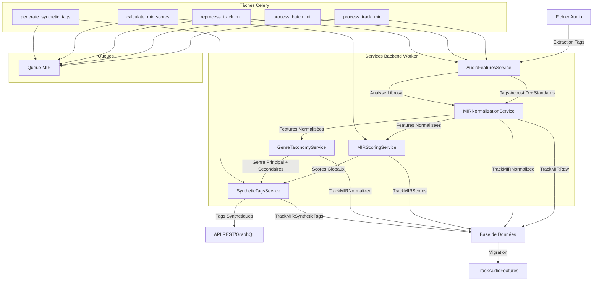

# Plan d'Implémentation MIR dans Backend Worker - SoniqueBay

## Vue d'ensemble

Ce plan détaille l'implémentation du système MIR (Music Information Retrieval) dans le **backend_worker** de SoniqueBay, en prenant en compte les plans existants [`track_model_evolution_plan.md`](track_model_evolution_plan.md) et [`mir_system_implementation_plan.md`](mir_system_implementation_plan.md).

## Objectifs

1. **Créer les services MIR manquants** - Implémenter les services de normalisation, scoring, fusion de taxonomies et génération de tags synthétiques
2. **Créer le worker MIR** - Worker dédié pour le traitement MIR
3. **Intégrer le pipeline MIR** - Intégrer le pipeline complet dans le service audio_features existant
4. **Configurer les queues** - S'assurer que la queue MIR est correctement configurée

---

## État Actuel - Analyse

### Infrastructure Existante dans backend_worker

| Composant | Fichier | État | Notes |
|-----------|---------|------|-------|
| **Audio Features Service** | [`audio_features_service.py`](../backend_worker/services/audio_features_service.py) | ✅ Existant | Contient extraction AcoustID + standards + Librosa |
| **Audio Analysis Tasks** | [`audio_analysis_tasks.py`](../backend_worker/tasks/audio_analysis_tasks.py) | ✅ Existant | Tâches pour l'analyse audio avec Librosa |
| **MIR Tasks** | [`mir_tasks.py`](../backend_worker/tasks/mir_tasks.py) | ✅ Existant | Tâches pour le pipeline MIR (process, reprocess, scores, tags) |
| **Queue MIR** | [`celery_config_source.py`](../backend_worker/celery_config_source.py) | ✅ Configurée | Queue `mir` déjà définie |

### Services MIR Référencés mais Non Créés

| Service | Référence dans | État | Description |
|---------|----------------|------|-------------|
| **MIRNormalizationService** | [`audio_features_service.py:846`](../backend_worker/services/audio_features_service.py:846) | ❌ Non créé | Normalisation des tags MIR bruts en scores continus |
| **MIRScoringService** | [`mir_system_implementation_plan.md`](mir_system_implementation_plan.md) | ❌ Non créé | Calcul des scores globaux (energy, valence, dance, etc.) |
| **GenreTaxonomyService** | [`mir_system_implementation_plan.md`](mir_system_implementation_plan.md) | ❌ Non créé | Fusion des taxonomies de genres via vote pondéré |
| **SyntheticTagsService** | [`mir_system_implementation_plan.md`](mir_system_implementation_plan.md) | ❌ Non créé | Génération de tags synthétiques haut niveau |
| **MIRPipelineService** | [`mir_system_implementation_plan.md`](mir_system_implementation_plan.md) | ❌ Non créé | Orchestrateur du pipeline MIR complet |

### Workers MIR

| Worker | État | Description |
|--------|------|-------------|
| **mir_worker.py** | ❌ Non créé | Worker dédié pour le traitement MIR |

---

## Architecture Cible

### Diagramme Mermaid - Pipeline MIR dans Backend Worker



---

## Plan d'Implémentation

### Phase 1: Création des Services MIR

#### 1.1 Créer MIRNormalizationService

**Fichier:** `backend_worker/services/mir_normalization_service.py`

**Objectif:** Normaliser les tags MIR bruts en scores continus

**Fonctions clés:**

```python
class MIRNormalizationService:
    """Service pour la normalisation des tags MIR."""
    
    def normalize_binary_to_continuous(self, binary_value: bool, confidence: float = 1.0) -> float:
        """Convertit une valeur binaire en score continu [0.0-1.0]."""
        
    def handle_opposing_tags(self, positive_score: float, negative_score: float) -> tuple[float, float]:
        """Gère les tags opposés (X vs not X)."""
        
    def normalize_bpm(self, bpm: int) -> float:
        """Normalise le BPM dans [0.0-1.0]."""
        
    def normalize_key_scale(self, key: str, scale: str) -> tuple[str, str]:
        """Normalise la tonalité et le mode."""
        
    def calculate_confidence_score(self, features: dict) -> float:
        """Calcule un score de confiance global."""
        
    def normalize_all_features(self, raw_features: dict) -> dict:
        """Normalise toutes les features MIR brutes."""
```

**Règles de normalisation:**

1. **Conversion binaire → continu:**
   - `True` → `1.0`, `False` → `0.0`
   - `danceable` → `1.0`, `not danceable` → `0.0`
   - `acoustic` → `1.0`, `not acoustic` → `0.0`

2. **Gestion des oppositions:**
   - `happy` vs `not happy` → Score = max(happy - not_happy, 0.0)
   - `sad` vs `not sad` → Score = max(sad - not_sad, 0.0)
   - `aggressive` vs `not aggressive` → Score = max(aggressive - not_aggressive, 0.0)
   - `party` vs `not party` → Score = max(party - not_party, 0.0)
   - `relaxed` vs `not relaxed` → Score = max(relaxed - not_relaxed, 0.0)
   - `acoustic` vs `not acoustic` → Score = max(acoustic - not_acoustic, 0.0)
   - `electronic` vs `not electronic` → Score = max(electronic - not_electronic, 0.0)

3. **Normalisation BPM:**
   - Plage typique: 60-200 BPM
   - Score = `(bpm - 60) / (200 - 60)` → [0.0-1.0]

4. **Normalisation Key/Scale:**
   - Key: C, C#, D, D#, E, F, F#, G, G#, A, A#, B
   - Scale: major, minor
   - Camelot key calculé automatiquement

5. **Score de confiance:**
   - Basé sur le consensus entre sources
   - Écart entre valeurs positives/négatives

#### 1.2 Créer MIRScoringService

**Fichier:** `backend_worker/services/mir_scoring_service.py`

**Objectif:** Calculer les scores globaux par track

**Fonctions clés:**

```python
class MIRScoringService:
    """Service pour le calcul des scores globaux MIR."""
    
    def calculate_energy_score(self, features: dict) -> float:
        """Calcule le score d'énergie [0.0-1.0]."""
        # Formule: 0.4 * danceability + 0.3 * (1 - acoustic) + 0.3 * bpm_normalized
        
    def calculate_mood_valence(self, features: dict) -> float:
        """Calcule la valence émotionnelle [-1.0 à +1.0]."""
        # Formule: (happy - aggressive) + (party - relaxed) / 2
        
    def calculate_dance_score(self, features: dict) -> float:
        """Calcule le score de danseabilité [0.0-1.0]."""
        # Formule: danceability + 0.2 * bpm_normalized
        
    def calculate_acousticness(self, features: dict) -> float:
        """Calcule l'acousticité [0.0-1.0]."""
        # Formule: acoustic + 0.3 * (1 - instrumental)
        
    def calculate_complexity_score(self, features: dict) -> float:
        """Calcule la complexité [0.0-1.0]."""
        # Formule: 0.5 * tonal + 0.3 * (1 - instrumental) + 0.2 * bpm_normalized
        
    def calculate_emotional_intensity(self, features: dict) -> float:
        """Calcule l'intensité émotionnelle [0.0-1.0]."""
        # Formule: max(happy, aggressive, party, relaxed)
        
    def calculate_all_scores(self, normalized_features: dict) -> dict:
        """Calcule tous les scores globaux."""
```

**Formules détaillées:**

1. **Energy Score:**

   ```
   energy = 0.4 * danceability + 0.3 * (1 - acoustic) + 0.3 * bpm_normalized
   ```

2. **Mood Valence:**

   ```
   valence = ((happy - aggressive) + (party - relaxed)) / 2
   Plage: [-1.0, +1.0]
   ```

3. **Dance Score:**

   ```
   dance = danceability + 0.2 * bpm_normalized
   ```

4. **Acousticness:**

   ```
   acoustic = acoustic + 0.3 * (1 - instrumental)
   ```

5. **Complexity Score:**

   ```
   complexity = 0.5 * tonal + 0.3 * (1 - instrumental) + 0.2 * bpm_normalized
   ```

6. **Emotional Intensity:**

   ```
   intensity = max(happy, aggressive, party, relaxed)
   ```

#### 1.3 Créer GenreTaxonomyService

**Fichier:** `backend_worker/services/genre_taxonomy_service.py`

**Objectif:** Fusionner les taxonomies de genres via vote pondéré

**Fonctions clés:**

```python
class GenreTaxonomyService:
    """Service pour la fusion des taxonomies de genres."""
    
    def extract_genres_from_tags(self, raw_features: dict) -> dict:
        """Extrait les genres depuis les tags AcoustID."""
        
    def vote_genre_main(self, genre_votes: dict) -> tuple[str, float]:
        """Vote pondéré pour le genre principal."""
        
    def extract_genre_secondary(self, genre_votes: dict) -> list[str]:
        """Extrait les genres secondaires."""
        
    def calculate_genre_confidence(self, genre_votes: dict) -> float:
        """Calcule la confiance du genre."""
        
    def process_genre_taxonomy(self, raw_features: dict) -> dict:
        """Traite complètement la taxonomie de genres."""
```

**Taxonomies supportées:**

| Taxonomie | Source | Poids |
|------------|--------|--------|
| GTZAN | `ab:hi:genre_tzanetakis:*` | 1.0 |
| ROSAMERICA | `ab:hi:genre_rosamerica:*` | 1.0 |
| DORTMUND | `ab:hi:genre_dortmund:*` | 1.0 |
| Electronic | `ab:hi:genre_electronic:*` | 1.0 |
| Standards | `genre` tag standard | 0.8 |

**Algorithme de vote:**

1. **Extraction des votes:**
   - Parser les tags `ab:hi:genre_*` pour chaque taxonomie
   - Compter les occurrences de chaque genre

2. **Vote pondéré:**
   - Score = Σ(poids_taxonomie × score_genre)
   - Genre principal = argmax(scores)

3. **Confiance:**
   - Si un seul vote → confiance = 1.0
   - Si votes contradictoires → confiance = 0.3-0.5
   - Si consensus fort → confiance = 0.8-1.0

#### 1.4 Créer SyntheticTagsService

**Fichier:** `backend_worker/services/synthetic_tags_service.py`

**Objectif:** Générer des tags synthétiques haut niveau

**Fonctions clés:**

```python
class SyntheticTagsService:
    """Service pour la génération de tags synthétiques."""
    
    def generate_mood_tags(self, features: dict, scores: dict) -> list[dict]:
        """Génère les tags de mood (dark, bright, energetic, chill, etc.)."""
        
    def generate_energy_tags(self, features: dict, scores: dict) -> list[dict]:
        """Génère les tags d'énergie."""
        
    def generate_atmosphere_tags(self, features: dict, scores: dict) -> list[dict]:
        """Génère les tags d'atmosphère."""
        
    def generate_usage_tags(self, features: dict, scores: dict) -> list[dict]:
        """Génère les tags d'usage."""
        
    def calculate_tag_explainability(self, tag_name: str, features: dict) -> dict:
        """Calcule l'explicabilité du tag."""
        
    def generate_all_synthetic_tags(self, features: dict, scores: dict) -> list[dict]:
        """Génère tous les tags synthétiques."""
```

**Tags synthétiques supportés:**

| Catégorie | Tags | Règles de calcul |
|-----------|------|-------------------|
| **Mood** | dark, bright, energetic, chill, melancholic, aggressive, uplifting | Basé sur mood_valence + energy_score |
| **Energy** | high_energy, medium_energy, low_energy | Basé sur energy_score |
| **Atmosphere** | dancefloor, ambient, intimate, epic | Basé sur dance_score + acousticness |
| **Usage** | workout, focus, background, party | Basé sur dance_score + mood_valence |

**Exemples de calcul:**

1. **Dark:**

   ```
   dark = 1.0 - mood_valence si mood_valence < 0
   ```

2. **Bright:**

   ```
   bright = mood_valence si mood_valence > 0
   ```

3. **Energetic:**

   ```
   energetic = energy_score si energy_score > 0.6
   ```

4. **Chill:**

   ```
   chill = (1.0 - energy_score) if energy_score < 0.4
   ```

5. **Dancefloor:**

   ```
   dancefloor = dance_score if dance_score > 0.7
   ```

#### 1.5 Créer MIRPipelineService

**Fichier:** `backend_worker/services/mir_pipeline_service.py`

**Objectif:** Orchestrateur du pipeline MIR complet

**Fonctions clés:**

```python
class MIRPipelineService:
    """Service pour l'orchestration du pipeline MIR."""
    
    def __init__(self):
        self.normalization_service = MIRNormalizationService()
        self.scoring_service = MIRScoringService()
        self.taxonomy_service = GenreTaxonomyService()
        self.synthetic_tags_service = SyntheticTagsService()
        
    async def process_track_mir(self, track_id: int, file_path: str, tags: dict) -> dict:
        """Pipeline complet MIR pour une track."""
        
    async def process_batch_mir(self, tracks_data: list) -> dict:
        """Pipeline MIR en lot."""
        
    async def _extract_raw_features(self, track_id: int, file_path: str, tags: dict) -> dict:
        """Étape 1: Extraction des tags bruts."""
        
    async def _normalize_features(self, track_id: int, raw_features: dict) -> dict:
        """Étape 2: Normalisation des features."""
        
    async def _calculate_scores(self, track_id: int, normalized_features: dict) -> dict:
        """Étape 3: Calcul des scores globaux."""
        
    async def _process_taxonomy(self, track_id: int, normalized_features: dict) -> dict:
        """Étape 4: Fusion des taxonomies de genres."""
        
    async def _generate_synthetic_tags(self, track_id: int, normalized_features: dict, scores: dict) -> list[dict]:
        """Étape 5: Génération des tags synthétiques."""
        
    async def _store_results(self, track_id: int, results: dict) -> bool:
        """Étape 6: Stockage des résultats dans la base de données."""
```

**Pipeline complet:**

1. **Extraction des tags bruts** (AcoustID + standards)
2. **Normalisation des features**
3. **Calcul des scores globaux**
4. **Fusion des taxonomies de genres**
5. **Génération des tags synthétiques**
6. **Stockage dans les tables MIR**
7. **Migration vers TrackAudioFeatures** (compatibilité avec plan existant)

---

### Phase 2: Création du Worker MIR

#### 2.1 Créer mir_worker.py

**Fichier:** `backend_worker/workers/mir/mir_worker.py`

**Objectif:** Worker dédié pour le traitement MIR

**Fonctions clés:**

```python
from celery import shared_task
from backend_worker.services.mir_pipeline_service import MIRPipelineService
from backend_worker.utils.logging import logger

@shared_task(name="mir.worker.process_track", queue="mir", bind=True)
def mir_worker_process_track(self, track_id: int, file_path: str, tags: dict = None):
    """Worker pour le traitement MIR d'une track."""
    
@shared_task(name="mir.worker.process_batch", queue="mir", bind=True)
def mir_worker_process_batch(self, tracks_data: list):
    """Worker pour le traitement MIR en lot."""
    
@shared_task(name="mir.worker.reprocess_track", queue="mir", bind=True)
def mir_worker_reprocess_track(self, track_id: int):
    """Worker pour le re-traitement MIR d'une track."""
    
@shared_task(name="mir.worker.calculate_scores", queue="mir", bind=True)
def mir_worker_calculate_scores(self, track_id: int, normalized_features: dict = None):
    """Worker pour le calcul des scores MIR."""
    
@shared_task(name="mir.worker.generate_tags", queue="mir", bind=True)
def mir_worker_generate_tags(self, track_id: int, scores: dict = None):
    """Worker pour la génération des tags synthétiques."""
```

---

### Phase 3: Refactorisation de AudioFeaturesService

#### 3.1 Mettre à jour audio_features_service.py

**Fichier:** `backend_worker/services/audio_features_service.py`

**Modifications:**

1. **Intégrer MIRPipelineService:**

   ```python
   from backend_worker.services.mir_pipeline_service import MIRPipelineService
   
   # Ajouter l'instance du pipeline MIR
   mir_pipeline = MIRPipelineService()
   ```

2. **Mettre à jour `extract_and_store_mir_raw`:**
   - Utiliser MIRNormalizationService pour la normalisation
   - Stocker dans TrackMIRRaw via API

3. **Mettre à jour `normalize_and_store_mir`:**
   - Utiliser MIRNormalizationService pour la normalisation
   - Stocker dans TrackMIRNormalized via API

4. **Mettre à jour `reprocess_track_mir`:**
   - Utiliser MIRPipelineService pour le pipeline complet
   - Stocker tous les résultats (raw, normalized, scores, synthetic_tags)

5. **Mettre à jour `batch_reprocess_tracks_mir`:**
   - Utiliser MIRPipelineService pour le traitement en lot

---

### Phase 4: Mise à jour des Tâches Celery

#### 4.1 Mettre à jour mir_tasks.py

**Fichier:** `backend_worker/tasks/mir_tasks.py`

**Modifications:**

1. **Intégrer MIRPipelineService:**

   ```python
   from backend_worker.services.mir_pipeline_service import MIRPipelineService
   
   # Ajouter l'instance du pipeline MIR
   mir_pipeline = MIRPipelineService()
   ```

2. **Mettre à jour `process_track_mir`:**
   - Utiliser MIRPipelineService.process_track_mir()
   - Retourner tous les résultats (raw, normalized, scores, synthetic_tags)

3. **Mettre à jour `process_batch_mir`:**
   - Utiliser MIRPipelineService.process_batch_mir()

4. **Mettre à jour `reprocess_track_mir`:**
   - Utiliser MIRPipelineService.process_track_mir()

5. **Mettre à jour `calculate_mir_scores`:**
   - Utiliser MIRScoringService.calculate_all_scores()

6. **Mettre à jour `generate_synthetic_tags`:**
   - Utiliser SyntheticTagsService.generate_all_synthetic_tags()

---

### Phase 5: Configuration des Queues

#### 5.1 Vérifier la configuration des queues

**Fichier:** `backend_worker/celery_config_source.py`

**Vérifications:**

1. **Queue MIR:**

   ```python
   Queue('mir', routing_key='mir'),
   ```

2. **Routes MIR:**

   ```python
   'mir.process_track': {'queue': 'mir'},
   'mir.process_batch': {'queue': 'mir'},
   'mir.reprocess_track': {'queue': 'mir'},
   'mir.calculate_scores': {'queue': 'mir'},
   'mir.generate_synthetic_tags': {'queue': 'mir'},
   ```

3. **Worker queues:**

   ```python
   worker_queues=[
       'scan', 'extract', 'batch', 'insert', 'covers',
       'deferred_vectors', 'deferred_covers', 'deferred_enrichment',
       'vectorization_monitoring', 'deferred', 'celery', 'maintenance',
       'audio_analysis', 'mir',  # Queue MIR déjà ajoutée
   ]
   ```

---

### Phase 6: Intégration avec le Plan Track Existant

#### 6.1 Intégration avec TrackAudioFeatures

**Objectif:** Migrer les données MIR vers TrackAudioFeatures

**Fonction à ajouter dans MIRPipelineService:**

```python
async def _migrate_to_track_audio_features(self, track_id: int, results: dict) -> bool:
    """Migre les données MIR vers TrackAudioFeatures."""
    
    API_URL = os.getenv("API_URL", "http://api:8001")
    
    try:
        async with httpx.AsyncClient(timeout=30.0) as client:
            response = await client.put(
                f"{API_URL}/api/tracks/{track_id}/audio-features",
                json={
                    "bpm": results.get("normalized", {}).get("bpm"),
                    "key": results.get("normalized", {}).get("key"),
                    "scale": results.get("normalized", {}).get("scale"),
                    "danceability": results.get("normalized", {}).get("danceability"),
                    "mood_happy": results.get("normalized", {}).get("mood_happy"),
                    "mood_aggressive": results.get("normalized", {}).get("mood_aggressive"),
                    "mood_party": results.get("normalized", {}).get("mood_party"),
                    "mood_relaxed": results.get("normalized", {}).get("mood_relaxed"),
                    "instrumental": results.get("normalized", {}).get("instrumental"),
                    "acoustic": results.get("normalized", {}).get("acoustic"),
                    "tonal": results.get("normalized", {}).get("tonal"),
                    "genre_main": results.get("taxonomy", {}).get("genre_main"),
                    "camelot_key": results.get("normalized", {}).get("camelot_key"),
                    "mir_source": "acoustid+standards+librosa",
                    "mir_version": "1.0",
                    "confidence_score": results.get("normalized", {}).get("confidence_score")
                }
            )
            response.raise_for_status()
            return True
    except Exception as e:
        logger.error(f"Erreur migration TrackAudioFeatures: {e}")
        return False
```

---

## Résumé des Services, Workers et Queues

### Services à Créer (5)

1. **MIRNormalizationService** - Normalisation des tags MIR bruts
2. **MIRScoringService** - Calcul des scores globaux
3. **GenreTaxonomyService** - Fusion des taxonomies de genres
4. **SyntheticTagsService** - Génération de tags synthétiques
5. **MIRPipelineService** - Orchestrateur du pipeline MIR

### Workers à Créer (1)

1. **mir_worker.py** - Worker dédié pour le traitement MIR

### Services à Refactoriser (2)

1. **audio_features_service.py** - Intégrer MIRPipelineService
2. **mir_tasks.py** - Utiliser MIRPipelineService

### Queues à Configurer

1. **Queue MIR** - Déjà configurée dans [`celery_config_source.py`](../backend_worker/celery_config_source.py:53)

---

## Contraintes Raspberry Pi 4

- **CPU**: Utiliser asyncio pour les I/O
- **RAM**: Traiter par lots (50-100 tracks)
- **Stockage**: Minimiser les écritures

---

## Séparation des Préoccupations

- **Backend Worker**: Services MIR + Workers + Tâches Celery
- **Backend API**: Routers + GraphQL + Base de données
- **Communication**: API REST/GraphQL entre worker et API

---

## Conclusion

Ce plan fournit une architecture complète et modulaire pour l'implémentation du système MIR dans le backend_worker de SoniqueBay. Le système est conçu pour être:

- **Reproductible**: Règles de normalisation claires et documentées
- **Explicable**: Scores de confiance et sources traçables
- **Évolutif**: Architecture modulaire prête pour Essentia
- **Performant**: Optimisé pour Raspberry Pi 4

L'implémentation se fera par phases, avec des tests complets à chaque étape pour assurer la qualité et la stabilité du système.
