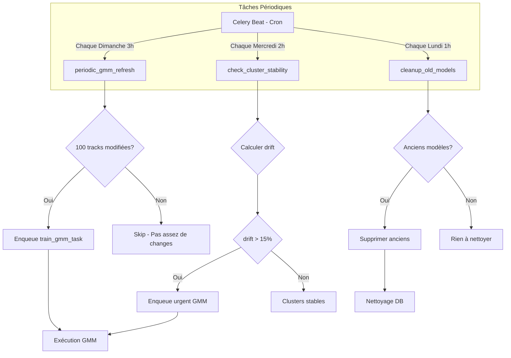

# Plan: Service GMM Clustering + Audio Features Embeddings - Worker

## Objectif

Migrer la logique de clustering GMM (Gaussian Mixture Model) et créer un service de vecteurs audio features enrichis avec les calculs MIR depuis `backend/api/` vers `backend_worker/services/` pour respecter l'architecture microservices avec optimisations Raspberry Pi 4, auto-queueing lors des scans et tâches périodiques de rafraîchissement.

## Architecture avec Tâches Périodiques

```
┌─────────────────────────────────────────────────────────────────────────────┐
│                    Architecture Vectorisation & Audio Features              │
├─────────────────────────────────────────────────────────────────────────────┤
│                                                                             │
│  ┌─────────────┐    ┌────────────────────┐    ┌─────────────────┐     │
│  │   Worker    │───▶│  Audio Features    │───▶│     API         │     │
│  │  (Celery)   │    │  Embeddings Service│    │   (FastAPI)     │     │
│  └─────────────┘    └────────────────────┘    └─────────────────┘     │
│         │                     │                         │                  │
│         │                     ▼                         │                  │
│         │           ┌────────────────────┐             │                  │
│         │           │  GMM Clustering    │             │                  │
│         │           │    Service        │             │                  │
│         │           └────────────────────┘             │                  │
│         │                     │                         │                  │
│         │         AUTO-QUEUE │                         │                  │
│         │◀────────────────────┘                         │                  │
│         │                                                 │                  │
│         ▼                                                 ▼                  │
│  ┌─────────────────────────────────────────────────────────────────┐     │
│  │                    Calculs ML (scikit-learn + numpy)            │     │
│  └─────────────────────────────────────────────────────────────────┘     │
│                                    │                                      │
│                                    ▼                                      │
│                       ┌─────────────────────────┐                         │
│                       │ PostgreSQL + sqlite-vec  │                         │
│                       │ (Embeddings & Clusters) │                         │
│                       └─────────────────────────┘                         │
│                                                                             │
│  ┌─────────────────────────────────────────────────────────────────┐     │
│  │                    Tâches Périodiques Celery                    │     │
│  │  ┌─────────────────────────────────────────────────────────┐   │     │
│  │  │  periodic_gmm_refresh - Tous les dimanches à 3h       │   │     │
│  │  │  check_cluster_stability - Tous les mercredis à 2h      │   │     │
│  │  │  cleanup_old_models - Tous les lundis à 1h             │   │     │
│  │  └─────────────────────────────────────────────────────────┘   │     │
│  └─────────────────────────────────────────────────────────────────┘     │
└─────────────────────────────────────────────────────────────────────────────┘
```

## Tâches Périodiques

### 1. `periodic_gmm_refresh`

Rafraîchit les clusters GMM selon un calendrier configurable.

```python
# Configuration du calendrier
PERIODIC_CONFIG = {
    'gmm_refresh': {
        'enabled': True,
        'schedule': 'cron',  # ou 'interval'
        'day_of_week': 'sun',  # Dimanche
        'hour': 3,  # 3h du matin (heures creuses)
        'minute': 0,
        'conditions': {
            'min_tracks_since_last': 100,  # Au moins 100 tracks ajoutées
            'days_since_last': 7,  # Ou 7 jours depuis dernier refresh
        }
    },
    'cluster_stability_check': {
        'enabled': True,
        'schedule': 'cron',
        'day_of_week': 'wed',  # Mercredi
        'hour': 2,
        'conditions': {
            'min_tracks_changed': 50,
            'drift_threshold': 0.15,  # Si drift > 15%, reclusteriser
        }
    },
    'cleanup_old_models': {
        'enabled': True,
        'schedule': 'cron',
        'day_of_week': 'mon',  # Lundi
        'hour': 1,
        'keep_count': 3,  # Garder les 3 derniers modèles
        'max_age_days': 30,  # Ou max 30 jours
    }
}
```

### Implémentation des Tâches Périodiques

```python
# Dans backend_worker/celery_tasks.py

@celery_app.task(
    bind=True,
    name='periodic_gmm_refresh',
    ignore_result=False,
    priority=5
)
def periodic_gmm_refresh_task(self):
    """
    Tâche périodique pour rafraîchir les clusters GMM.
    
    Exécution: Tous les dimanches à 3h (heures creuses)
    Conditions: Au moins 100 tracks ajoutées OU 7 jours depuis dernier refresh
    """
    from backend_worker.services.artist_clustering_service import ArtistClusteringService
    
    service = ArtistClusteringService()
    
    try:
        # Vérifier conditions d'exécution
        if not service.should_run_periodic_refresh():
            logger.info("[Periodic GMM] Conditions non remplies, skip")
            return {'status': 'skipped', 'reason': 'conditions_not_met'}
        
        # Récupérer les tracks modifiées depuis dernier refresh
        tracks_changed = service.get_tracks_since_last_refresh()
        
        if tracks_changed < 100:
            logger.info(f"[Periodic GMM] Pas assez de changements: {tracks_changed}/100")
            return {'status': 'skipped', 'reason': 'insufficient_changes'}
        
        logger.info(f"[Periodic GMM] Début refresh: {tracks_changed} tracks modifiées")
        
        # Enqueue le refresh GMM
        task = train_gmm_task.apply_async(
            args=[5],  # n_components par défaut
            kwargs={
                'refresh_mode': True,
                'tracks_changed': tracks_changed
            },
            priority=5,
            countdown=60  # Délai 1 minute
        )
        
        return {
            'status': 'queued',
            'task_id': task.id,
            'tracks_changed': tracks_changed
        }
        
    except Exception as e:
        logger.error(f"[Periodic GMM] Erreur: {e}")
        return {'status': 'error', 'message': str(e)}


@celery_app.task(
    bind=True,
    name='check_cluster_stability',
    ignore_result=False,
    priority=3
)
def check_cluster_stability_task(self):
    """
    Vérifie la stabilité des clusters et reclusterise si nécessaire.
    
    Exécution: Tous les mercredis à 2h
    """
    from backend_worker.services.artist_clustering_service import ArtistClusteringService
    
    service = ArtistClusteringService()
    
    try:
        # Calculer le drift des clusters
        drift_score = service.calculate_cluster_drift()
        
        logger.info(f"[Stability Check] Drift score: {drift_score:.3f}")
        
        if drift_score > 0.15:  # Seuil de 15%
            logger.warning(f"[Stability Check] Drift détecté: {drift_score:.3f}, reclusterisation")
            
            # Enqueue reclusterisation
            task = train_gmm_task.apply_async(
                args=[5],
                kwargs={
                    'refresh_mode': True,
                    'force_refresh': True,
                    'reason': f'instability_drift_{drift_score:.3f}'
                },
                priority=7,  # Haute priorité
                countdown=30
            )
            
            return {
                'status': 'reclustering_queued',
                'drift_score': drift_score,
                'task_id': task.id
            }
        
        return {
            'status': 'stable',
            'drift_score': drift_score
        }
        
    except Exception as e:
        logger.error(f"[Stability Check] Erreur: {e}")
        return {'status': 'error', 'message': str(e)}


@celery_app.task(
    bind=True,
    name='cleanup_old_models',
    ignore_result=False,
    priority=1  # Basse priorité
)
def cleanup_old_models_task(self):
    """
    Nettoie les vieux modèles GMM.
    
    Exécution: Tous les lundis à 1h
    Nettoie: Garder les 3 derniers modèles OU max 30 jours
    """
    from backend_worker.services.artist_clustering_service import ArtistClusteringService
    
    service = ArtistClusteringService()
    
    try:
        # Récupérer les modèles anciens
        old_models = service.get_old_models(keep_count=3, max_age_days=30)
        
        if not old_models:
            logger.info("[Cleanup] Aucun vieux modèle à supprimer")
            return {'status': 'clean', 'deleted_count': 0}
        
        # Supprimer les vieux modèles
        deleted = service.delete_models(old_models)
        
        logger.info(f"[Cleanup] {deleted} modèles supprimés")
        
        return {
            'status': 'completed',
            'deleted_count': deleted,
            'models_removed': [m.id for m in old_models]
        }
        
    except Exception as e:
        logger.error(f"[Cleanup] Erreur: {e}")
        return {'status': 'error', 'message': str(e)}
```

### Configuration Celery Beat

```python
# Dans backend_worker/celery_config.py ou directement dans celery_app

CELERY_BEAT_SCHEDULE = {
    'periodic-gmm-refresh': {
        'task': 'periodic_gmm_refresh',
        'schedule': crontab(hour=3, minute=0, day_of_week='sun'),
        'options': {'priority': 5}
    },
    'check-cluster-stability': {
        'task': 'check_cluster_stability',
        'schedule': crontab(hour=2, minute=0, day_of_week='wed'),
        'options': {'priority': 3}
    },
    'cleanup-old-models': {
        'task': 'cleanup_old_models',
        'schedule': crontab(hour=1, minute=0, day_of_week='mon'),
        'options': {'priority': 1}
    },
}
```

## Flux de Tâches Périodiques



## Services à Créer

### 1. `backend_worker/services/audio_features_embeddings.py`

Vecteurs de 64 dimensions avec formules MIR.

### 2. `backend_worker/services/gmm_clustering_service.py`

Clustering GMM optimisé RPi4.

### 3. `backend_worker/services/artist_clustering_service.py`

Orchestration avec:

- Auto-queueing lors des scans
- Vérification conditions périodiques
- Calcul de drift des clusters
- Nettoyage des vieux modèles

## Fichiers à Créer/Modifier

### Nouveaux fichiers

1. `backend_worker/services/audio_features_embeddings.py`
2. `backend_worker/services/gmm_clustering_service.py`
3. `backend_worker/services/artist_clustering_service.py`
4. `backend/api/routers/gmm_router.py`

### Fichiers à modifier

1. `backend_worker/celery_tasks.py` - Ajouter tâches périodiques
2. `backend_worker/celery_config.py` - Configurer CELERY_BEAT_SCHEDULE
3. `backend_worker/workers/scan/scan_worker.py` - Auto-queueing callback
4. `backend/api/routers/__init__.py`

### Fichiers à refactoriser

1. `backend/api/services/artist_embedding_service.py`

## Configuration Complete

```yaml
# config/gmm_config.yaml

gmm_clustering:
  # Auto-queueing lors des scans
  auto_queue:
    enabled: true
    min_artists: 50
    min_tracks: 500
    min_change_percent: 20
    batch_size: 500
    max_components: 10
    priority: 'high'
  
  # Tâches périodiques
  periodic:
    gmm_refresh:
      enabled: true
      schedule: 'cron'
      day_of_week: 'sun'
      hour: 3
      min_tracks_since_last: 100
      days_since_last: 7
    
    stability_check:
      enabled: true
      schedule: 'cron'
      day_of_week: 'wed'
      hour: 2
      min_tracks_changed: 50
      drift_threshold: 0.15
    
    cleanup:
      enabled: true
      schedule: 'cron'
      day_of_week: 'mon'
      hour: 1
      keep_count: 3
      max_age_days: 30
  
  # Retry configuration
  retry:
    enabled: true
    max_retries: 3
    backoff: true
```

## Validation

- [ ] Tâches périodiques exécutées selon le calendrier
- [ ] Auto-queueing déclenché après scan complet
- [ ] Drift des clusters détecté et reclusterisation
- [ ] Nettoyage des vieux modèles
- [ ] Les tests passent avec `pytest -x`
- [ ] Le projet démarre dans Docker
