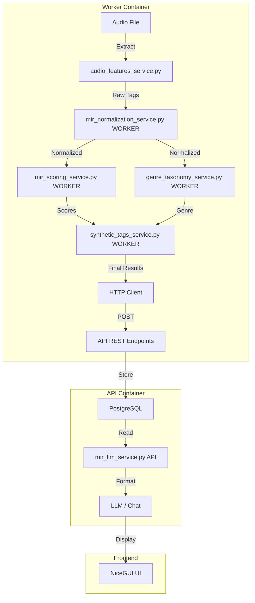
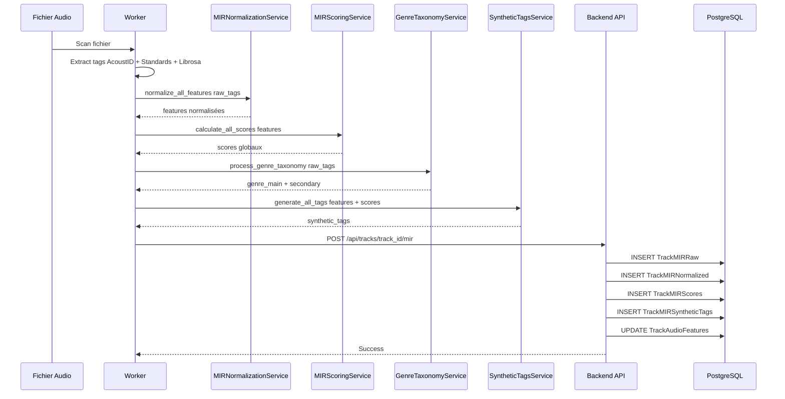
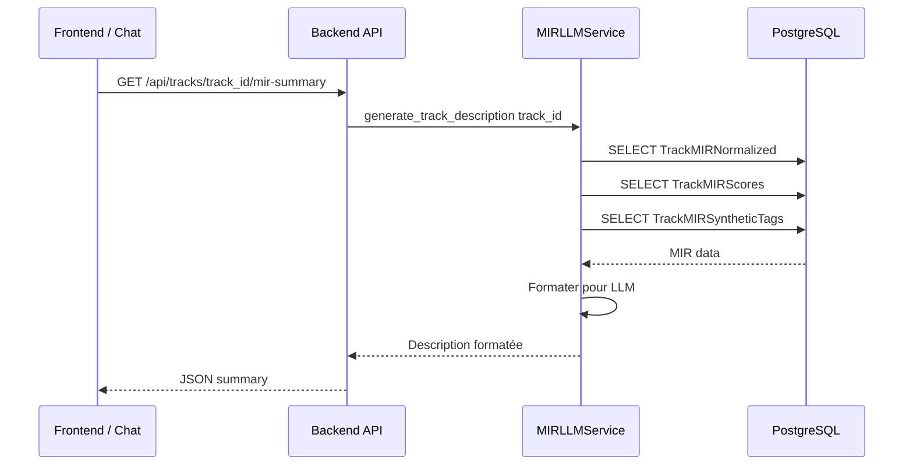

# Architecture MIR Sans Doublons - SoniqueBay

## 🔴 Problème Identifié

Le plan [`backend_worker_mir_implementation_plan.md`](backend_worker_mir_implementation_plan.md) propose de créer des services MIR dans [`backend_worker/services/`](../../backend_worker/services/) alors qu'ils existent DÉJÀ dans [`backend/api/services/`](../../backend/api/services/).

**Services MIR existants dans backend/api/services :**

- [`mir_normalization_service.py`](../../backend/api/services/mir_normalization_service.py) ✅
- [`mir_scoring_service.py`](../../backend/api/services/mir_scoring_service.py) ✅
- [`genre_taxonomy_service.py`](../../backend/api/services/genre_taxonomy_service.py) ✅
- [`synthetic_tags_service.py`](../../backend/api/services/synthetic_tags_service.py) ✅
- [`mir_llm_service.py`](../../backend/api/services/mir_llm_service.py) ✅

**Violation architecturale actuelle :**
Le fichier [`audio_features_service.py:846`](../../backend_worker/services/audio_features_service.py:846) importe ILLÉGALEMENT :

```python
from backend.api.services.mir_normalization_service import MIRNormalizationService
```

**❌ INTERDIT :** `backend` et `backend_worker` sont dans des conteneurs Docker SÉPARÉS. Ils NE PEUVENT PAS s'importer mutuellement.

---

## ✅ Solution Architecturale Correcte

### Principe : **Calcul côté Worker, Stockage via API**

Selon les règles de SoniqueBay :

- *"Le code métier lourd va dans les Services ou Workers"*
- *"L'API ne fait que de la validation et du dispatch"*
- *"Celery pour tout traitement > 500ms"*

**Décision architecturale :** Les services MIR de calcul DOIVENT être dupliqués dans le worker, les services d'exposition restent dans l'API.

---

## Architecture Cible



---

## Séparation des Responsabilités

### 🔧 backend_worker (Conteneur Worker)

**Services de CALCUL MIR** - Calculent les caractéristiques audio

| Service | Fichier | Responsabilité | Dépendances |
|---------|---------|----------------|-------------|
| **MIRNormalizationService** | `backend_worker/services/mir_normalization_service.py` | Normalise tags bruts → scores [0-1] | `backend_worker.utils.logging` |
| **MIRScoringService** | `backend_worker/services/mir_scoring_service.py` | Calcule scores globaux (energy, valence, etc.) | `backend_worker.utils.logging` |
| **GenreTaxonomyService** | `backend_worker/services/genre_taxonomy_service.py` | Vote pondéré pour genres | `backend_worker.utils.logging` |
| **SyntheticTagsService** | `backend_worker/services/synthetic_tags_service.py` | Génère tags synthétiques | `backend_worker.utils.logging` |
| **MIRPipelineService** | `backend_worker/services/mir_pipeline_service.py` | Orchestre le pipeline complet | Services MIR locaux |

**Communication :**

- Envoie les résultats FINAUX à l'API via HTTPX (REST)
- Utilise Redis PubSub pour la progression (SSE)

### 🌐 backend/api (Conteneur API)

**Services d'EXPOSITION MIR** - Lisent et formatent les données pour les LLMs

| Service | Fichier | Responsabilité | Dépendances |
|---------|---------|----------------|-------------|
| **MIRLLMService** | `backend/api/services/mir_llm_service.py` | Expose données MIR aux LLMs | `backend.api.utils.logging` + DB |

**Suppression des services de calcul** :

- ❌ **mir_normalization_service.py** → Supprimer de l'API (dupliquer dans worker)
- ❌ **mir_scoring_service.py** → Supprimer de l'API (dupliquer dans worker)
- ❌ **genre_taxonomy_service.py** → Supprimer de l'API (dupliquer dans worker)
- ❌ **synthetic_tags_service.py** → Supprimer de l'API (dupliquer dans worker)
- ✅ **mir_llm_service.py** → Conserver (exposition aux LLMs)

---

## Pipeline MIR Complet

### Phase 1 : Extraction dans Worker



### Phase 2 : Exposition via API



---

## Endpoints API Requis

### POST `/api/tracks/{track_id}/mir` - **Stockage complet MIR**

**Payload Worker → API :**

```json
{
  "raw": {
    "tags": ["ab:hi:genre_tzanetakis:rock", "ab:mood:happy"],
    "source": "acoustid+standards+librosa",
    "version": "1.0"
  },
  "normalized": {
    "bpm": 128.0,
    "key": "C",
    "scale": "major",
    "camelot_key": "8B",
    "danceability": 0.8,
    "mood_happy": 0.7,
    "mood_aggressive": 0.1,
    "mood_party": 0.6,
    "mood_relaxed": 0.3,
    "instrumental": 0.2,
    "acoustic": 0.1,
    "tonal": 0.9,
    "genre_main": "rock",
    "genre_secondary": ["alternative", "indie"],
    "confidence_score": 0.85
  },
  "scores": {
    "energy_score": 0.72,
    "mood_valence": 0.45,
    "dance_score": 0.81,
    "acousticness": 0.15,
    "complexity_score": 0.68,
    "emotional_intensity": 0.7
  },
  "synthetic_tags": [
    {"tag": "energetic", "score": 0.8, "category": "mood", "source": "calculated"},
    {"tag": "dancefloor", "score": 0.85, "category": "atmosphere", "source": "calculated"},
    {"tag": "workout", "score": 0.75, "category": "usage", "source": "calculated"}
  ]
}
```

**Traitement API :**

1. Stocke `raw` dans [`TrackMIRRaw`](../../backend/api/models/track_mir_raw_model.py)
2. Stocke `normalized` dans [`TrackMIRNormalized`](../../backend/api/models/track_mir_normalized_model.py)
3. Stocke `scores` dans [`TrackMIRScores`](../../backend/api/models/track_mir_scores_model.py)
4. Stocke chaque tag de `synthetic_tags` dans [`TrackMIRSyntheticTags`](../../backend/api/models/track_mir_synthetic_tags_model.py)
5. Met à jour [`TrackAudioFeatures`](../../backend/api/models/track_audio_features_model.py) avec les champs compatibles

### GET `/api/tracks/{track_id}/mir-summary` - **Exposition pour LLM**

**Response API → Frontend :**

```json
{
  "track_id": 1,
  "summary": "un titre rock au mood joyeux et énergétique, plutôt dansable avec un BPM de 128 (clé Camelot: 8B). Tags: energetic, dancefloor, workout",
  "context": {
    "genre": "rock",
    "mood": "happy",
    "energy": 0.72,
    "danceability": 0.8,
    "bpm": 128,
    "key": "8B",
    "synthetic_tags": ["energetic", "dancefloor", "workout"],
    "source": "acoustid+standards+librosa"
  },
  "search_suggestions": [
    "musique rock",
    "rock pour danser",
    "musique énergique pour le sport",
    "pistes punchy et puissantes"
  ]
}
```

---

## Justification de la Duplication

### Pourquoi dupliquer les services de calcul MIR ?

1. **Isolation des conteneurs** : `backend` et `backend_worker` ne peuvent PAS s'importer mutuellement.

2. **Separation of Concerns** :
   - **Worker :** Calcul intensif (normalisation, scoring, taxonomie, tags)
   - **API :** Exposition légère (lecture, formatage pour LLM)

3. **Performance Raspberry Pi** :
   - Les calculs lourds dans le worker ne bloquent JAMAIS l'API
   - L'API reste réactive pour le chat et la recherche

4. **Évolutivité** :
   - Le worker peut être mis à l'échelle indépendamment
   - L'API peut utiliser le cache Redis pour les lectures

### Services à dupliquer (Worker uniquement)

| Service | Taille | Justification Duplication |
|---------|--------|---------------------------|
| `mir_normalization_service.py` | ~720 lignes | Calcul intensif, aucune DB |
| `mir_scoring_service.py` | ~486 lignes | Calcul intensif, aucune DB |
| `genre_taxonomy_service.py` | ~401 lignes | Calcul intensif, aucune DB |
| `synthetic_tags_service.py` | ~453 lignes | Calcul intensif, aucune DB |

**Total :** ~2060 lignes de code pur calcul, **AUCUN accès DB**, facilement testable unitairement.

### Services à supprimer de l'API

Les services de calcul dans `backend/api/services/` doivent être **supprimés** car :

- Ils ne peuvent PAS être utilisés par le worker (conteneur séparé)
- Ils ne doivent PAS être utilisés par l'API (violation Separation of Concerns)
- Seul [`mir_llm_service.py`](../../backend/api/services/mir_llm_service.py) reste pour l'exposition

---

## Comparaison des Approches

### ❌ Approche Actuelle (INVALIDE)

```python
# backend_worker/services/audio_features_service.py:846
from backend.api.services.mir_normalization_service import MIRNormalizationService  # INTERDIT!
```

**Problèmes :**

- Import impossible (conteneurs séparés)
- Violation de l'isolation Docker
- Crash au runtime

### ✅ Approche Correcte

**Worker :** Calcul complet avec services locaux

```python
# backend_worker/services/audio_features_service.py
from backend_worker.services.mir_normalization_service import MIRNormalizationService
from backend_worker.services.mir_scoring_service import MIRScoringService
from backend_worker.services.genre_taxonomy_service import GenreTaxonomyService
from backend_worker.services.synthetic_tags_service import SyntheticTagsService

# Pipeline complet
normalized = MIRNormalizationService().normalize_all_features(raw)
scores = MIRScoringService().calculate_all_scores(normalized)
taxonomy = GenreTaxonomyService().process_genre_taxonomy(raw)
tags = SyntheticTagsService().generate_all_tags(normalized, scores)

# Envoyer à l'API
await send_to_api(track_id, {"raw": raw, "normalized": normalized, "scores": scores, "synthetic_tags": tags})
```

**API :** Exposition légère

```python
# backend/api/services/mir_llm_service.py
from backend.api.models.track_mir_normalized_model import TrackMIRNormalized
from backend.api.models.track_mir_scores_model import TrackMIRScores

# Lecture depuis DB
mir_data = await get_mir_data(track_id)
summary = self.generate_track_summary(track_id, mir_data)
```

---

## Structure des Fichiers

### backend_worker/services/ (CALCUL)

```
backend_worker/services/
├── mir_normalization_service.py    ✨ À CRÉER (duplication nécessaire)
├── mir_scoring_service.py          ✨ À CRÉER (duplication nécessaire)
├── genre_taxonomy_service.py       ✨ À CRÉER (duplication nécessaire)
├── synthetic_tags_service.py       ✨ À CRÉER (duplication nécessaire)
├── mir_pipeline_service.py         ✨ À CRÉER (orchestrateur)
└── audio_features_service.py       ✏️ À REFACTORISER (enlever import backend.api)
```

### backend/api/services/ (EXPOSITION)

```
backend/api/services/
├── mir_normalization_service.py    ❌ À SUPPRIMER (doit être dans worker)
├── mir_scoring_service.py          ❌ À SUPPRIMER (doit être dans worker)
├── genre_taxonomy_service.py       ❌ À SUPPRIMER (doit être dans worker)
├── synthetic_tags_service.py       ❌ À SUPPRIMER (doit être dans worker)
└── mir_llm_service.py              ✅ À CONSERVER (exposition LLM)
```

---

## Données Échangées entre Worker et API

### Worker → API (Résultats MIR)

**Endpoint :** `POST /api/tracks/{track_id}/mir`

**Payload complet :**

```python
{
    "raw": {
        "tags": list[str],                # Tags AcoustID bruts
        "source": "acoustid+standards+librosa",
        "version": "1.0",
        "features_raw": dict              # Features brutes complètes
    },
    "normalized": {
        "bpm": float,
        "key": str,
        "scale": str,
        "camelot_key": str,
        "danceability": float,            # [0-1]
        "mood_happy": float,              # [0-1]
        "mood_aggressive": float,         # [0-1]
        "mood_party": float,              # [0-1]
        "mood_relaxed": float,            # [0-1]
        "instrumental": float,            # [0-1]
        "acoustic": float,                # [0-1]
        "tonal": float,                   # [0-1]
        "genre_main": str,
        "genre_secondary": list[str],
        "confidence_score": float         # [0-1]
    },
    "scores": {
        "energy_score": float,            # [0-1]
        "mood_valence": float,            # [-1 à +1]
        "dance_score": float,             # [0-1]
        "acousticness": float,            # [0-1]
        "complexity_score": float,        # [0-1]
        "emotional_intensity": float      # [0-1]
    },
    "synthetic_tags": [
        {
            "tag": str,                   # Nom du tag
            "score": float,               # [0-1]
            "category": str,              # "mood", "energy", "atmosphere", "usage"
            "source": "calculated"
        }
    ]
}
```

### API → Frontend (Summary LLM)

**Endpoint :** `GET /api/tracks/{track_id}/mir-summary`

**Response :**

```python
{
    "track_id": int,
    "summary": str,                       # Description textuelle
    "context": {
        "genre": str,
        "mood": str,
        "energy": float,
        "danceability": float,
        "bpm": int,
        "key": str,
        "synthetic_tags": list[str],
        "source": str
    },
    "search_suggestions": list[str]       # Suggestions de recherche
}
```

---

## Modifications à Effectuer

### 1. Créer les Services MIR dans Worker

**Copier les fichiers depuis `backend/api/services/` vers `backend_worker/services/` :**

```python
# backend_worker/services/mir_normalization_service.py
from backend_worker.utils.logging import logger  # ✅ Import local

class MIRNormalizationService:
    # ... Code identique à backend/api/services/mir_normalization_service.py
```

**Modifications requises :**

- Changer `from backend.api.utils.logging import logger` → `from backend_worker.utils.logging import logger`
- Aucun autre changement nécessaire (services purs sans DB)

### 2. Créer MIRPipelineService dans Worker

**Nouveau fichier :** `backend_worker/services/mir_pipeline_service.py`

```python
"""
Service d'orchestration du pipeline MIR complet.
Utilise les services de calcul locaux au worker.
"""
import httpx
import os
from typing import Dict, Any
from backend_worker.utils.logging import logger

from backend_worker.services.mir_normalization_service import MIRNormalizationService
from backend_worker.services.mir_scoring_service import MIRScoringService
from backend_worker.services.genre_taxonomy_service import GenreTaxonomyService
from backend_worker.services.synthetic_tags_service import SyntheticTagsService


class MIRPipelineService:
    """Orchestrateur du pipeline MIR complet dans le worker."""
    
    def __init__(self):
        self.normalization_service = MIRNormalizationService()
        self.scoring_service = MIRScoringService()
        self.taxonomy_service = GenreTaxonomyService()
        self.synthetic_tags_service = SyntheticTagsService()
        self.api_url = os.getenv("API_URL", "http://api:8001")
    
    async def process_track_mir(self, track_id: int, file_path: str, tags: dict) -> dict:
        """
        Pipeline complet MIR pour une track.
        
        Args:
            track_id: ID de la track
            file_path: Chemin vers le fichier audio
            tags: Tags AcoustID + standards
            
        Returns:
            Résultats complets du pipeline
        """
        logger.info(f"[MIR PIPELINE] Démarrage pour track_id={track_id}")
        
        # Étape 1: Tags bruts
        raw_features = self._extract_raw_features(tags)
        
        # Étape 2: Normalisation
        normalized_features = self.normalization_service.normalize_all_features(raw_features)
        
        # Étape 3: Calcul scores
        scores = self.scoring_service.calculate_all_scores(normalized_features)
        
        # Étape 4: Taxonomie genres
        genre_votes = self.taxonomy_service.extract_genres_from_tags(raw_features)
        genre_main, genre_conf = self.taxonomy_service.vote_genre_main(genre_votes)
        genre_secondary = self.taxonomy_service.extract_genre_secondary(genre_votes)
        
        normalized_features['genre_main'] = genre_main
        normalized_features['genre_secondary'] = genre_secondary
        
        # Étape 5: Tags synthétiques
        synthetic_tags = self.synthetic_tags_service.generate_all_tags(normalized_features, scores)
        
        # Étape 6: Envoyer à l'API
        result = {
            "raw": {
                "tags": raw_features.get('tags', []),
                "source": "acoustid+standards+librosa",
                "version": "1.0",
                "features_raw": raw_features
            },
            "normalized": normalized_features,
            "scores": scores,
            "synthetic_tags": synthetic_tags
        }
        
        success = await self._send_to_api(track_id, result)
        
        if success:
            logger.info(f"[MIR PIPELINE] Succès pour track_id={track_id}")
        else:
            logger.error(f"[MIR PIPELINE] Échec stockage API pour track_id={track_id}")
        
        return result
    
    def _extract_raw_features(self, tags: dict) -> dict:
        """Extrait les features brutes depuis les tags."""
        return {"tags": list(tags.keys()), **tags}
    
    async def _send_to_api(self, track_id: int, result: dict) -> bool:
        """Envoie les résultats MIR à l'API."""
        try:
            async with httpx.AsyncClient(timeout=60.0) as client:
                response = await client.post(
                    f"{self.api_url}/api/tracks/{track_id}/mir",
                    json=result
                )
                response.raise_for_status()
                return True
        except Exception as e:
            logger.error(f"[MIR PIPELINE] Erreur envoi API: {e}")
            return False
```

### 3. Refactoriser audio_features_service.py

**Modifications dans [`backend_worker/services/audio_features_service.py`](../../backend_worker/services/audio_features_service.py) :**

**AVANT (ligne 846) :**

```python
from backend.api.services.mir_normalization_service import MIRNormalizationService  # ❌ INTERDIT
```

**APRÈS :**

```python
from backend_worker.services.mir_normalization_service import MIRNormalizationService  # ✅ CORRECT
from backend_worker.services.mir_pipeline_service import MIRPipelineService

# Remplacer toutes les fonctions extract_and_store_mir_raw, normalize_and_store_mir, etc.
# Par des appels à MIRPipelineService
```

### 4. Supprimer Services de Calcul de l'API

Une fois les services copiés dans le worker, **supprimer de l'API** :

- ❌ [`backend/api/services/mir_normalization_service.py`](../../backend/api/services/mir_normalization_service.py)
- ❌ [`backend/api/services/mir_scoring_service.py`](../../backend/api/services/mir_scoring_service.py)
- ❌ [`backend/api/services/genre_taxonomy_service.py`](../../backend/api/services/genre_taxonomy_service.py)
- ❌ [`backend/api/services/synthetic_tags_service.py`](../../backend/api/services/synthetic_tags_service.py)

**Conserver uniquement :**

- ✅ [`mir_llm_service.py`](../../backend/api/services/mir_llm_service.py) - Exposition pour LLM

### 5. Créer Router API pour MIR

**Nouveau fichier :** `backend/api/routers/mir_router.py`

```python
from fastapi import APIRouter, HTTPException, Depends
from sqlalchemy.ext.asyncio import AsyncSession

from backend.api.utils.database import get_async_session
from backend.api.services.mir_llm_service import MIRLLMService
from backend.api.models.track_mir_raw_model import TrackMIRRaw
from backend.api.models.track_mir_normalized_model import TrackMIRNormalized
from backend.api.models.track_mir_scores_model import TrackMIRScores
from backend.api.models.track_mir_synthetic_tags_model import TrackMIRSyntheticTags

router = APIRouter(prefix="/api/tracks", tags=["MIR"])


@router.post("/{track_id}/mir", status_code=201)
async def store_mir_data(
    track_id: int,
    payload: dict,
    db: AsyncSession = Depends(get_async_session)
):
    """
    Stocke toutes les données MIR pour une track.
    Endpoint utilisé par le worker après calcul.
    """
    # Stocker raw
    raw_data = TrackMIRRaw(track_id=track_id, **payload["raw"])
    db.add(raw_data)
    
    # Stocker normalized
    normalized_data = TrackMIRNormalized(track_id=track_id, **payload["normalized"])
    db.add(normalized_data)
    
    # Stocker scores
    scores_data = TrackMIRScores(track_id=track_id, **payload["scores"])
    db.add(scores_data)
    
    # Stocker synthetic tags
    for tag in payload["synthetic_tags"]:
        tag_data = TrackMIRSyntheticTags(
            track_id=track_id,
            tag_name=tag["tag"],
            tag_score=tag["score"],
            tag_category=tag["category"],
            tag_source=tag["source"]
        )
        db.add(tag_data)
    
    await db.commit()
    return {"success": True, "track_id": track_id}


@router.get("/{track_id}/mir-summary")
async def get_mir_summary(
    track_id: int,
    db: AsyncSession = Depends(get_async_session)
):
    """
    Génère un résumé MIR pour les LLMs.
    Endpoint utilisé par le chat et le frontend.
    """
    service = MIRLLMService(db)
    mir_data = await service.get_mir_data(track_id)
    
    if not mir_data:
        raise HTTPException(status_code=404, detail="MIR data not found")
    
    summary = service.generate_track_summary(track_id, mir_data)
    context = service.generate_mir_context(track_id, mir_data)
    suggestions = service.generate_search_query_suggestions(mir_data)
    
    return {
        "track_id": track_id,
        "summary": summary,
        "context": context,
        "search_suggestions": suggestions
    }
```

---

## Avantages de Cette Architecture

| Aspect | Avantage |
|--------|----------|
| **Isolation** | Conteneurs complètement indépendants |
| **Performance** | Calculs lourds ne bloquent jamais l'API |
| **Scalabilité** | Worker peut être mis à l'échelle indépendamment |
| **Testabilité** | Services de calcul testables unitairement sans DB |
| **Maintenance** | Séparation claire : calcul (worker) vs exposition (API) |
| **Raspberry Pi** | API reste légère et réactive pour le chat/frontend |

---

## Désavantages et Mitigation

| Désavantage | Impact | Mitigation |
|-------------|--------|------------|
| **Duplication code** | ~2060 lignes dupliquées | Code pur calcul, aucune DB, facilement testable |
| **Maintenance** | 2 copies à maintenir | Services stables (formules mathématiques fixes) |
| **Synchronisation** | Risque de drift | Tests d'intégration Worker ↔ API obligatoires |

**Conclusion :** La duplication est **nécessaire et justifiée** pour respecter l'architecture microservices et les contraintes Docker.

---

## Tests Requis

### Tests Worker (Calcul)

```python
# tests/worker/services/test_mir_normalization_service.py
def test_normalize_bpm():
    service = MIRNormalizationService()
    assert service.normalize_bpm(120) == pytest.approx(0.428, abs=0.01)

# tests/worker/services/test_mir_pipeline_service.py
async def test_process_track_mir():
    pipeline = MIRPipelineService()
    result = await pipeline.process_track_mir(1, "/path/to/file.mp3", {})
    assert "normalized" in result
    assert "scores" in result
```

### Tests API (Exposition)

```python
# tests/backend/test_api/test_mir_router.py
async def test_store_mir_data():
    response = await client.post("/api/tracks/1/mir", json={...})
    assert response.status_code == 201

async def test_get_mir_summary():
    response = await client.get("/api/tracks/1/mir-summary")
    assert response.status_code == 200
    assert "summary" in response.json()
```

### Tests d'Intégration

```python
# tests/integration/test_mir_worker_to_api.py
async def test_full_mir_pipeline():
    """Test le pipeline complet du worker vers l'API."""
    # 1. Worker calcule
    from backend_worker.services.mir_pipeline_service import MIRPipelineService
    pipeline = MIRPipelineService()
    result = await pipeline.process_track_mir(1, "/test.mp3", {...})
    
    # 2. API lit
    from backend.api.services.mir_llm_service import MIRLLMService
    llm = MIRLLMService(db)
    summary = await llm.generate_track_description_for_llm(1, "Test", "Artist")
    
    assert summary is not None
```

---

## Conclusion

**L'architecture correcte est :**

1. **Worker (backend_worker) :** Calcule TOUT localement avec services MIR dupliqués
2. **API (backend) :** Stocke les résultats et expose pour les LLMs
3. **Communication :** Worker → API via REST (HTTPX), API → Frontend via REST/GraphQL

**La duplication des services de calcul MIR est NÉCESSAIRE et JUSTIFIÉE** pour respecter l'architecture microservices Docker et les règles de Separation of Concerns.
