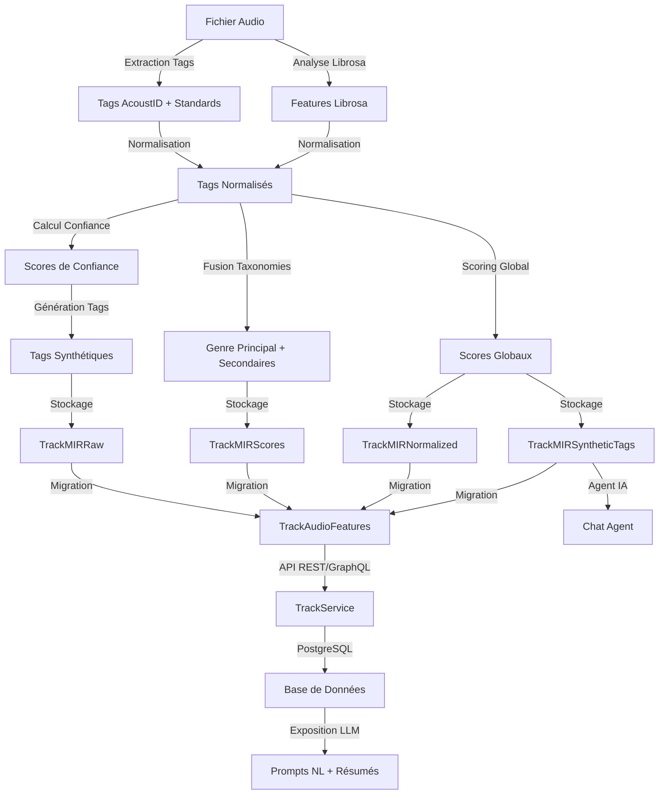

# Plan d'Implémentation du Système MIR - SoniqueBay

## Vue d'ensemble

Ce plan détaille l'implémentation d'un système complet de **Music Information Retrieval (MIR)** pour SoniqueBay, en s'intégrant avec le plan existant de migration du modèle Track. Le système utilise actuellement les tags AcoustID + standards et Librosa, et prépare l'architecture pour l'intégration d'Essentia dans le futur.

## Objectifs

1. **Stockage des données MIR brutes** - Conserver l'intégralité des tags MIREX/AcousticBrainz sans perte d'information
2. **Normalisation des sorties MIR** - Convertir les sorties binaires en scores continus exploitables
3. **Calcul des scores de confiance** - Évaluer la fiabilité de chaque caractéristique
4. **Fusion des taxonomies de genres** - Vote pondéré entre GTZAN, ROSAMERICA, DORTMUND, Electronic
5. **Génération de tags synthétiques** - Créer des concepts haut niveau (dark, bright, energetic, etc.)
6. **Système de scoring global** - Scores énergétiques, émotionnels, de danseabilité
7. **Intégration base de données** - Schéma SQLAlchemy compatible avec le plan Track existant
8. **Exploitation par les LLM** - Exposer les données pour l'agent conversationnel

---

## État Actuel - Analyse

### Infrastructure Existante

Le projet dispose déjà de:

| Composant | Fichier | Rôle |
|------------|---------|------|
| **Tags AcoustID** | [`audio_features_service.py`](backend_worker/services/audio_features_service.py:443-626) | Extraction des tags `ab:hi:*`, `ab:lo:*` |
| **Tags Standards** | [`audio_features_service.py`](backend_worker/services/audio_features_service.py:316-440) | Extraction BPM, KEY, MOOD, DANCEABILITY |
| **Analyse Librosa** | [`audio_features_service.py`](backend_worker/services/audio_features_service.py:10-106) | Fallback pour BPM, key, spectral features |
| **Tâches Celery** | [`audio_analysis_tasks.py`](backend_worker/tasks/audio_analysis_tasks.py) | Orchestration de l'analyse audio |
| **Modèle Track** | [`tracks_model.py`](backend/api/models/tracks_model.py:44-56) | Champs audio actuels (bpm, key, mood_*, etc.) |
| **Tags existants** | [`tags_model.py`](backend/api/models/tags_model.py) | GenreTag, MoodTag avec relations many-to-many |

### Tags AcoustID Réels Extraits

Exemple concret de tags extraits depuis les fichiers audio:

**Tags Standards:**
- `key`, `bpm`, `year`, `genre`, `artist`, `album`, `track`, `title`
- `disc`, `tracknumber`, `totaltracks`, `totaldiscs`, `disctotal`, `tracktotal`, `trackc`, `discc`, `discnumber`, `discsubtitle`
- `language`, `media`, `encoder`, `encodedby`, `mixer`, `arranger`, `lyricist`, `composer`, `writer`, `producer`, `performer`, `engineer`, `publisher`, `label`, `catalognumber`, `barcode`, `asin`, `isrc`, `work`, `script`, `description`, `comment`, `grouping`, `originaldate`, `originalyear`, `date`, `releasetype`, `releasestatus`, `releasecountry`
- `musicbrainz_albumtype`, `musicbrainz_albumstatus`, `musicbrainz_albumcomment`, `musicbrainz_albumid`, `musicbrainz_albumartistid`, `musicbrainz_artistid`, `musicbrainz_trackid`, `musicbrainz_workid`, `musicbrainz_releasetrackid`, `musicbrainz_releasegroupid`, `acoustid_id`, `acoustid_fingerprint`

**Tags AcoustID High-Level (ab:hi:*):**

| Catégorie | Tags AcoustID | Description |
|-----------|----------------|-------------|
| **ISMIR04 Rhythm** | `ab:hi:ismir04_rhythm:rumba-misc`, `rumba-american`, `samba`, `tango`, `jive`, `quickstep`, `chachacha`, `viennesewaltz`, `waltz`, `rumba-international` | Styles rythmiques |
| **Genre Tzanetakis** | `ab:hi:genre_tzanetakis:hiphop`, `jazz`, `classical`, `reggae`, `disco`, `blues`, `pop`, `country`, `rock`, `metal` | Taxonomie GTZAN |
| **Genre ROSAMERICA** | `ab:hi:genre_rosamerica:classical`, `rhythm and blues`, `hiphop`, `jazz`, `pop`, `dance`, `rock`, `speech` | Taxonomie ROSAMERICA |
| **Genre DORTMUND** | `ab:hi:genre_dortmund:rap/hiphop`, `alternative`, `electronic`, `jazz`, `rock`, `blues`, `folk/country`, `funk/soul/rnb`, `pop` | Taxonomie DORTMUND |
| **Genre Electronic** | `ab:hi:genre_electronic:drum and bass`, `ambient`, `house`, `techno`, `trance` | Sous-genres électroniques |
| **Moods MIREX** | `ab:hi:moods_mirex:humorous, silly, campy, quirky, whimsical, witty, wry`, `aggressive, fiery, tense/anxious, intense, volatile, visceral`, `passionate, rousing, confident, boisterous, rowdy`, `rollicking, cheerful, fun, sweet, amiable/good natured`, `literate, poignant, wistful, bittersweet, autumnal, brooding` | Moods complexes MIREX |
| **Mood Happy** | `ab:hi:mood_happy:happy`, `not happy` | Mood happy (opposition) |
| **Mood Sad** | `ab:hi:mood_sad:sad`, `not sad` | Mood sad (opposition) |
| **Mood Aggressive** | `ab:hi:mood_aggressive:aggressive`, `not aggressive` | Mood aggressive (opposition) |
| **Mood Party** | `ab:hi:mood_party:party`, `not party` | Mood party (opposition) |
| **Mood Relaxed** | `ab:hi:mood_relaxed:relaxed`, `not relaxed` | Mood relaxed (opposition) |
| **Mood Acoustic** | `ab:hi:mood_acoustic:acoustic`, `not acoustic` | Mood acoustic (opposition) |
| **Mood Electronic** | `ab:hi:mood_electronic:not electronic`, `electronic` | Mood electronic (opposition) |
| **Danceability** | `ab:hi:danceability:danceable`, `not danceable` | Danseabilité (opposition) |
| **Timbre** | `ab:hi:timbre:dark`, `bright` | Timbre sonore |
| **Tonal/Atonal** | `ab:hi:tonal_atonal:atonal`, `tonal` | Caractère tonal/atonal |
| **Voice/Instrumental** | `ab:hi:voice_instrumental:instrumental`, `voice` | Voix vs instrumental |
| **Gender** | `ab:hi:gender:female`, `male` | Genre vocal |

**Tags AcoustID Low-Level (ab:lo:*):**
- `ab:lo:rhythm:bpm` - BPM extrait
- `ab:lo:tonal:chords_changes_rate` - Taux de changement d'accords
- `ab:lo:tonal:chords_scale` - Échelle des accords
- `ab:lo:tonal:key_key` - Tonalité (key)
- `ab:lo:tonal:chords_key` - Key des accords

### Contraintes

- ✅ Utiliser les tags existants (AcoustID + standards) et Librosa
- ✅ Essentia sera implémenté dans un 2ème temps
- ✅ S'intégrgre avec le plan [`track_model_evolution_plan.md`](docs/plans/track_model_evolution_plan.md)
- ✅ Compatible avec l'architecture existante (FastAPI, GraphQL, Celery, PostgreSQL)
- ✅ Optimisé pour Raspberry Pi 4 (CPU, RAM, stockage)

---

## Architecture Cible

### Diagramme Mermaid - Pipeline MIR Complète



### Diagramme Mermaid - Schéma de Base de Données

```mermaid
erDiagram
    Track ||--|| TrackAudioFeatures : 1:1
    Track ||--o{ TrackMIRRaw : 1:1
    Track ||--o{ TrackMIRNormalized : 1:1
    Track ||--o{ TrackMIRScores : 1:1
    Track ||--o{ TrackMIRSyntheticTags : 1:N
    Track }o--|| Artist : N:1
    Track }o--o| Album : N:1
    Track }o--o{ Genre : N:N
    Track }o--o{ GenreTag : N:N
    Track }o--o{ MoodTag : N:N
    
    Track {
        int id PK
        string title
        string path UK
        int track_artist_id FK
        int album_id FK
        int duration
        string track_number
        string disc_number
        string year
        string file_type
        int bitrate
        float file_mtime
        int file_size
        string featured_artists
        string musicbrainz_id UK
        string musicbrainz_albumid
        string musicbrainz_artistid
        string musicbrainz_albumartistid
        string acoustid_fingerprint
        datetime date_added
        datetime date_modified
    }
    
    TrackMIRRaw {
        int id PK
        int track_id FK UK
        jsonb features_raw
        string mir_source
        string mir_version
        datetime analyzed_at
        datetime date_added
        datetime date_modified
    }
    
    TrackMIRNormalized {
        int id PK
        int track_id FK UK
        float bpm
        string key
        string scale
        float danceability
        float mood_happy
        float mood_aggressive
        float mood_party
        float mood_relaxed
        float instrumental
        float acoustic
        float tonal
        string genre_main
        string genre_secondary
        string camelot_key
        float confidence_score
        datetime normalized_at
        datetime date_added
        datetime date_modified
    }
    
    TrackMIRScores {
        int id PK
        int track_id FK UK
        float energy_score
        float mood_valence
        float dance_score
        float acousticness
        float complexity_score
        float emotional_intensity
        datetime calculated_at
        datetime date_added
        datetime date_modified
    }
    
    TrackMIRSyntheticTags {
        int id PK
        int track_id FK
        string tag_name
        float tag_score
        string tag_category
        string tag_source
        datetime created_at
        datetime date_added
        datetime date_modified
    }
```

---

## Plan d'Implémentation

### Phase 1: Création des modèles de données MIR

#### 1.1 Créer TrackMIRRaw

**Fichier:** `backend/api/models/track_mir_raw_model.py`

**Objectif:** Stocker l'intégralité des tags MIR bruts (AcoustID + standards)

| Champ | Type | Description |
|-------|------|-------------|
| `id` | Integer | Clé primaire |
| `track_id` | Integer FK | Référence vers [`Track.id`](backend/api/models/tracks_model.py:15) (UNIQUE) |
| `features_raw` | JSONB | Tags MIR bruts (AcoustID + standards) |
| `mir_source` | String | Source MIR (acoustid, standards, librosa, essentia) |
| `mir_version` | String | Version du modèle MIR |
| `analyzed_at` | DateTime | Date de l'analyse |
| `date_added` | DateTime | Date d'ajout |
| `date_modified` | DateTime | Date de modification |

**Index:**
- `idx_track_mir_raw_track_id` sur `track_id` (UNIQUE)
- `idx_track_mir_raw_source` sur `mir_source`
- `idx_track_mir_raw_analyzed_at` sur `analyzed_at`

#### 1.2 Créer TrackMIRNormalized

**Fichier:** `backend/api/models/track_mir_normalized_model.py`

**Objectif:** Stocker les tags MIR normalisés en scores continus

| Champ | Type | Description |
|-------|------|-------------|
| `id` | Integer | Clé primaire |
| `track_id` | Integer FK | Référence vers [`Track.id`](backend/api/models/tracks_model.py:15) (UNIQUE) |
| `bpm` | Float | Tempo normalisé |
| `key` | String | Tonalité normalisée |
| `scale` | String | Mode (major/minor) |
| `danceability` | Float | Score de danseabilité [0.0-1.0] |
| `mood_happy` | Float | Score mood happy [0.0-1.0] |
| `mood_aggressive` | Float | Score mood aggressive [0.0-1.0] |
| `mood_party` | Float | Score mood party [0.0-1.0] |
| `mood_relaxed` | Float | Score mood relaxed [0.0-1.0] |
| `instrumental` | Float | Score instrumental [0.0-1.0] |
| `acoustic` | Float | Score acoustic [0.0-1.0] |
| `tonal` | Float | Score tonal [0.0-1.0] |
| `genre_main` | String | Genre principal normalisé |
| `genre_secondary` | String | Genre secondaire (JSON array) |
| `camelot_key` | String | Clé Camelot pour DJ |
| `confidence_score` | Float | Score de confiance global [0.0-1.0] |
| `normalized_at` | DateTime | Date de normalisation |
| `date_added` | DateTime | Date d'ajout |
| `date_modified` | DateTime | Date de modification |

**Index:**
- `idx_track_mir_normalized_track_id` sur `track_id` (UNIQUE)
- `idx_track_mir_normalized_bpm` sur `bpm`
- `idx_track_mir_normalized_key` sur `key`
- `idx_track_mir_normalized_camelot_key` sur `camelot_key`
- `idx_track_mir_normalized_genre_main` sur `genre_main`

#### 1.3 Créer TrackMIRScores

**Fichier:** `backend/api/models/track_mir_scores_model.py`

**Objectif:** Stocker les scores globaux calculés

| Champ | Type | Description |
|-------|------|-------------|
| `id` | Integer | Clé primaire |
| `track_id` | Integer FK | Référence vers [`Track.id`](backend/api/models/tracks_model.py:15) (UNIQUE) |
| `energy_score` | Float | Score d'énergie [0.0-1.0] |
| `mood_valence` | Float | Score de valence émotionnelle [-1.0 à +1.0] |
| `dance_score` | Float | Score de danseabilité [0.0-1.0] |
| `acousticness` | Float | Score d'acousticité [0.0-1.0] |
| `complexity_score` | Float | Score de complexité [0.0-1.0] |
| `emotional_intensity` | Float | Intensité émotionnelle [0.0-1.0] |
| `calculated_at` | DateTime | Date du calcul |
| `date_added` | DateTime | Date d'ajout |
| `date_modified` | DateTime | Date de modification |

**Index:**
- `idx_track_mir_scores_track_id` sur `track_id` (UNIQUE)
- `idx_track_mir_scores_energy` sur `energy_score`
- `idx_track_mir_scores_mood_valence` sur `mood_valence`

#### 1.4 Créer TrackMIRSyntheticTags

**Fichier:** `backend/api/models/track_mir_synthetic_tags_model.py`

**Objectif:** Stocker les tags synthétiques haut niveau

| Champ | Type | Description |
|-------|------|-------------|
| `id` | Integer | Clé primaire |
| `track_id` | Integer FK | Référence vers [`Track.id`](backend/api/models/tracks_model.py:15) |
| `tag_name` | String | Nom du tag synthétique |
| `tag_score` | Float | Score du tag [0.0-1.0] |
| `tag_category` | String | Catégorie (mood, energy, atmosphere, etc.) |
| `tag_source` | String | Source du tag (calculated, llm, etc.) |
| `created_at` | DateTime | Date de création |
| `date_added` | DateTime | Date d'ajout |
| `date_modified` | DateTime | Date de modification |

**Index:**
- `idx_track_mir_synthetic_tags_track_id` sur `track_id`
- `idx_track_mir_synthetic_tags_name` sur `tag_name`
- `idx_track_mir_synthetic_tags_category` sur `tag_category`

---

### Phase 2: Services de Normalisation MIR

#### 2.1 Créer MIRNormalizationService

**Fichier:** `backend/api/services/mir_normalization_service.py`

**Objectif:** Normaliser les tags MIR bruts en scores continus

**Fonctions clés:**

```python
class MIRNormalizationService:
    """Service pour la normalisation des tags MIR."""
    
    def normalize_binary_to_continuous(self, binary_value: bool, confidence: float = 1.0) -> float:
        """Convertit une valeur binaire en score continu [0.0-1.0]."""
        
    def handle_opposing_tags(self, positive_score: float, negative_score: float) -> tuple[float, float]:
        """Gère les tags opposés (X vs not X)."""
        
    def normalize_bpm(self, bpm: int) -> float:
        """Normalise le BPM dans [0.0-1.0]."""
        
    def normalize_key_scale(self, key: str, scale: str) -> tuple[str, str]:
        """Normalise la tonalité et le mode."""
        
    def calculate_confidence_score(self, features: dict) -> float:
        """Calcule un score de confiance global."""
```

**Règles de normalisation:**

1. **Conversion binaire → continu:**
   - `True` → `1.0`, `False` → `0.0`
   - `danceable` → `1.0`, `not danceable` → `0.0`
   - `acoustic` → `1.0`, `not acoustic` → `0.0`

2. **Gestion des oppositions (basé sur les tags réels):**
   
   **Oppositions Mood:**
   - `happy` vs `not happy` → Score = max(happy - not_happy, 0.0)
   - `sad` vs `not sad` → Score = max(sad - not_sad, 0.0)
   - `aggressive` vs `not aggressive` → Score = max(aggressive - not_aggressive, 0.0)
   - `party` vs `not party` → Score = max(party - not_party, 0.0)
   - `relaxed` vs `not relaxed` → Score = max(relaxed - not_relaxed, 0.0)
   - `acoustic` vs `not acoustic` → Score = max(acoustic - not_acoustic, 0.0)
   - `electronic` vs `not electronic` → Score = max(electronic - not_electronic, 0.0)
   
   **Oppositions Danceability:**
   - `danceable` vs `not danceable` → Score = max(danceable - not_danceable, 0.0)
   
   **Oppositions Voice/Instrumental:**
   - `instrumental` vs `voice` → Score instrumental = instrumental (si instrumental=1.0, voice=0.0)
   
   **Oppositions Tonal/Atonal:**
   - `tonal` vs `atonal` → Score tonal = tonal (si tonal=1.0, atonal=0.0)
   
   **Oppositions Timbre:**
   - `dark` vs `bright` → Scores conservés séparément (pas d'opposition directe)
   
   **Formule générale:**
   ```
   score_final = max(positive_score - negative_score, 0.0)
   ```

3. **Normalisation BPM:**
   - Plage typique: 60-200 BPM
   - Score = `(bpm - 60) / (200 - 60)` → [0.0-1.0]
   - Si BPM < 60 → Score = 0.0
   - Si BPM > 200 → Score = 1.0

4. **Normalisation Key/Scale:**
   - Key: C, C#, D, D#, E, F, F#, G, G#, A, A#, B
   - Scale: major, minor
   - Camelot key calculé automatiquement

5. **Score de confiance:**
   - Basé sur le consensus entre sources
   - Écart entre valeurs positives/négatives
   - Qualité du signal (durée, RMS, silence)

---

### Phase 3: Services de Scoring Global

#### 3.1 Créer MIRScoringService

**Fichier:** `backend/api/services/mir_scoring_service.py`

**Objectif:** Calculer les scores globaux par track

**Fonctions clés:**

```python
class MIRScoringService:
    """Service pour le calcul des scores globaux MIR."""
    
    def calculate_energy_score(self, features: dict) -> float:
        """Calcule le score d'énergie [0.0-1.0]."""
        # Formule: 0.4 * danceability + 0.3 * (1 - acoustic) + 0.3 * bpm_normalized
        
    def calculate_mood_valence(self, features: dict) -> float:
        """Calcule la valence émotionnelle [-1.0 à +1.0]."""
        # Formule: (happy - aggressive) + (party - relaxed) / 2
        
    def calculate_dance_score(self, features: dict) -> float:
        """Calcule le score de danseabilité [0.0-1.0]."""
        # Formule: danceability + 0.2 * bpm_normalized
        
    def calculate_acousticness(self, features: dict) -> float:
        """Calcule l'acousticité [0.0-1.0]."""
        # Formule: acoustic + 0.3 * (1 - instrumental)
        
    def calculate_complexity_score(self, features: dict) -> float:
        """Calcule la complexité [0.0-1.0]."""
        # Formule: 0.5 * tonal + 0.3 * (1 - instrumental) + 0.2 * bpm_normalized
        
    def calculate_emotional_intensity(self, features: dict) -> float:
        """Calcule l'intensité émotionnelle [0.0-1.0]."""
        # Formule: max(happy, aggressive, party, relaxed)
```

**Formules détaillées:**

1. **Energy Score:**
   ```
   energy = 0.4 * danceability + 0.3 * (1 - acoustic) + 0.3 * bpm_normalized
   ```

2. **Mood Valence:**
   ```
   valence = ((happy - aggressive) + (party - relaxed)) / 2
   Plage: [-1.0, +1.0]
   ```

3. **Dance Score:**
   ```
   dance = danceability + 0.2 * bpm_normalized
   ```

4. **Acousticness:**
   ```
   acoustic = acoustic + 0.3 * (1 - instrumental)
   ```

5. **Complexity Score:**
   ```
   complexity = 0.5 * tonal + 0.3 * (1 - instrumental) + 0.2 * bpm_normalized
   ```

6. **Emotional Intensity:**
   ```
   intensity = max(happy, aggressive, party, relaxed)
   ```

---

### Phase 4: Services de Fusion de Taxonomies

#### 4.1 Créer GenreTaxonomyService

**Fichier:** `backend/api/services/genre_taxonomy_service.py`

**Objectif:** Fusionner les taxonomies de genres via vote pondéré

**Fonctions clés:**

```python
class GenreTaxonomyService:
    """Service pour la fusion des taxonomies de genres."""
    
    def extract_genres_from_tags(self, raw_features: dict) -> dict:
        """Extrait les genres depuis les tags AcoustID."""
        
    def vote_genre_main(self, genre_votes: dict) -> tuple[str, float]:
        """Vote pondéré pour le genre principal."""
        
    def extract_genre_secondary(self, genre_votes: dict) -> list[str]:
        """Extrait les genres secondaires."""
        
    def calculate_genre_confidence(self, genre_votes: dict) -> float:
        """Calcule la confiance du genre."""
```

**Taxonomies supportées:**

| Taxonomie | Source | Poids |
|------------|--------|--------|
| GTZAN | `ab:hi:genre_tzanetakis:*` | 1.0 |
| ROSAMERICA | `ab:hi:genre_rosamerica:*` | 1.0 |
| DORTMUND | `ab:hi:genre_dortmund:*` | 1.0 |
| Electronic | `ab:hi:genre_electronic:*` | 1.0 |
| Standards | `genre` tag standard | 0.8 |

**Algorithme de vote:**

1. **Extraction des votes:**
   - Parser les tags `ab:hi:genre_*` pour chaque taxonomie
   - Compter les occurrences de chaque genre

2. **Vote pondéré:**
   - Score = Σ(poids_taxonomie × score_genre)
   - Genre principal = argmax(scores)

3. **Confiance:**
   - Si un seul vote → confiance = 1.0
   - Si votes contradictoires → confiance = 0.3-0.5
   - Si consensus fort → confiance = 0.8-1.0

---

### Phase 5: Services de Tags Synthétiques

#### 5.1 Créer SyntheticTagsService

**Fichier:** `backend/api/services/synthetic_tags_service.py`

**Objectif:** Générer des tags synthétiques haut niveau

**Fonctions clés:**

```python
class SyntheticTagsService:
    """Service pour la génération de tags synthétiques."""
    
    def generate_mood_tags(self, features: dict, scores: dict) -> list[dict]:
        """Génère les tags de mood (dark, bright, energetic, chill, etc.)."""
        
    def generate_energy_tags(self, features: dict, scores: dict) -> list[dict]:
        """Génère les tags d'énergie."""
        
    def generate_atmosphere_tags(self, features: dict, scores: dict) -> list[dict]:
        """Génère les tags d'atmosphère."""
        
    def calculate_tag_explainability(self, tag_name: str, features: dict) -> dict:
        """Calcule l'explicabilité du tag."""
```

**Tags synthétiques supportés:**

| Catégorie | Tags | Règles de calcul |
|-----------|------|-------------------|
| **Mood** | dark, bright, energetic, chill, melancholic, aggressive, uplifting | Basé sur mood_valence + energy_score |
| **Energy** | high_energy, medium_energy, low_energy | Basé sur energy_score |
| **Atmosphere** | dancefloor, ambient, intimate, epic | Basé sur dance_score + acousticness |
| **Usage** | workout, focus, background, party | Basé sur dance_score + mood_valence |

**Exemples de calcul basés sur les tags réels:**

1. **Dark:**
   ```
   dark = 1.0 - mood_valence si mood_valence < 0
   ```
   - Basé sur: `mood_sad`, `mood_aggressive`, `timbre:dark`

2. **Bright:**
   ```
   bright = mood_valence si mood_valence > 0
   ```
   - Basé sur: `mood_happy`, `timbre:bright`

3. **Energetic:**
   ```
   energetic = energy_score si energy_score > 0.6
   ```
   - Basé sur: `danceability`, `mood_party`, `mood_aggressive`

4. **Chill:**
   ```
   chill = (1.0 - energy_score) if energy_score < 0.4
   ```
   - Basé sur: `mood_relaxed`, `acoustic`, `danceability` (faible)

5. **Dancefloor:**
   ```
   dancefloor = dance_score if dance_score > 0.7
   ```
   - Basé sur: `danceability`, `mood_party`, `bpm` (élevé)

6. **Melancholic:**
   ```
   melancholic = (1.0 - mood_valence) / 2 if mood_valence < 0
   ```
   - Basé sur: `mood_sad`, `mood_aggressive`, `timbre:dark`

7. **Aggressive:**
   ```
   aggressive = mood_aggressive if mood_aggressive > 0.6
   ```
   - Basé sur: `mood_aggressive`, `moods_mirex:aggressive, fiery, tense/anxious, intense, volatile, visceral`

8. **Uplifting:**
   ```
   uplifting = mood_valence if mood_valence > 0.5
   ```
   - Basé sur: `mood_happy`, `mood_party`, `moods_mirex:passionate, rousing, confident, boisterous, rowdy`

9. **Ambient:**
   ```
   ambient = acoustic if acoustic > 0.6
   ```
   - Basé sur: `mood_acoustic`, `genre_electronic:ambient`, `mood_relaxed`

10. **Epic:**
   ```
   epic = energy_score if energy_score > 0.7 and mood_valence > 0.3
   ```
   - Basé sur: `moods_mirex:passionate, rousing`, `mood_party`, `danceability`

11. **Workout:**
   ```
   workout = dance_score if dance_score > 0.6 and energy_score > 0.5
   ```
   - Basé sur: `danceability`, `bpm` (élevé), `mood_party`

12. **Focus:**
   ```
   focus = (1.0 - dance_score) if dance_score < 0.4
   ```
   - Basé sur: `acoustic`, `mood_relaxed`, `danceability` (faible)

13. **Background:**
   ```
   background = acoustic if acoustic > 0.5 and energy_score < 0.4
   ```
   - Basé sur: `mood_acoustic`, `mood_relaxed`, `energy_score` (faible)

14. **Party:**
   ```
   party = mood_party if mood_party > 0.6
   ```
   - Basé sur: `mood_party`, `moods_mirex:passionate, rousing, confident, boisterous, rowdy`

**Exemples de calcul:**

1. **Dark:**
   ```
   dark = 1.0 - mood_valence si mood_valence < 0
   ```

2. **Bright:**
   ```
   bright = mood_valence si mood_valence > 0
   ```

3. **Energetic:**
   ```
   energetic = energy_score si energy_score > 0.6
   ```

4. **Chill:**
   ```
   chill = (1.0 - energy_score) if energy_score < 0.4
   ```

5. **Dancefloor:**
   ```
   dancefloor = dance_score if dance_score > 0.7
   ```

---

### Phase 6: Mise à jour du Worker Backend

#### 6.1 Mettre à jour audio_features_service.py

**Fichier:** `backend_worker/services/audio_features_service.py`

**Modifications:**

1. **Ajouter la fonction `extract_and_store_mir_raw`:**
   ```python
   async def extract_and_store_mir_raw(track_id: int, file_path: str, tags: dict) -> dict:
       """Extrait et stocke les tags MIR bruts."""
       # Extraire les tags AcoustID + standards
       raw_features = _extract_features_from_acoustid_tags(tags)
       raw_features.update(_extract_features_from_standard_tags(tags))
       
       # Stocker dans TrackMIRRaw via API
       await _store_mir_raw(track_id, raw_features)
       
       return raw_features
   ```

2. **Ajouter la fonction `normalize_and_store_mir`:**
   ```python
   async def normalize_and_store_mir(track_id: int, raw_features: dict) -> dict:
       """Normalise et stocke les tags MIR."""
       # Normaliser les features
       normalized = await normalize_mir_features(raw_features)
       
       # Stocker dans TrackMIRNormalized via API
       await _store_mir_normalized(track_id, normalized)
       
       return normalized
   ```

3. **Intégrer avec le pipeline existant:**
   - Appeler `extract_and_store_mir_raw` avant `analyze_audio_with_librosa`
   - Appeler `normalize_and_store_mir` après l'extraction

#### 6.2 Créer mir_pipeline_service.py

**Fichier:** `backend_worker/services/mir_pipeline_service.py`

**Objectif:** Orchestrateur du pipeline MIR complet

**Fonctions clés:**

```python
class MIRPipelineService:
    """Service pour l'orchestration du pipeline MIR."""
    
    async def process_track_mir(self, track_id: int, file_path: str, tags: dict) -> dict:
        """Pipeline complet MIR pour une track."""
        
    async def process_batch_mir(self, tracks_data: list) -> dict:
        """Pipeline MIR en lot."""
```

**Pipeline complet:**

1. **Extraction des tags bruts** (AcoustID + standards)
2. **Stockage dans TrackMIRRaw**
3. **Normalisation des features**
4. **Stockage dans TrackMIRNormalized**
5. **Calcul des scores globaux**
6. **Stockage dans TrackMIRScores**
7. **Génération des tags synthétiques**
8. **Stockage dans TrackMIRSyntheticTags**
9. **Migration vers TrackAudioFeatures** (compatibilité avec plan existant)

---

### Phase 7: Création des Routers API

#### 7.1 Créer track_mir_api.py

**Fichier:** `backend/api/routers/track_mir_api.py`

**Endpoints:**

```python
@router.get("/tracks/{track_id}/mir/raw")
async def get_track_mir_raw(track_id: int):
    """Récupère les tags MIR bruts."""

@router.get("/tracks/{track_id}/mir/normalized")
async def get_track_mir_normalized(track_id: int):
    """Récupère les tags MIR normalisés."""

@router.get("/tracks/{track_id}/mir/scores")
async def get_track_mir_scores(track_id: int):
    """Récupère les scores MIR."""

@router.get("/tracks/{track_id}/mir/synthetic-tags")
async def get_track_mir_synthetic_tags(track_id: int):
    """Récupère les tags synthétiques."""

@router.post("/tracks/{track_id}/mir/reprocess")
async def reprocess_track_mir(track_id: int):
    """Re-traite les tags MIR d'une track."""

@router.get("/tracks/mir/batch")
async def batch_process_tracks_mir(track_ids: list[int]):
    """Traite en lot les tags MIR."""
```

---

### Phase 8: Création des Types GraphQL

#### 8.1 Créer track_mir_type.py

**Fichier:** `backend/api/graphql/types/track_mir_type.py`

**Types:**

```python
@strawberry.type
class TrackMIRRawType:
    """Type GraphQL pour les tags MIR bruts."""

@strawberry.type
class TrackMIRNormalizedType:
    """Type GraphQL pour les tags MIR normalisés."""

@strawberry.type
class TrackMIRScoresType:
    """Type GraphQL pour les scores MIR."""

@strawberry.type
class TrackMIRSyntheticTagType:
    """Type GraphQL pour les tags synthétiques."""
```

#### 8.2 Mettre à jour TrackType

**Fichier:** `backend/api/graphql/types/tracks_type.py`

**Modifications:**

```python
@strawberry.type
class TrackType:
    """Type GraphQL pour Track avec relations MIR."""
    
    # Relations MIR
    mir_raw: Optional[TrackMIRRawType]
    mir_normalized: Optional[TrackMIRNormalizedType]
    mir_scores: Optional[TrackMIRScoresType]
    mir_synthetic_tags: List[TrackMIRSyntheticTagType]
    
    # Propriétés calculées (compatibilité avec plan existant)
    @strawberry.field
    def bpm(self) -> Optional[float]:
        """BPM depuis TrackMIRNormalized."""
        
    @strawberry.field
    def key(self) -> Optional[str]:
        """Key depuis TrackMIRNormalized."""
```

---

### Phase 9: Création des Queries et Mutations GraphQL

#### 9.1 Créer track_mir_queries.py

**Fichier:** `backend/api/graphql/queries/queries/track_mir_queries.py`

**Queries:**

```python
@strawberry.field
def track_mir_raw(track_id: int) -> Optional[TrackMIRRawType]:
    """Query pour les tags MIR bruts."""

@strawberry.field
def track_mir_normalized(track_id: int) -> Optional[TrackMIRNormalizedType]:
    """Query pour les tags MIR normalisés."""

@strawberry.field
def track_mir_scores(track_id: int) -> Optional[TrackMIRScoresType]:
    """Query pour les scores MIR."""

@strawberry.field
def track_mir_synthetic_tags(track_id: int) -> List[TrackMIRSyntheticTagType]:
    """Query pour les tags synthétiques."""
```

#### 9.2 Créer track_mir_mutations.py

**Fichier:** `backend/api/graphql/queries/mutations/track_mir_mutations.py`

**Mutations:**

```python
@strawberry.mutation
def reprocess_track_mir(track_id: int) -> TrackType:
    """Mutation pour re-traiter les tags MIR."""

@strawberry.mutation
def batch_reprocess_tracks_mir(track_ids: List[int]) -> List[TrackType]:
    """Mutation pour re-traiter en lot les tags MIR."""
```

---

### Phase 10: Intégration avec le Plan Track Existant

#### 10.1 Mettre à jour TrackAudioFeatures

**Fichier:** `backend/api/models/track_audio_features_model.py` (du plan existant)

**Modifications:**

1. **Ajouter les champs MIR:**
   ```python
   # Champs existants du plan
   bpm, key, scale, danceability, mood_happy, mood_aggressive, 
   mood_party, mood_relaxed, instrumental, acoustic, tonal, 
   genre_main, camelot_key
   
   # Nouveaux champs MIR
   mir_source: Mapped[str] = mapped_column(String, nullable=True)
   mir_version: Mapped[str] = mapped_column(String, nullable=True)
   confidence_score: Mapped[float] = mapped_column(Float, nullable=True)
   ```

2. **Créer la migration Alembic:**
   - Ajouter les colonnes `mir_source`, `mir_version`, `confidence_score`

#### 10.2 Mettre à jour TrackService

**Fichier:** `backend/api/services/track_audio_features_service.py` (du plan existant)

**Modifications:**

1. **Intégrer le pipeline MIR:**
   ```python
   async def create_track_audio_features(self, track_id: int, features: dict) -> TrackAudioFeatures:
       """Crée les features audio avec intégration MIR."""
       # Appeler le pipeline MIR
       mir_data = await self.mir_pipeline_service.process_track_mir(track_id, file_path, tags)
       
       # Fusionner avec les features existantes
       features.update(mir_data)
       
       # Créer TrackAudioFeatures
       return await self.create(features)
   ```

---

### Phase 11: Création des Tâches Celery

#### 11.1 Créer mir_tasks.py

**Fichier:** `backend_worker/tasks/mir_tasks.py`

**Tâches:**

```python
@shared_task(name="mir.process_track", queue="mir", bind=True)
def process_track_mir(self, track_id: int, file_path: str, tags: dict):
    """Tâche Celery pour le traitement MIR d'une track."""

@shared_task(name="mir.process_batch", queue="mir", bind=True)
def process_batch_mir(self, tracks_data: list):
    """Tâche Celery pour le traitement MIR en lot."""

@shared_task(name="mir.reprocess_track", queue="mir", bind=True)
def reprocess_track_mir(self, track_id: int):
    """Tâche Celery pour le re-traitement MIR."""

@shared_task(name="mir.calculate_scores", queue="mir", bind=True)
def calculate_mir_scores(self, track_id: int):
    """Tâche Celery pour le calcul des scores MIR."""
```

#### 11.2 Mettre à jour celery_config_source.py

**Fichier:** `backend_worker/celery_config_source.py`

**Modifications:**

1. **Ajouter la queue MIR:**
   ```python
   def get_unified_queues():
       return [
           # ... queues existantes ...
           Queue('mir', routing_key='mir'),
       ]
   ```

2. **Ajouter les routes MIR:**
   ```python
   def get_unified_task_routes():
       return {
           # ... routes existantes ...
           'mir.process_track': {'queue': 'mir'},
           'mir.process_batch': {'queue': 'mir'},
           'mir.reprocess_track': {'queue': 'mir'},
           'mir.calculate_scores': {'queue': 'mir'},
       }
   ```

---

### Phase 12: Intégration LLM

#### 12.1 Créer mir_llm_service.py

**Fichier:** `backend/api/services/mir_llm_service.py`

**Objectif:** Exposer les données MIR pour les LLM

**Fonctions clés:**

```python
class MIRLLMService:
    """Service pour l'exposition des données MIR aux LLM."""
    
    def generate_track_summary(self, track_id: int, mir_data: dict) -> str:
        """Génère un résumé de la track pour les LLM."""
        
    def generate_mir_context(self, track_id: int) -> dict:
        """Génère le contexte MIR pour les prompts LLM."""
        
    def generate_search_query_suggestions(self, mir_data: dict) -> list[str]:
        """Génère des suggestions de requêtes de recherche."""
        
    def generate_playlist_prompts(self, mir_data: dict) -> list[str]:
        """Génère des prompts pour la création de playlists."""
```

**Formats de sortie:**

1. **Résumé de track:**
   ```
   "Cette piste est un {genre_main} {mood_valence > 0 ? 'énergique' : 'mélancolique'} 
   avec un BPM de {bpm} et une danseabilité de {danceability}."
   ```

2. **Contexte MIR:**
   ```json
   {
       "genre": "electronic",
       "mood": "energetic",
       "energy": 0.8,
       "danceability": 0.7,
       "synthetic_tags": ["dancefloor", "high_energy"]
   }
   ```

3. **Suggestions de recherche:**
   ```
   - "musique énergique pour faire du sport"
   - "pistes chill pour la relaxation"
   - "mood sombre pour l'ambiance"
   ```

4. **Prompts de playlist:**
   ```
   - "Crée une playlist de {genre} avec mood {mood}"
   - "Pistes {energy} pour {usage}"
   ```

#### 12.2 Mettre à jour chat_service.py

**Fichier:** `backend/api/services/chat_service.py`

**Modifications:**

1. **Intégrer les données MIR:**
   ```python
   async def generate_track_context(self, track_id: int) -> str:
       """Génère le contexte de track avec données MIR."""
       # Récupérer les données MIR
       mir_data = await self.mir_llm_service.generate_mir_context(track_id)
       
       # Fusionner avec le contexte existant
       context = self._build_context(track_id, mir_data=mir_data)
       
       return context
   ```

---

### Phase 13: Migrations Alembic

#### 13.1 Créer la migration initiale

**Fichier:** `alembic/versions/xxxx_add_mir_tables.py`

**Opérations:**

```python
def upgrade():
    # Créer TrackMIRRaw
    op.create_table('track_mir_raw')
    
    # Créer TrackMIRNormalized
    op.create_table('track_mir_normalized')
    
    # Créer TrackMIRScores
    op.create_table('track_mir_scores')
    
    # Créer TrackMIRSyntheticTags
    op.create_table('track_mir_synthetic_tags')
    
    # Ajouter les colonnes MIR à TrackAudioFeatures
    op.add_column('track_audio_features', 'mir_source', sa.String())
    op.add_column('track_audio_features', 'mir_version', sa.String())
    op.add_column('track_audio_features', 'confidence_score', sa.Float())

def downgrade():
    # Supprimer les tables MIR
    op.drop_table('track_mir_synthetic_tags')
    op.drop_table('track_mir_scores')
    op.drop_table('track_mir_normalized')
    op.drop_table('track_mir_raw')
    
    # Supprimer les colonnes MIR de TrackAudioFeatures
    op.drop_column('track_audio_features', 'confidence_score')
    op.drop_column('track_audio_features', 'mir_version')
    op.drop_column('track_audio_features', 'mir_source')
```

---

### Phase 14: Tests

#### 14.1 Tests unitaires

**Fichiers:**
- `tests/backend/test_models/test_track_mir_raw_model.py`
- `tests/backend/test_models/test_track_mir_normalized_model.py`
- `tests/backend/test_models/test_track_mir_scores_model.py`
- `tests/backend/test_models/test_track_mir_synthetic_tags_model.py`
- `tests/backend/test_services/test_mir_normalization_service.py`
- `tests/backend/test_services/test_mir_scoring_service.py`
- `tests/backend/test_services/test_genre_taxonomy_service.py`
- `tests/backend/test_services/test_synthetic_tags_service.py`

#### 14.2 Tests d'intégration

**Fichiers:**
- `tests/backend/test_integration/test_mir_pipeline_integration.py`
- `tests/backend/test_integration/test_mir_api_integration.py`
- `tests/backend/test_integration/test_mir_graphql_integration.py`

#### 14.3 Tests de performance

**Fichiers:**
- `tests/benchmark/test_mir_normalization_performance.py`
- `tests/benchmark/test_mir_scoring_performance.py`
- `tests/benchmark/test_mir_pipeline_performance.py`

---

### Phase 15: Documentation

#### 15.1 Documentation technique

**Fichiers:**
- `docs/architecture/mir_system_architecture.md`
- `docs/architecture/mir_normalization_rules.md`
- `docs/architecture/mir_scoring_formulas.md`
- `docs/architecture/mir_taxonomy_fusion.md`

#### 15.2 Documentation utilisateur

**Fichiers:**
- `docs/user/mir_features_guide.md`
- `docs/user/mir_search_guide.md`
- `docs/user/mir_playlist_guide.md`

---

## Avantages de la Nouvelle Architecture

### 1. Séparation des responsabilités

- **TrackMIRRaw**: Tags MIR bruts (AcoustID + standards)
- **TrackMIRNormalized**: Tags MIR normalisés en scores continus
- **TrackMIRScores**: Scores globaux calculés
- **TrackMIRSyntheticTags**: Tags synthétiques haut niveau
- **TrackAudioFeatures**: Features audio (compatibilité avec plan existant)

### 2. Extensibilité

- Ajout facile de nouvelles taxonomies de genres
- Support de nouveaux tags synthétiques
- Préparation pour l'intégration d'Essentia
- Versioning des modèles MIR

### 3. Performance

- Index optimisés pour chaque table
- Requêtes ciblées par type de données
- Cache Redis pour les données MIR fréquemment accédées

### 4. Traçabilité

- Source MIR (acoustid, standards, librosa, essentia)
- Version du modèle MIR
- Date d'analyse et de normalisation
- Score de confiance global

### 5. Explicabilité

- Règles de normalisation documentées
- Formules de scoring claires
- Sources des tags synthétiques traçables
- Intégration LLM avec contexte riche

---

## Risques et Mitigations

### Risque 1: Performance sur Raspberry Pi 4

**Mitigation:**
- Utiliser des traitements par lots (batch processing)
- Limiter la taille des batches (50-100 tracks)
- Utiliser Redis pour le cache des données MIR
- Optimiser les index PostgreSQL

### Risque 2: Incohérence dans les données MIR

**Mitigation:**
- Scores de confiance pour évaluer la fiabilité
- Validation des tags lors de l'insertion
- Tests unitaires pour les fonctions de normalisation

### Risque 3: Impact sur le plan Track existant

**Mitigation:**
- Intégration progressive avec TrackAudioFeatures
- Compatibilité rétroactive via propriétés calculées
- Tests d'intégration complets

### Risque 4: Complexité du pipeline MIR

**Mitigation:**
- Documentation détaillée du pipeline
- Tests de performance pour chaque étape
- Monitoring des tâches Celery

---

## Checklist d'Implémentation

### Phase 1: Création des modèles de données MIR
- [ ] Créer TrackMIRRaw model
- [ ] Créer TrackMIRNormalized model
- [ ] Créer TrackMIRScores model
- [ ] Créer TrackMIRSyntheticTags model
- [ ] Créer les schémas Pydantic
- [ ] Créer la migration Alembic initiale

### Phase 2: Services de Normalisation MIR
- [ ] Créer MIRNormalizationService
- [ ] Implémenter normalize_binary_to_continuous
- [ ] Implémenter handle_opposing_tags
- [ ] Implémenter normalize_bpm
- [ ] Implémenter normalize_key_scale
- [ ] Implémenter calculate_confidence_score
- [ ] Écrire les tests unitaires

### Phase 3: Services de Scoring Global
- [ ] Créer MIRScoringService
- [ ] Implémenter calculate_energy_score
- [ ] Implémenter calculate_mood_valence
- [ ] Implémenter calculate_dance_score
- [ ] Implémenter calculate_acousticness
- [ ] Implémenter calculate_complexity_score
- [ ] Implémenter calculate_emotional_intensity
- [ ] Écrire les tests unitaires

### Phase 4: Services de Fusion de Taxonomies
- [ ] Créer GenreTaxonomyService
- [ ] Implémenter extract_genres_from_tags
- [ ] Implémenter vote_genre_main
- [ ] Implémenter extract_genre_secondary
- [ ] Implémenter calculate_genre_confidence
- [ ] Écrire les tests unitaires

### Phase 5: Services de Tags Synthétiques
- [ ] Créer SyntheticTagsService
- [ ] Implémenter generate_mood_tags
- [ ] Implémenter generate_energy_tags
- [ ] Implémenter generate_atmosphere_tags
- [ ] Implémenter calculate_tag_explainability
- [ ] Écrire les tests unitaires

### Phase 6: Mise à jour du Worker Backend
- [ ] Mettre à jour audio_features_service.py
- [ ] Créer mir_pipeline_service.py
- [ ] Intégrer avec le pipeline existant
- [ ] Écrire les tests d'intégration

### Phase 7: Création des Routers API
- [ ] Créer track_mir_api.py
- [ ] Implémenter get_track_mir_raw
- [ ] Implémenter get_track_mir_normalized
- [ ] Implémenter get_track_mir_scores
- [ ] Implémenter get_track_mir_synthetic_tags
- [ ] Implémenter reprocess_track_mir
- [ ] Implémenter batch_process_tracks_mir
- [ ] Écrire les tests d'intégration

### Phase 8: Création des Types GraphQL
- [ ] Créer track_mir_type.py
- [ ] Créer TrackMIRRawType
- [ ] Créer TrackMIRNormalizedType
- [ ] Créer TrackMIRScoresType
- [ ] Créer TrackMIRSyntheticTagType
- [ ] Mettre à jour TrackType avec relations MIR
- [ ] Ajouter les propriétés calculées
- [ ] Écrire les tests GraphQL

### Phase 9: Création des Queries et Mutations GraphQL
- [ ] Créer track_mir_queries.py
- [ ] Implémenter track_mir_raw query
- [ ] Implémenter track_mir_normalized query
- [ ] Implémenter track_mir_scores query
- [ ] Implémenter track_mir_synthetic_tags query
- [ ] Créer track_mir_mutations.py
- [ ] Implémenter reprocess_track_mir mutation
- [ ] Implémenter batch_reprocess_tracks_mir mutation
- [ ] Écrire les tests GraphQL

### Phase 10: Intégration avec le Plan Track Existant
- [ ] Mettre à jour TrackAudioFeatures model
- [ ] Ajouter les champs MIR
- [ ] Créer la migration Alembic
- [ ] Mettre à jour TrackAudioFeaturesService
- [ ] Intégrer le pipeline MIR
- [ ] Écrire les tests d'intégration

### Phase 11: Création des Tâches Celery
- [ ] Créer mir_tasks.py
- [ ] Implémenter process_track_mir task
- [ ] Implémenter process_batch_mir task
- [ ] Implémenter reprocess_track_mir task
- [ ] Implémenter calculate_mir_scores task
- [ ] Mettre à jour celery_config_source.py
- [ ] Ajouter la queue MIR
- [ ] Ajouter les routes MIR
- [ ] Écrire les tests de workers

### Phase 12: Intégration LLM
- [ ] Créer mir_llm_service.py
- [ ] Implémenter generate_track_summary
- [ ] Implémenter generate_mir_context
- [ ] Implémenter generate_search_query_suggestions
- [ ] Implémenter generate_playlist_prompts
- [ ] Mettre à jour chat_service.py
- [ ] Intégrer les données MIR
- [ ] Écrire les tests d'intégration

### Phase 13: Migrations Alembic
- [ ] Créer la migration initiale
- [ ] Tester la migration upgrade
- [ ] Tester la migration downgrade
- [ ] Valider les données après migration

### Phase 14: Tests
- [ ] Écrire les tests unitaires des modèles
- [ ] Écrire les tests unitaires des services
- [ ] Écrire les tests d'intégration
- [ ] Écrire les tests de performance
- [ ] Exécuter tous les tests
- [ ] Corriger les erreurs

### Phase 15: Documentation
- [ ] Créer la documentation technique
- [ ] Créer la documentation utilisateur
- [ ] Documenter les règles de normalisation
- [ ] Documenter les formules de scoring
- [ ] Documenter l'architecture MIR

### Phase 16: Validation Docker
- [ ] Builder les images Docker
- [ ] Démarrer les conteneurs
- [ ] Valider les 4 conteneurs
- [ ] Tester les endpoints MIR
- [ ] Tester les queries GraphQL MIR
- [ ] Valider les performances

---

## Livrables

1. **Modèles SQLAlchemy** (4 nouveaux modèles)
   - TrackMIRRaw
   - TrackMIRNormalized
   - TrackMIRScores
   - TrackMIRSyntheticTags

2. **Services** (5 nouveaux services)
   - MIRNormalizationService
   - MIRScoringService
   - GenreTaxonomyService
   - SyntheticTagsService
   - MIRPipelineService

3. **Routers API** (1 nouveau router)
   - track_mir_api.py

4. **Types GraphQL** (1 nouveau fichier)
   - track_mir_type.py

5. **Queries et Mutations GraphQL** (2 nouveaux fichiers)
   - track_mir_queries.py
   - track_mir_mutations.py

6. **Tâches Celery** (1 nouveau fichier)
   - mir_tasks.py

7. **Services LLM** (1 nouveau service)
   - MIRLLMService

8. **Migrations Alembic** (1 nouvelle migration)

9. **Tests** (tests unitaires, d'intégration, performance)

10. **Documentation** (technique et utilisateur)

11. **Configuration Celery** (mise à jour)

12. **Validation Docker** réussie

---

## Notes Importantes

### Compatibilité avec le Plan Track Existant

Ce plan est conçu pour s'intégrer parfaitement avec le plan [`track_model_evolution_plan.md`](docs/plans/track_model_evolution_plan.md):

1. **TrackAudioFeatures** sera étendu avec les champs MIR
2. **Les services MIR** alimenteront TrackAudioFeatures
3. **La compatibilité rétroactive** est maintenue via les propriétés calculées de TrackType

### Préparation pour Essentia

L'architecture est prête pour l'intégration d'Essentia dans le futur:

1. **TrackMIRRaw.mir_source** peut accueillir "essentia"
2. **TrackMIRRaw.mir_version** peut stocker la version Essentia
3. **MIRNormalizationService** peut être étendu pour normaliser les tags Essentia
4. **GenreTaxonomyService** peut intégrer les taxonomies Essentia

### Contraintes Raspberry Pi 4

- **CPU**: Utiliser asyncio pour les I/O, limiter la parallélisation
- **RAM**: Traiter par lots, éviter de charger toutes les données en mémoire
- **Stockage**: Minimiser les écritures, utiliser Redis pour le cache

### Règles de Codage

- Respecter **PEP8**
- Utiliser les **annotations de type** (`typing`)
- Ajouter des **docstrings** claires
- Utiliser `utils/logging.py` pour les logs (pas de `print`)
- Gestion d'erreurs explicites avec exceptions

### Séparation des Préoccupations

- **Backend API**: Services MIR + Routers + GraphQL
- **Backend Worker**: Pipeline MIR + Tâches Celery
- **Base de données**: Modèles MIR + Migrations
- **LLM**: Service d'exposition des données MIR

---

## Conclusion

Ce plan fournit une architecture complète et modulaire pour le système MIR de SoniqueBay, en utilisant les tags existants (AcoustID + standards) et Librosa, tout en préparant l'architecture pour l'intégration d'Essentia dans le futur. Le système est conçu pour être:

- **Reproductible**: Règles de normalisation claires et documentées
- **Explicable**: Scores de confiance et sources traçables
- **Évolutif**: Architecture modulaire prête pour Essentia
- **Performant**: Optimisé pour Raspberry Pi 4

L'implémentation se fera par phases, avec des tests complets à chaque étape pour assurer la qualité et la stabilité du système.
