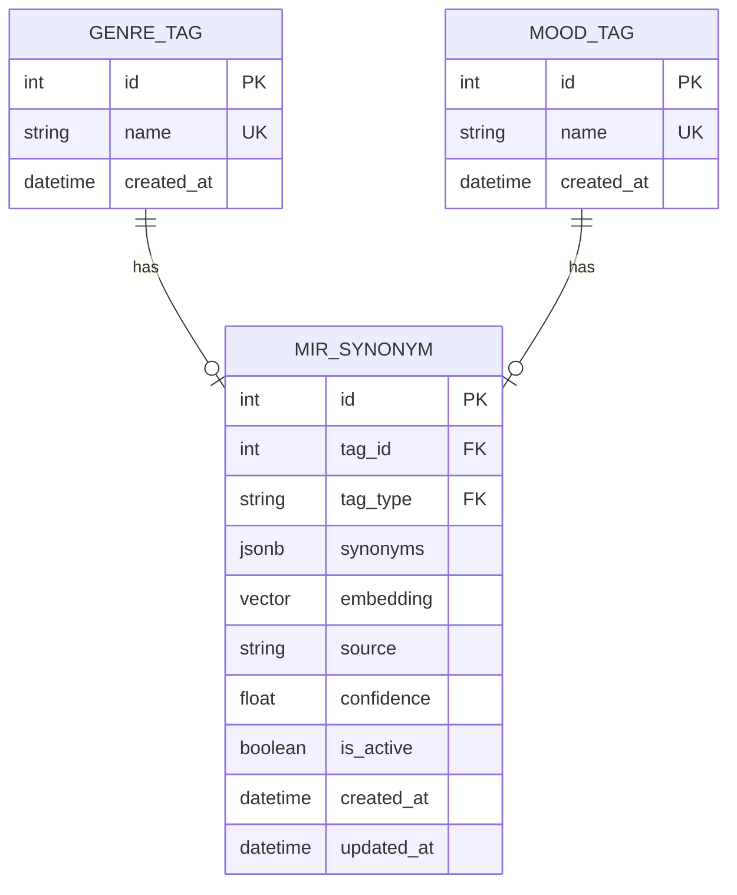
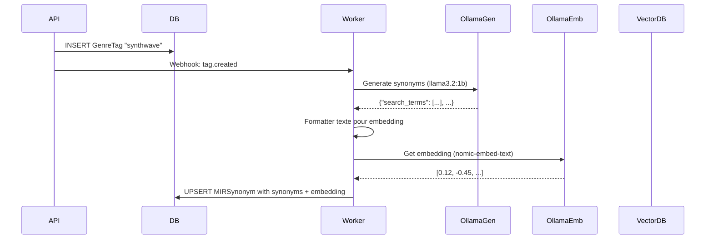

# Plan: Système de Synonyms avec Vecteurs et Recherche Sémantique

## Objectif

Remplacer les dictionnaires codés en dur par un système complet avec:
- Stockage DB via `MIRSynonym` lié à `GenreTag` et `MoodTag`
- **Modèles Ollama**: 
  - `llama3.2:1b` ou `gemma2:2b` pour génération des synonyms (texte)
  - `nomic-embed-text` pour les embeddings sémantiques (vecteurs 768D)
- Webhook déclenché à la création/modification de tags
- Worker Celery pour génération via Ollama
- Cache Redis pour performance

## Architecture



## Modèles Ollama

| Usage | Modèle | Dimension | Justification |
|-------|--------|-----------|---------------|
| Génération synonyms | `llama3.2:1b` ou `gemma2:2b` | N/A | Léger, rapide, parfait pour génération de texte court |
| Embeddings sémantiques | `nomic-embed-text` | 768 | Spécialisé embeddings, optimisé recherche sémantique |

## Prompt pour Génération Synonyms

```python
SYNONYM_PROMPT = """
Tu es un expert en musique. Génère des synonymes et termes associés pour le tag musical: "{tag_name}"

Tags similaires disponibles dans le contexte: {related_tags}

Génère un JSON avec:
- "search_terms": [] termes de recherche (5-10)
- "related_tags": [] tags musicalement liés
- "usage_context": [] contextes d'usage
- "translations": {} traductions FR/EN

Format JSON uniquement, pas de markdown.
"""
```

## Structure des Synonyms (JSONB)

```json
{
  "search_terms": ["rock", "hard rock", "rock classique", "rock alternatif"],
  "related_tags": ["guitar", "energetic", "loud", "band"],
  "usage_context": ["party", "workout", "driving"],
  "translations": {"en": ["rock"], "fr": ["rock", "rock classique"]}
}
```

## Workflow de Génération



## Recherche Hybride (SQL + Vectorielle)

```python
async def search_synonyms(query: str, limit: int = 10) -> list[dict]:
    """
    Recherche hybride:
    1. Recherche textuelle (FTS) sur search_terms
    2. Recherche sémantique (pgvector) sur embedding
    3. Fusion des résultats avec score pondéré
    """
    # Recherche FTS
    fts_results = await search_fts(query)
    
    # Recherche vectorielle
    embedding = await ollama.get_embedding(f"music synonym: {query}")
    vector_results = await search_vector(embedding, limit=limit)
    
    # Fusion
    results = fuse_results(fts_results, vector_results, weight_fts=0.3, weight_vector=0.7)
    
    return results[:limit]
```

## Fichiers à Créer/Modifier

| Fichier | Action | Description |
|---------|--------|-------------|
| `backend/api/models/mir_synonym_model.py` | Créer | Modèle MIRSynonym avec embedding |
| `backend/api/models/tags_model.py` | Modifier | Ajouter relations |
| `alembic/versions/xxx_add_mir_synonyms.py` | Migration | Table + vector column |
| `backend/api/services/mir_synonym_service.py` | Créer | Service CRUD + recherche hybride |
| `backend/api/routers/synonyms_router.py` | Créer | Endpoints REST + Webhook + recherche |
| `backend_worker/services/ollama_synonym_service.py` | Créer | Service Ollama (gemma2:2b pour génération) |
| `backend_worker/workers/synonym_worker.py` | Créer | Worker Celery |
| `backend_worker/services/music_summary_service.py` | Modifier | Utiliser MIRSynonym |
| `backend/api/services/mir_llm_service.py` | Modifier | Utiliser MIRSynonym |

## Endpoints API

| Méthode | Endpoint | Description |
|---------|----------|-------------|
| `GET` | `/api/synonyms/{tag_type}/{tag_name}` | Récupérer synonymes |
| `GET` | `/api/synonyms/search?q={query}` | **Recherche hybride** |
| `POST` | `/api/synonyms` | Créer manuellement |
| `PUT` | `/api/synonyms/{id}` | Modifier |
| `DELETE` | `/api/synonyms/{id}` | Désactiver |
| `POST` | `/api/webhooks/synonyms` | Webhook trigger |

## Considérations RPi4

| Aspect | Choix | Justification |
|--------|-------|---------------|
| Modèle génération | `llama3.2:1b` ou `gemma2:2b` | ~1-2GB RAM, inférence rapide |
| Modèle embedding | `nomic-embed-text` | 768D, optimisé recherche |
| Index pgvector | IVFFlat | Performance sur CPU ARM |
| Cache Redis | TTL 24h | Éviter surchage CPU |
| Batch Ollama | Grouper requêtes | Optimiser inférence |
| Priorité Celery | Basse | Ne pas bloquer scan |

## Installation Ollama

```bash
# RPi4 - modèles légers
ollama run llama3.2:1b
ollama run gemma2:2b
ollama run nomic-embed-text
```
