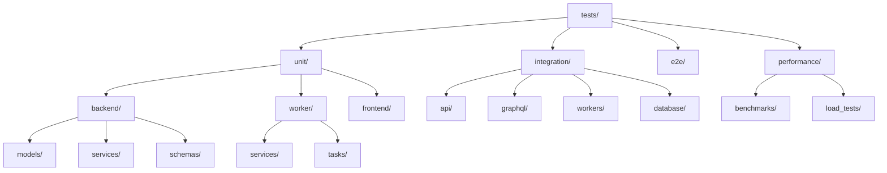

# Plan de Nettoyage des Tests - SoniqueBay

## Vue d'ensemble

Ce plan détaille la stratégie de nettoyage et de restructuration du répertoire `tests/` de SoniqueBay après les nombreuses refactorisations et modifications du code. L'objectif est d'établir un système de tests propre, maintenable et complet pour valider chaque composant.

## État Actuel des Tests

### Problèmes Identifiés

#### 1. Tests Temporaires/Obsoletes (à supprimer)
Ces tests ont été créés pour valider des corrections spécifiques qui sont maintenant intégrées :

| Fichier | Raison de suppression |
|---------|----------------------|
| `test_crypto_fix.py` | Correction crypto intégrée, plus besoin de test spécifique |
| `test_release_year_fix.py` | Validation release_year corrigée |
| `test_celery_kombu_fix.py` | Configuration Celery stabilisée |
| `test_celery_redis_fix.py` | Communication Celery-Redis opérationnelle |
| `test_audio_features_fix.py` | Pipeline audio features refactorisé |
| `test_audio_tags_fix.py` | Extraction tags stabilisée |
| `test_batch_validation.py` | Validation batch corrigée |
| `test_cache_simple.py` | Redondant avec `test_cache_integration.py` |
| `test_cover_extraction_manual.py` | Test manuel obsolète |
| `test_lastfm_fix.py` | Intégration Last.fm stabilisée |
| `test_optimization_deployment.py` | Test de déploiement temporaire |
| `test_rtcros_construction.py` | Architecture RTCROS refactorisée |
| `test_security_improvements.py` | Sécurité intégrée dans les tests principaux |
| `test_sse_integration.py` | SSE généralisé et testé ailleurs |

#### 2. Tests de Worker - Doublons et obsolètes

| Fichier | Action | Raison |
|---------|--------|--------|
| `test_genres_cleaning_fix.py` | Supprimer | Correction intégrée |
| `test_genres_constraint_solution.py` | Supprimer | Contraintes stabilisées |
| `test_genres_endpoint_fix.py` | Supprimer | Endpoints genres refactorisés |
| `test_genres_integration_fix.py` | Supprimer | Intégration complète |
| `test_genres_unique_constraint_fix.py` | Supprimer | Contraintes en place |
| `test_metadata_diagnostic_fix.py` | Supprimer | Diagnostics refactorisés |
| `test_regression_solo_para_mujeres.py` | Supprimer | Test spécifique obsolète |
| `test_simple_genres_fix.py` | Supprimer | Correction intégrée |
| `test_redis_utils_callback_fix.py` | Supprimer | Redis utils stabilisé |
| `test_new_architecture.py` | Évaluer | Vérifier si encore pertinent |

#### 3. Tests Backend - Consolidation nécessaire

| Fichier | Action | Destination |
|---------|--------|-------------|
| `test_422_validation_errors.py` | Fusionner | Dans `test_api/test_validation.py` |
| `test_album_fix.py` | Supprimer | Correction intégrée |
| `test_album_temp_id_fix.py` | Supprimer | Correction intégrée |
| `test_album_validation_fix.py` | Supprimer | Validation refactorisée |
| `test_artist_embeddings_api.py` | Garder | Déplacer vers `test_api/` |
| `test_celery_optimization.py` | Supprimer | Optimisation Celery terminée |
| `test_genres_endpoint_diagnosis.py` | Supprimer | Diagnostique terminé |
| `test_lastfm_integration.py` | Garder | Déplacer vers `test_integration/` |
| `test_release_year_validation.py` | Supprimer | Validation intégrée |
| `test_unique_constraint_fix.py` | Supprimer | Contraintes stabilisées |
| `test_vector_search_integration.py` | Garder | Déplacer vers `test_integration/` |
| `test_vectorization_integration.py` | Garder | Fusionner avec autre test vectorisation |
| `test_whoosh_search.py` | Supprimer | Whoosh remplacé par FTS PostgreSQL |

### Architecture Cible des Tests



## Plan de Restructuration

### Phase 1: Suppression des Tests Obsoletes

#### 1.1 Supprimer les tests "fix" temporaires
```powershell
# Tests racine à supprimer
Remove-Item tests/test_crypto_fix.py
Remove-Item tests/test_release_year_fix.py
Remove-Item tests/test_celery_kombu_fix.py
Remove-Item tests/test_celery_redis_fix.py
Remove-Item tests/test_audio_features_fix.py
Remove-Item tests/test_audio_tags_fix.py
Remove-Item tests/test_batch_validation.py
Remove-Item tests/test_cache_simple.py
Remove-Item tests/test_cover_extraction_manual.py
Remove-Item tests/test_lastfm_fix.py
Remove-Item tests/test_optimization_deployment.py
Remove-Item tests/test_rtcros_construction.py
Remove-Item tests/test_security_improvements.py
Remove-Item tests/test_sse_integration.py
```

#### 1.2 Supprimer les tests de correction genres dupliqués
```powershell
# Worker tests à supprimer
Remove-Item tests/worker/test_genres_cleaning_fix.py
Remove-Item tests/worker/test_genres_constraint_solution.py
Remove-Item tests/worker/test_genres_endpoint_fix.py
Remove-Item tests/worker/test_genres_integration_fix.py
Remove-Item tests/worker/test_genres_unique_constraint_fix.py
Remove-Item tests/worker/test_metadata_diagnostic_fix.py
Remove-Item tests/worker/test_regression_solo_para_mujeres.py
Remove-Item tests/worker/test_simple_genres_fix.py
Remove-Item tests/worker/test_redis_utils_callback_fix.py
```

#### 1.3 Supprimer les tests backend temporaires
```powershell
# Backend tests à supprimer
Remove-Item tests/backend/test_album_fix.py
Remove-Item tests/backend/test_album_temp_id_fix.py
Remove-Item tests/backend/test_album_validation_fix.py
Remove-Item tests/backend/test_celery_optimization.py
Remove-Item tests/backend/test_genres_endpoint_diagnosis.py
Remove-Item tests/backend/test_release_year_validation.py
Remove-Item tests/backend/test_unique_constraint_fix.py
Remove-Item tests/backend/test_whoosh_search.py
Remove-Item tests/backend/test_422_validation_errors.py
```

### Phase 2: Restructuration par Composant

#### 2.1 Créer la nouvelle structure de répertoires

```
tests/
├── conftest.py                    # Configuration pytest principale
├── pytest.ini                     # Configuration pytest
├── unit/                          # Tests unitaires
│   ├── __init__.py
│   ├── backend/                   # Tests unitaires backend
│   │   ├── __init__.py
│   │   ├── models/                # Tests des modèles SQLAlchemy
│   │   │   ├── __init__.py
│   │   │   ├── test_artists_model.py
│   │   │   ├── test_albums_model.py
│   │   │   ├── test_tracks_model.py
│   │   │   ├── test_genres_model.py
│   │   │   ├── test_covers_model.py
│   │   │   ├── test_tags_model.py
│   │   │   └── test_relations.py
│   │   ├── services/              # Tests des services
│   │   │   ├── __init__.py
│   │   │   ├── test_artist_service.py
│   │   │   ├── test_album_service.py
│   │   │   ├── test_track_service.py
│   │   │   ├── test_search_service.py
│   │   │   ├── test_scan_service.py
│   │   │   ├── test_mir_services.py
│   │   │   └── test_vectorization_service.py
│   │   └── schemas/               # Tests des schémas Pydantic
│   │       ├── __init__.py
│   │       ├── test_artists_schema.py
│   │       ├── test_albums_schema.py
│   │       └── test_tracks_schema.py
│   ├── worker/                    # Tests unitaires worker
│   │   ├── __init__.py
│   │   ├── services/              # Tests des services worker
│   │   │   ├── __init__.py
│   │   │   ├── test_audio_features_service.py
│   │   │   ├── test_vectorization_service.py
│   │   │   ├── test_coverart_service.py
│   │   │   ├── test_enrichment_service.py
│   │   │   ├── test_mir_normalization_service.py
│   │   │   ├── test_mir_scoring_service.py
│   │   │   ├── test_genre_taxonomy_service.py
│   │   │   └── test_synthetic_tags_service.py
│   │   └── tasks/                 # Tests des tâches Celery
│   │       ├── __init__.py
│   │       ├── test_audio_analysis_tasks.py
│   │       ├── test_mir_tasks.py
│   │       ├── test_covers_tasks.py
│   │       └── test_maintenance_tasks.py
│   └── ai/                        # Tests unitaires AI
│       ├── __init__.py
│       ├── test_agents.py
│       ├── test_tools.py
│       ├── test_orchestrator.py
│       └── test_context.py
├── integration/                   # Tests d'intégration
│   ├── __init__.py
│   ├── api/                       # Tests d'intégration API
│   │   ├── __init__.py
│   │   ├── test_artists_api.py
│   │   ├── test_albums_api.py
│   │   ├── test_tracks_api.py
│   │   ├── test_genres_api.py
│   │   ├── test_covers_api.py
│   │   ├── test_scan_api.py
│   │   ├── test_search_api.py
│   │   └── test_playqueue_api.py
│   ├── graphql/                   # Tests d'intégration GraphQL
│   │   ├── __init__.py
│   │   ├── conftest.py
│   │   ├── fixtures.py
│   │   ├── test_queries.py
│   │   ├── test_mutations.py
│   │   └── snapshots/
│   ├── workers/                   # Tests d'intégration workers
│   │   ├── __init__.py
│   │   ├── test_scan_worker.py
│   │   ├── test_metadata_worker.py
│   │   ├── test_vectorization_worker.py
│   │   ├── test_audio_analysis_worker.py
│   │   └── test_mir_worker.py
│   └── database/                  # Tests d'intégration DB
│       ├── __init__.py
│       ├── test_migrations.py
│       └── test_transactions.py
├── e2e/                          # Tests end-to-end
│   ├── __init__.py
│   ├── test_full_scan_workflow.py
│   ├── test_player_workflow.py
│   └── test_chat_workflow.py
└── performance/                   # Tests de performance
    ├── __init__.py
    ├── conftest.py
    ├── benchmarks/                # Benchmarks pytest
    │   ├── test_api_performance.py
    │   ├── test_database_performance.py
    │   └── test_worker_performance.py
    └── load_tests/                # Tests de charge
        └── test_concurrent_users.py
```

#### 2.2 Migrer et consolider les tests existants

| Source | Destination | Action |
|--------|-------------|--------|
| `tests/backend/test_models/*.py` | `tests/unit/backend/models/` | Déplacer |
| `tests/backend/test_services/*.py` | `tests/unit/backend/services/` | Déplacer et fusionner doublons |
| `tests/backend/test_api/*.py` | `tests/integration/api/` | Déplacer |
| `tests/backend/test_graphql/*.py` | `tests/integration/graphql/` | Déplacer |
| `tests/backend/test_integration/*.py` | `tests/integration/` | Déplacer et réorganiser |
| `tests/worker/test_*.py` | `tests/unit/worker/` | Déplacer et nettoyer |
| `tests/benchmark/*.py` | `tests/performance/benchmarks/` | Déplacer |
| `tests/test_*.py` (racine conservés) | `tests/unit/` ou `tests/integration/` | Redistribuer |

### Phase 3: Tests à Conserver et Améliorer

#### 3.1 Tests de la racine à conserver et déplacer

| Test Actuel | Destination | Notes |
|-------------|-------------|-------|
| `test_agents_api.py` | `tests/integration/api/` | Tests endpoints agents |
| `test_agent_builder.py` | `tests/unit/ai/` | Tests construction agents |
| `test_agent_response_schemas.py` | `tests/unit/backend/schemas/` | Tests schémas réponse |
| `test_agent_scores_api.py` | `tests/integration/api/` | Tests API scores |
| `test_ai_agents.py` | `tests/unit/ai/` | Tests agents IA |
| `test_ai_tool_decorator.py` | `tests/unit/ai/` | Tests décorateurs tools |
| `test_ai_tool_executor.py` | `tests/unit/ai/` | Tests exécuteur tools |
| `test_ai_tools.py` | `tests/unit/ai/` | Tests tools IA |
| `test_artist_gmm_integration.py` | `tests/integration/workers/` | Tests GMM artistes |
| `test_artist_similar_endpoints.py` | `tests/integration/api/` | Tests endpoints similar |
| `test_audio_tags_db_integration.py` | `tests/integration/database/` | Tests intégration tags DB |
| `test_audio_tags_extraction.py` | `tests/unit/worker/services/` | Tests extraction tags |
| `test_cache_integration.py` | `tests/integration/cache/` | Tests cache Redis |
| `test_celery_autoscale.py` | `tests/unit/worker/` | Tests config Celery |
| `test_celery_communication.py` | `tests/integration/workers/` | Tests communication Celery |
| `test_celery_config_redis_sync.py` | `tests/unit/worker/` | Tests sync config Celery |
| `test_celery_priority_configuration.py` | `tests/unit/worker/` | Tests priorités Celery |
| `test_celery_unified_config.py` | `tests/unit/worker/` | Tests config unifiée |
| `test_cleanup.py` | `tests/unit/worker/tasks/` | Tests tâches cleanup |
| `test_conversation_persistence.py` | `tests/integration/database/` | Tests persistance conversations |
| `test_cover_extraction_integration.py` | `tests/integration/workers/` | Tests extraction covers |
| `test_cover_extraction_simple.py` | `tests/unit/worker/services/` | Tests simples covers |
| `test_fts_search.py` | `tests/unit/backend/services/` | Tests recherche FTS |
| `test_full_integration.py` | `tests/e2e/` | Tests intégration complète |
| `test_insert_batch_worker.py` | `tests/unit/worker/tasks/` | Tests insertion batch |
| `test_mir_services.py` | `tests/unit/backend/services/` | Tests services MIR |
| `test_model_imports.py` | `tests/unit/backend/models/` | Tests imports modèles |
| `test_music_summary_service.py` | `tests/unit/worker/services/` | Tests résumé musical |
| `test_optimized_scan_integration.py` | `tests/integration/workers/` | Tests scan optimisé |
| `test_scan_sessions.py` | `tests/unit/backend/services/` | Tests sessions scan |
| `test_search_performance.py` | `tests/performance/` | Tests perf recherche |
| `test_streaming_optimization.py` | `tests/unit/ai/` | Tests optimisation streaming |
| `test_tag_monitoring_refactor.py` | `tests/integration/workers/` | Tests monitoring tags |
| `test_vectorization_flow.py` | `tests/integration/workers/` | Tests flux vectorisation |

### Phase 4: Nouveaux Tests à Créer

#### 4.1 Tests manquants identifiés

| Composant | Type | Priorité |
|-----------|------|----------|
| **Frontend NiceGUI** | Tests E2E | Haute |
| **Player WebSocket** | Tests intégration | Haute |
| **Recommandations hybrides** | Tests intégration | Haute |
| **Chat Agent IA** | Tests E2E | Moyenne |
| **Cache Redis** | Tests performance | Moyenne |
| **Migrations Alembic** | Tests intégration | Haute |

### Phase 5: Configuration Pytest Optimisée

#### 5.1 Configuration `pytest.ini`

```ini
[pytest]
minversion = 7.0
testpaths = tests
python_files = test_*.py
python_classes = Test*
python_functions = test_*
addopts = 
    -v
    --tb=short
    --strict-markers
    -ra
    --snapshot-update
markers =
    unit: Tests unitaires rapides
    integration: Tests d'intégration
    e2e: Tests end-to-end
    performance: Tests de performance
    slow: Tests lents
    worker: Tests spécifiques aux workers
    api: Tests d'API
    graphql: Tests GraphQL
    database: Tests de base de données
    redis: Tests Redis
    celery: Tests Celery
    ai: Tests IA/Agents
    mir: Tests Music Information Retrieval
    security: Tests de sécurité
filterwarnings =
    ignore::DeprecationWarning
    ignore::PendingDeprecationWarning
```

#### 5.2 Organisation des marqueurs

```python
# conftest.py - Marqueurs automatiques
def pytest_collection_modifyitems(config, items):
    """Ajoute automatiquement les marqueurs basés sur le chemin."""
    for item in items:
        path = str(item.fspath)
        if "/unit/" in path:
            item.add_marker(pytest.mark.unit)
        elif "/integration/" in path:
            item.add_marker(pytest.mark.integration)
        elif "/e2e/" in path:
            item.add_marker(pytest.mark.e2e)
        elif "/performance/" in path:
            item.add_marker(pytest.mark.performance)
        
        if "/worker/" in path:
            item.add_marker(pytest.mark.worker)
        elif "/ai/" in path:
            item.add_marker(pytest.mark.ai)
        elif "/mir/" in path:
            item.add_marker(pytest.mark.mir)
```

### Phase 6: Commandes de Test Optimisées

#### 6.1 Exécution sélective des tests

```powershell
# Tests unitaires uniquement (rapides)
python -m pytest tests/unit -v --tb=short -q -n auto

# Tests d'intégration
python -m pytest tests/integration -v --tb=short -q -n auto

# Tests par composant
python -m pytest tests/unit/backend/models -v
python -m pytest tests/unit/worker/services -v
python -m pytest tests/integration/api -v
python -m pytest tests/integration/graphql -v

# Tests avec marqueurs spécifiques
python -m pytest -m "unit and not slow" -v -n auto
python -m pytest -m "integration and api" -v -n auto
python -m pytest -m "worker and celery" -v -n auto

# Tests end-to-end (complets)
python -m pytest tests/e2e -v

# Tests de performance
python -m pytest tests/performance -v --benchmark-only

# Exclure les tests lents
python -m pytest -m "not slow" -v -n auto

# Tests Docker (tous)
python -m pytest tests/ -v --tb=short -q --snapshot-update -n auto
```

### Phase 7: Checklist de Validation

#### 7.1 Avant nettoyage
- [ ] Exécuter tous les tests actuels et documenter les échecs
- [ ] Sauvegarder les rapports de couverture
- [ ] Identifier les tests flaky (instables)

#### 7.2 Pendant le nettoyage
- [ ] Supprimer les tests obsolètes un par un
- [ ] Vérifier que les tests conservés passent
- [ ] Migrer les tests vers la nouvelle structure
- [ ] Mettre à jour les imports et fixtures

#### 7.3 Après nettoyage
- [ ] Tous les tests passent dans Docker
- [ ] Couverture de code maintenue ou améliorée
- [ ] Temps d'exécution optimisé
- [ ] Documentation mise à jour

## Livrables

1. **Structure de tests propre et organisée**
2. **Fichier `pytest.ini` configuré**
3. **Documentation des commandes de test**
4. **Rapport de couverture de code**
5. **Tests fonctionnels dans Docker**

## Risques et Mitigations

| Risque | Mitigation |
|--------|------------|
| Suppression de tests encore utiles | Vérifier chaque test avant suppression, créer backup |
| Tests qui échouent après migration | Exécuter tests après chaque migration, corriger au fur et à mesure |
| Perte de couverture de code | Générer rapport de couverture avant/après |
| Temps d'exécution augmenté | Utiliser `-n auto` pour parallélisation |

## Notes Importantes

- **Ne jamais supprimer** `conftest.py` sans vérifier les fixtures utilisées
- **Conserver** les snapshots GraphQL si les schémas n'ont pas changé
- **Vérifier** les dépendances entre tests avant suppression
- **Documenter** chaque suppression dans le message de commit
- **Tester** dans Docker après chaque phase
