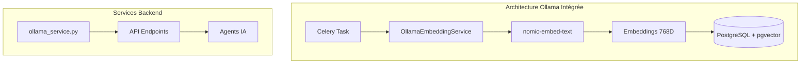
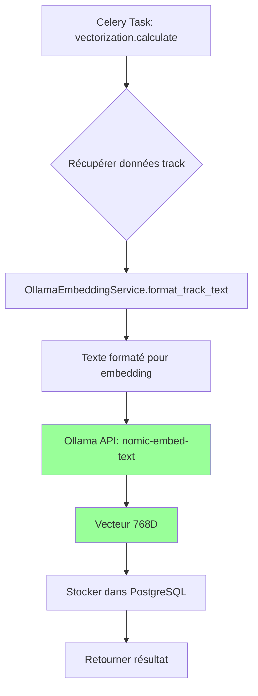

# Plan de Refactorisation - Vectorisation Ollama avec nomic-embed-text

## 1. État Actuel

### 1.1 Problème Identifié

Le système de vectorisation actuel n'utilise **PAS Ollama** malgré :
- La documentation technique qui spécifie Ollama comme moteur de vectorisation
- Les modèles de base de données qui référencent `nomic-embed-text`
- L'infrastructure Ollama déjà déployée dans Docker Compose

### 1.2 Services Actuels

| Service | Localisation | Méthode | Statut |
|---------|--------------|---------|--------|
| `OptimizedVectorizationService` | `backend_worker/services/vectorization_service.py` | scikit-learn (TfidfVectorizer + TruncatedSVD) | **Actif** |
| `TrackVectorizationService` | `backend_worker/services/track_vectorization_service.py` | Encodage manuel one-hot | **Obsolète** |
| `track_vectorization_worker` | `backend_worker/workers/vectorization/track_vectorization_worker.py` | Placeholder obsolète | **Obsolète** |

### 1.3 Code Obsolète à Supprimer

```
backend_worker/services/track_vectorization_service.py
backend_worker/workers/vectorization/track_vectorization_worker.py
```

---

## 2. Architecture Cible



---

## 3. Plan d'Implémentation

### Phase 1 : Créer le Service Ollama Embedding

#### 3.1.1 Nouveau fichier : `backend_worker/services/ollama_embedding_service.py`

```python
# -*- coding: utf-8 -*-
"""
Service d'embeddings Ollama avec nomic-embed-text.

Optimisé pour Raspberry Pi 4 avec batching et retry automatique.
"""

import ollama
import asyncio
from typing import List, Dict, Any, Optional
from backend_worker.utils.logging import logger


class OllamaEmbeddingError(Exception):
    """Exception pour les erreurs d'embedding Ollama."""
    pass


class OllamaEmbeddingService:
    """
    Service d'embeddings basé sur Ollama.
    
    Modèle : nomic-embed-text (768 dimensions)
    """
    
    MODEL_NAME = "nomic-embed-text"
    EMBEDDING_DIMENSION = 768
    OLLAMA_HOST = "http://ollama:11434"
    
    def __init__(self, host: str = None):
        """Initialise le service Ollama."""
        self.host = host or self.OLLAMA_HOST
        self.client = ollama.Client(host=self.host)
        logger.info(f"[OLLAMA_EMBEDDING] Service initialisé avec {self.host}")
    
    async def get_embedding(self, text: str) -> List[float]:
        """
        Génère un embedding pour un texte.
        
        Args:
            text: Texte à vectoriser
            
        Returns:
            Vecteur de 768 dimensions
        """
        try:
            response = self.client.embed(
                model=self.MODEL_NAME,
                input=text
            )
            return response['embeddings'][0]
        except Exception as e:
            logger.error(f"[OLLAMA_EMBEDDING] Erreur: {e}")
            raise OllamaEmbeddingError(f"Échec génération embedding: {e}")
    
    async def get_embeddings_batch(self, texts: List[str]) -> List[List[float]]:
        """
        Génère des embeddings pour une liste de textes.
        
        Args:
            texts: Liste de textes à vectoriser
            
        Returns:
            Liste de vecteurs
        """
        try:
            response = self.client.embed(
                model=self.MODEL_NAME,
                input=texts
            )
            return response['embeddings']
        except Exception as e:
            logger.error(f"[OLLAMA_EMBEDDING] Erreur batch: {e}")
            raise OllamaEmbeddingError(f"Échec génération embeddings batch: {e}")
    
    def format_track_text(self, track_data: Dict[str, Any]) -> str:
        """
        Formate les données d'une track en texte pour embedding.
        
        Args:
            track_data: Données de la track
            
        Returns:
            Texte formaté pour Ollama
        """
        parts = []
        
        # Titre (priorité haute)
        if title := track_data.get('title'):
            parts.append(f"Title: {title}")
        
        # Artiste (priorité haute)
        if artist := track_data.get('artist_name'):
            parts.append(f"Artist: {artist}")
        
        # Album (priorité moyenne)
        if album := track_data.get('album_title'):
            parts.append(f"Album: {album}")
        
        # Genre (priorité haute)
        if genre := track_data.get('genre'):
            parts.append(f"Genre: {genre}")
        
        # Clé musicale
        if key := track_data.get('key'):
            parts.append(f"Key: {key}")
        
        # BPM
        if bpm := track_data.get('bpm'):
            parts.append(f"BPM: {bpm}")
        
        # Tags
        if tags := track_data.get('tags'):
            parts.append(f"Tags: {tags}")
        
        return " | ".join(parts)
```

---

### Phase 2 : Refactoriser le Service de Vectorisation

#### 3.2.1 Modifier `backend_worker/services/vectorization_service.py`

Remplacer l'utilisation de scikit-learn par Ollama :

```python
# NOUVELLES IMPORTS
from backend_worker.services.ollama_embedding_service import (
    OllamaEmbeddingService,
    OllamaEmbeddingError
)

# SUPPRIMER LES ANCIENNES IMPORTS
# from sklearn.feature_extraction.text import TfidfVectorizer
# from sklearn.decomposition import TruncatedSVD
# ...

class OptimizedVectorizationService:
    """Service de vectorisation avec Ollama nomic-embed-text."""
    
    def __init__(self):
        self.embedding_service = OllamaEmbeddingService()
        self.is_trained = True  # Ollama n'a pas besoin d'entraînement
        self.vector_dimension = OllamaEmbeddingService.EMBEDDING_DIMENSION
    
    async def vectorize_single_track(self, track_data: Dict[str, Any]) -> List[float]:
        """Vectorise une track avec Ollama."""
        text = self.embedding_service.format_track_text(track_data)
        return await self.embedding_service.get_embedding(text)
```

---

### Phase 3 : Mettre à Jour les Tâches Celery

#### 3.3.1 Modifier `backend_worker/celery_tasks.py`

```python
@celery.task(name="vectorization.calculate", queue="vectorization", bind=True)
def calculate_vector(self, track_id: int, metadata: dict = None):
    """
    Calcule le vecteur d'une track via Ollama.
    """
    import asyncio
    
    try:
        from backend_worker.services.ollama_embedding_service import (
            OllamaEmbeddingService,
            OllamaEmbeddingError
        )
        from backend_worker.services.vectorization_service import OptimizedVectorizationService
        
        service = OllamaEmbeddingService()
        
        async def run_vectorization():
            # Récupérer les données de la track
            # ... via API library
            
            # Générer l'embedding Ollama
            text = service.format_track_text(track_data)
            embedding = await service.get_embedding(text)
            
            # Stocker via API
            await service.store_vector_to_database(track_id, embedding)
            
            return embedding
        
        embedding = asyncio.run(run_vectorization())
        return {
            'task_id': self.request.id,
            'track_id': track_id,
            'status': 'success',
            'vector_dimension': len(embedding),
            'embedding_model': 'nomic-embed-text'
        }
        
    except OllamaEmbeddingError as e:
        return {
            'task_id': self.request.id,
            'track_id': track_id,
            'status': 'error',
            'message': str(e)
        }
```

---

### Phase 4 : Supprimer le Code Obsolète

#### 3.4.1 Fichiers à Supprimer

```bash
# Supprimer les fichiers obsolètes
rm backend_worker/services/track_vectorization_service.py
rm backend_worker/workers/vectorization/track_vectorization_worker.py

# ou les déplacer vers un dossier archive
mkdir -p backend_worker/_archived
mv backend_worker/services/track_vectorization_service.py backend_worker/_archived/
mv backend_worker/workers/vectorization/track_vectorization_worker.py backend_worker/_archived/
```

---

### Phase 5 : Mettre à Jour la Configuration Docker

#### 3.5.1 Vérifier que nomic-embed-text est disponible

Dans `ollama/entrypoint.sh` ou `docker-compose.yml` :

```bash
# S'assurer que le modèle est pull au démarrage
ollama pull nomic-embed-text
```

---

## 4. Liste des Tâches Détaillées

### Tâche 1 : Créer `ollama_embedding_service.py`
- [ ] Créer le fichier `backend_worker/services/ollama_embedding_service.py`
- [ ] Implémenter `OllamaEmbeddingService`
- [ ] Implémenter `format_track_text()`
- [ ] Ajouter les méthodes de batching
- [ ] Ajouter les tests unitaires

### Tâche 2 : Refactoriser `vectorization_service.py`
- [ ] Ajouter l'import de `OllamaEmbeddingService`
- [ ] Supprimer les imports scikit-learn (TfidfVectorizer, TruncatedSVD)
- [ ] Mettre à jour `OptimizedVectorizationService`
- [ ] Vérifier que `vectorize_single_track` utilise Ollama
- [ ] Mettre à jour les logs

### Tâche 3 : Mettre à jour `celery_tasks.py`
- [ ] Modifier la tâche `vectorization.calculate`
- [ ] Utiliser `OllamaEmbeddingService` au lieu de `OptimizedVectorizationService`
- [ ] Mettre à jour le format de réponse
- [ ] Ajouter le fallback en cas d'indisponibilité Ollama

### Tâche 4 : Supprimer le code obsolète
- [ ] Supprimer `track_vectorization_service.py`
- [ ] Supprimer `track_vectorization_worker.py`
- [ ] Mettre à jour les imports dans les fichiers qui utilisent ces services

### Tâche 5 : Tests et Validation
- [ ] Exécuter les tests existants
- [ ] Ajouter des tests pour `OllamaEmbeddingService`
- [ ] Vérifier que Docker startup fonctionne
- [ ] Vérifier que la vectorisation fonctionne via Ollama

---

## 5. Diagramme de Flux



---

## 6. Contraintes Raspberry Pi 4

| Aspect | Recommandation |
|--------|----------------|
| **Mémoire** | `nomic-embed-text` demande ~1GB RAM |
| **CPU** | Utilisation intensive lors du premier passage |
| **Batching** | Grouper les requêtes Ollama (batch de 10-20 tracks) |
| **Retry** | Implémenter retry automatique avec exponential backoff |

---

## 7. Vérifications Avant Merge

- [ ] Le projet démarre dans Docker avec `docker-compose up`
- [ ] Les 4 conteneurs tournent sans erreur
- [ ] Ollama est accessible et `nomic-embed-text` est chargé
- [ ] Les tests passent avec `python -m pytest .\tests\ -x --tb=no -q`
- [ ] Le code respecte PEP8 et les règles du projet
- [ ] Aucun fichier sensible n'est committé
