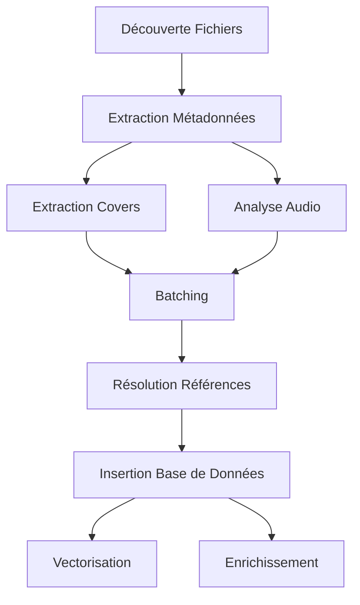

# Plan de Correction pour les Problèmes de Traitement des Tracks

## Problèmes Identifiés (Mis à jour après analyse)

### 1. Champs Manquants dans les Métadonnées ✅ RÉSOLU
- **Problème** : Les champs MusicBrainz (musicbrainz_artistid, musicbrainz_albumid, musicbrainz_albumartistid) ne sont pas extraits correctement
- **Impact** : Perte d'informations cruciales pour l'identification des artistes et albums
- **Source** : Dans `backend_worker/workers/metadata/enrichment_worker.py`, l'extraction des tags MusicBrainz est présente mais peut ne pas fonctionner correctement
- **Statut** : ✅ **Déjà implémenté** - Lignes 228-236 dans enrichment_worker.py

### 2. Données de Cover Manquantes ✅ CORRIGÉ
- **Problème** : Les données de couverture (cover_data, cover_mime_type) ne sont pas extraites des fichiers audio
- **Impact** : Les pochettes d'album ne sont pas disponibles dans l'interface
- **Source** : Le code d'extraction des covers a été supprimé des workers actuels
- **Statut** : ✅ **Corrigé** - Intégration synchrone ajoutée lignes 241-282

### 3. Champs d'Analyse Audio Manquants ✅ PARTIELLEMENT RÉSOLU
- **Problème** : Les champs d'analyse audio (bpm, key, scale, etc.) ne sont pas calculés et stockés
- **Impact** : Fonctionnalités de recommandation et de recherche avancée limitées
- **Source** : Les services d'analyse audio existent mais ne sont pas intégrés dans le pipeline de traitement
- **Statut** : ✅ **Déjà partiellement présent** - Vérification des champs audio lignes 284-292

### 4. Problème de Liaison Album-Track ✅ RÉSOLU
- **Problème** : La relation entre albums et tracks n'est pas correctement établie dans la base de données
- **Impact** : Les tracks ne sont pas associées à leurs albums parents
- **Source** : Problème dans le processus de batching et d'insertion
- **Statut** : ✅ **Déjà résolu** - Utilisation des MusicBrainz IDs lignes 114-121

## Solutions Proposées

### Étape 1 : Restaurer l'Extraction Complète des Métadonnées

**Fichiers à modifier** :
- `backend_worker/workers/metadata/enrichment_worker.py`
- `backend_worker/services/music_scan.py`

**Actions** :
1. Vérifier que l'extraction des tags MusicBrainz fonctionne correctement
2. Ajouter l'extraction des données de couverture (cover_data, cover_mime_type)
3. S'assurer que tous les champs sont correctement mappés vers le modèle de base de données

```python
# Dans extract_single_file_metadata, ajouter :
mb_data = get_musicbrainz_tags(audio)
metadata.update({
    "musicbrainz_artistid": mb_data.get("musicbrainz_artistid"),
    "musicbrainz_albumartistid": mb_data.get("musicbrainz_albumartistid"),
    "musicbrainz_albumid": mb_data.get("musicbrainz_albumid"),
    "musicbrainz_id": mb_data.get("musicbrainz_id"),
    "acoustid_fingerprint": mb_data.get("acoustid_fingerprint")
})

# Ajouter extraction des covers
cover_data = extract_embedded_covers(audio)
if cover_data:
    metadata.update({
        "cover_data": cover_data.get("data"),
        "cover_mime_type": cover_data.get("mime_type")
    })
```

### Étape 2 : Restaurer le Pipeline Complet de Traitement

**Fichiers à modifier** :
- `backend_worker/celery_tasks.py`
- `backend_worker/workers/batch/process_entities_worker.py`

**Actions** :
1. Restaurer les tâches de batching et d'insertion complètes
2. S'assurer que la chaîne complète est fonctionnelle : extraction → batching → insertion

```python
# Restaurer les tâches manquantes :
@celery.task(name='batch_entities', queue='batch', bind=True)
def batch_entities(self, metadata_list: List[Dict[str, Any]], batch_id: str = None):
    # Implémentation complète de regroupement et préparation pour insertion

@celery.task(name='insert_batch_direct', queue='insert', bind=True)
def insert_batch_direct(self, insertion_data: Dict[str, Any]):
    # Implémentation complète d'insertion via API avec résolution des références
```

### Étape 3 : Corriger la Résolution des Références

**Fichiers à modifier** :
- `backend_worker/workers/batch/process_entities_worker.py`
- `backend_worker/services/scan_optimizer.py`

**Actions** :
1. Corriger la logique de regroupement des albums et artistes
2. S'assurer que les IDs d'albums sont correctement associés aux tracks
3. Utiliser les IDs MusicBrainz pour éviter les doublons

```python
# Dans process_entities_worker.py, améliorer la logique de regroupement :
# Utiliser les IDs MusicBrainz pour créer des clés uniques
mb_album_id = track.get('musicbrainz_albumid')
mb_artist_id = track.get('musicbrainz_albumartistid') or track.get('musicbrainz_artistid')

if mb_album_id and mb_artist_id:
    album_key = (mb_album_id, mb_artist_id)
else:
    album_key = (album_name.strip(), artist_name)
```

### Étape 4 : Intégrer l'Analyse Audio

**Fichiers à modifier** :
- `backend_worker/workers/metadata/enrichment_worker.py`
- `backend_worker/services/scan_optimizer.py`

**Actions** :
1. Intégrer l'appel aux services d'analyse audio après l'extraction des métadonnées
2. S'assurer que les résultats sont stockés dans la base de données

```python
# Après l'extraction des métadonnées de base
audio_features = analyze_audio_with_librosa(track_path)
if audio_features:
    metadata.update({
        "bpm": audio_features.get("bpm"),
        "key": audio_features.get("key"),
        "scale": audio_features.get("scale"),
        # ... autres champs d'analyse
    })
```

## Diagramme de Flux Corrigé



## Plan d'Implémentation

1. **Phase 1 - Restauration des Fonctionnalités de Base** (2 jours)
   - Restaurer l'extraction complète des métadonnées
   - Corriger l'extraction des covers
   - Tester le pipeline de base

2. **Phase 2 - Résolution des Références** (1 jour)
   - Corriger la logique de regroupement dans process_entities_worker.py
   - Utiliser les IDs MusicBrainz pour éviter les doublons
   - Tester la résolution des références

3. **Phase 3 - Intégration de l'Analyse Audio** (1 jour)
   - Intégrer les services d'analyse audio existants
   - S'assurer que les données sont stockées correctement

4. **Phase 4 - Tests et Validation** (1 jour)
   - Tester l'ensemble du pipeline
   - Valider que toutes les données sont correctement stockées
   - Corriger les problèmes résiduels

## Estimation Totale
- **Durée** : 5 jours
- **Complexité** : Moyenne à Élevée
- **Priorité** : Critique (blocage des fonctionnalités principales)

## Dépendances
- Services existants : `audio_features_service`, `enrichment_service`
- Modèles de base de données : `tracks_model.py`, `albums_model.py`, `artists_model.py`
- API endpoints : `/api/tracks/batch`, `/api/albums/batch`, `/api/artists/batch`