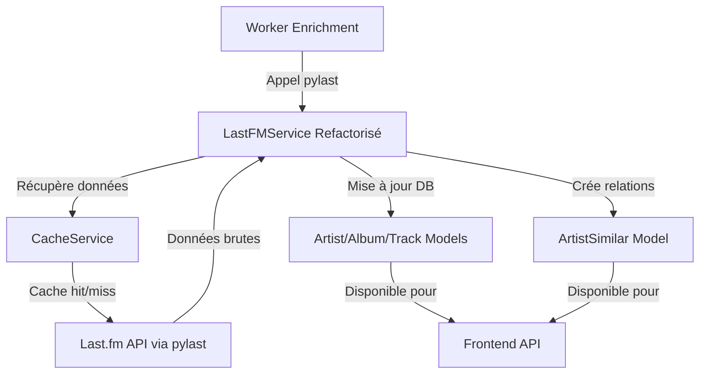
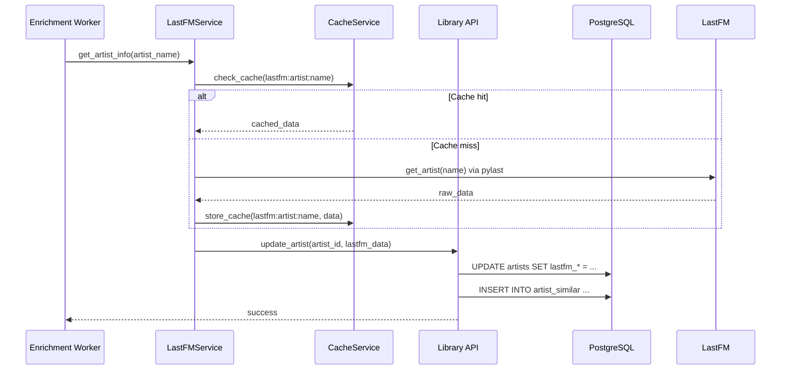

# Plan de Refactorisation Last.fm - Intégration pylast

## Contexte et Objectifs

### Problème Actuel

Le service Last.fm actuel dans `backend_worker/services/lastfm_service.py` utilise des appels HTTP directs à l'API Last.fm, ce qui présente plusieurs inconvénients :

1. **Complexité de gestion** : Gestion manuelle des requêtes HTTP, des timeouts et des erreurs
2. **Pas de cache intégré** : Pas de mécanisme de cache natif pour les appels Last.fm
3. **Fonctionnalités limitées** : Se concentre uniquement sur la récupération d'images d'artistes
4. **Pas de gestion des relations** : Pas de support pour les artistes similaires ou les tags

### Objectifs de la Refactorisation

1. **Utiliser pylast** : Intégrer la bibliothèque officielle Last.fm pour une meilleure gestion
2. **Étendre les fonctionnalités** : Ajouter la récupération d'informations complètes (tags, artistes similaires, statistiques)
3. **Améliorer la performance** : Ajouter cache et circuit breaker
4. **Créer un pipeline par entité** : Pipeline spécifique pour artistes, albums et tracks
5. **Intégrer avec l'architecture existante** : Utiliser les modèles de base de données et services existants

## Architecture Cible



## Composants à Créer/Modifier

### 1. Modèle ArtistSimilar (Nouveau)

**Fichier** : `backend/api/models/artist_similar_model.py`

```python
from sqlalchemy import Column, Integer, Float, ForeignKey
from sqlalchemy.orm import relationship
from backend.api.utils.database import Base

class ArtistSimilar(Base):
    __tablename__ = 'artist_similar'

    id = Column(Integer, primary_key=True)
    artist_id = Column(Integer, ForeignKey('artists.id'))
    similar_artist_id = Column(Integer, ForeignKey('artists.id'))
    weight = Column(Float, nullable=False)

    # Relations
    artist = relationship("Artist", foreign_keys=[artist_id])
    similar_artist = relationship("Artist", foreign_keys=[similar_artist_id])
```

### 2. Mise à jour du Modèle Artist

**Fichier** : `backend/api/models/artists_model.py`

Ajouter les colonnes Last.fm manquantes :

```python
# Colonnes Last.fm
lastfm_url = mapped_column(String, nullable=True)
lastfm_listeners = mapped_column(Integer, nullable=True)
lastfm_playcount = mapped_column(Integer, nullable=True)
lastfm_tags = mapped_column(String, nullable=True)  # JSON string
lastfm_similar_artists_fetched = mapped_column(Integer, default=0)
lastfm_info_fetched_at = mapped_column(DateTime(timezone=True), nullable=True)
```

### 3. Service Last.fm Refactorisé

**Fichier** : `backend_worker/services/lastfm_service.py`

#### Nouvelle Structure

```python
class LastFMService:
    def __init__(self, cache_service: CacheService):
        self.cache_service = cache_service
        self._network = None

    @property
    def network(self) -> pylast.LastFMNetwork:
        """Lazy initialization with caching"""
        if self._network is None:
            self._initialize_network()
        return self._network

    def _initialize_network(self):
        """Initialize pylast network with error handling"""
        # Get credentials from settings service
        api_key = settings_service.get_setting("lastfm_api_key")
        api_secret = settings_service.get_setting("lastfm_api_secret")

        if not api_key or not api_secret:
            raise ValueError("Last.fm credentials not configured")

        self._network = pylast.LastFMNetwork(
            api_key=api_key,
            api_secret=api_secret,
            username="SoniqueBay",
            password_hash=pylast.md5("")  # Anonymous session
        )

    # Pipeline par entité
    async def get_artist_info(self, artist_name: str) -> Dict:
        """Récupère les informations complètes d'un artiste"""
        cache_key = f"lastfm:artist:{artist_name.lower()}"
        return await self.cache_service.call_with_cache_and_circuit_breaker(
            cache_key,
            self._fetch_artist_info,
            artist_name
        )

    async def _fetch_artist_info(self, artist_name: str) -> Dict:
        """Fonction interne pour récupérer les infos artistes"""
        try:
            artist = self.network.get_artist(artist_name)

            return {
                "url": artist.get_url(),
                "listeners": artist.get_listener_count(),
                "playcount": artist.get_playcount(),
                "tags": [tag.item.get_name() for tag in artist.get_top_tags(limit=10)],
                "bio": self._get_artist_bio(artist),
                "images": self._get_artist_images(artist)
            }
        except Exception as e:
            logger.error(f"Failed to fetch artist info for {artist_name}: {e}")
            raise

    async def get_similar_artists(self, artist_name: str, limit: int = 5) -> List[Dict]:
        """Récupère les artistes similaires"""
        cache_key = f"lastfm:similar:{artist_name.lower()}:{limit}"
        return await self.cache_service.call_with_cache_and_circuit_breaker(
            cache_key,
            self._fetch_similar_artists,
            artist_name, limit
        )

    async def _fetch_similar_artists(self, artist_name: str, limit: int) -> List[Dict]:
        """Fonction interne pour récupérer les artistes similaires"""
        try:
            artist = self.network.get_artist(artist_name)
            similar_artists = artist.get_similar(limit=limit)

            return [{
                "name": similar.item.get_name(),
                "url": similar.item.get_url(),
                "weight": float(similar.weight),
                "match": similar.item.get_match() if hasattr(similar, 'match') else None
            } for similar in similar_artists]
        except Exception as e:
            logger.error(f"Failed to fetch similar artists for {artist_name}: {e}")
            raise
```

### 4. Intégration avec Enrichment Service

**Fichier** : `backend_worker/services/enrichment_service.py`

```python
from backend_worker.services.lastfm_service import LastFMService

lastfm_service = LastFMService(cache_service)

async def enrich_artist_with_lastfm(artist_id: int, artist_name: str):
    """Enrichit un artiste avec les données Last.fm complètes"""
    try:
        # Récupérer les infos de base
        artist_info = await lastfm_service.get_artist_info(artist_name)

        # Mettre à jour la base de données via l'API
        update_data = {
            "lastfm_url": artist_info["url"],
            "lastfm_listeners": artist_info["listeners"],
            "lastfm_playcount": artist_info["playcount"],
            "lastfm_tags": json.dumps(artist_info["tags"]),
            "lastfm_info_fetched_at": datetime.utcnow().isoformat()
        }

        await self._update_artist_via_api(artist_id, update_data)

        # Récupérer et stocker les artistes similaires
        similar_artists = await lastfm_service.get_similar_artists(artist_name)
        await self._store_similar_artists(artist_id, similar_artists)

    except Exception as e:
        logger.error(f"Failed to enrich artist {artist_id} with Last.fm: {e}")
        raise
```

### 5. Mise à jour du Worker d'Enrichissement

**Fichier** : `backend_worker/workers/metadata/enrichment_worker.py`

```python
async def enrich_tracks_batch(track_ids: List[int], enrichment_types: List[str] = None):
    # ... code existant ...

    # Remplacer l'appel actuel à get_lastfm_artist_image
    if "lastfm" in enrichment_types or "all" in enrichment_types:
        artist_id = track_data.get("track_artist_id")
        if artist_id:
            artist_name = track_data.get("artist")
            if artist_name:
                await enrich_artist_with_lastfm(artist_id, artist_name)
```

## Pipeline Spécifique par Entité

### Pipeline Artiste

```mermaid
graph TD
    A[Début] --> B[Vérifier cache Last.fm]
    B -->|Cache hit| C[Retourner données cachées]
    B -->|Cache miss| D[Appeler pylast.get_artist()]
    D --> E[Extraire infos complètes]
    E --> F[Mettre à jour modèle Artist]
    F --> G[Récupérer artistes similaires]
    G --> H[Créer relations ArtistSimilar]
    H --> I[Stocker dans cache]
    I --> J[Retourner données]
```

### Pipeline Album

```mermaid
graph TD
    A[Début] --> B[Vérifier cache Last.fm]
    B -->|Cache hit| C[Retourner données cachées]
    B -->|Cache miss| D[Appeler pylast.get_album()]
    D --> E[Extraire infos album]
    E --> F[Extraire tags album]
    F --> G[Extraire images album]
    G --> H[Mettre à jour modèle Album]
    H --> I[Stocker dans cache]
    I --> J[Retourner données]
```

## Gestion du Cache et Circuit Breaker

### Stratégie de Cache

1. **Cache à deux niveaux** :
   - Niveau 1 : Cache Redis (1 heure pour les données statiques)
   - Niveau 2 : Cache mémoire local (5 minutes pour les données fréquemment accédées)

2. **Clés de cache** :
   - `lastfm:artist:{artist_name}` - Infos artistes
   - `lastfm:similar:{artist_name}:{limit}` - Artistes similaires
   - `lastfm:album:{album_name}:{artist_name}` - Infos albums
   - `lastfm:track:{track_name}:{artist_name}` - Infos tracks

3. **Stratégie d'invalidation** :
   - Invalidation automatique après 24h
   - Invalidation manuelle lors des mises à jour de la bibliothèque
   - Invalidation par version d'API Last.fm

### Circuit Breaker

```python
class LastFMCircuitBreaker:
    def __init__(self, failure_threshold=3, reset_timeout=300):
        self.failure_threshold = failure_threshold
        self.reset_timeout = reset_timeout
        self.failure_count = 0
        self.last_failure_time = 0
        self.state = "CLOSED"

    async def call_with_circuit_breaker(self, func, *args, **kwargs):
        if self.state == "OPEN":
            if time.time() - self.last_failure_time > self.reset_timeout:
                self.state = "HALF_OPEN"
            else:
                raise CircuitBreakerOpenException("Last.fm service unavailable")

        try:
            result = await func(*args, **kwargs)
            if self.state == "HALF_OPEN":
                self.state = "CLOSED"
                self.failure_count = 0
            return result
        except Exception as e:
            self.failure_count += 1
            self.last_failure_time = time.time()

            if self.failure_count >= self.failure_threshold:
                self.state = "OPEN"

            logger.error(f"Last.fm circuit breaker trip: {e}")
            raise
```

## Intégration avec l'Architecture Existante

### Flux de Données



### Points d'Intégration

1. **Enrichment Worker** : Appelle le nouveau service Last.fm au lieu des fonctions actuelles
2. **API Endpoints** : Nouveaux endpoints pour récupérer les données Last.fm
3. **Modèles de Base de Données** : Mise à jour pour stocker les données Last.fm
4. **Cache Service** : Intégration avec le système de cache existant

## Migration et Compatibilité

### Stratégie de Migration

1. **Déploiement progressif** :
   - Phase 1 : Nouveau service en parallèle de l'ancien
   - Phase 2 : Basculer les appels dans enrichment_service.py
   - Phase 3 : Supprimer l'ancien code après validation

2. **Compatibilité arrière** :
   - Conserver les anciens endpoints API pendant la transition
   - Mapping des anciennes données vers le nouveau format
   - Script de migration pour les données existantes

### Script de Migration

```python
async def migrate_existing_lastfm_data():
    """Migre les données Last.fm existantes vers le nouveau format"""
    # 1. Trouver tous les artistes avec des covers Last.fm
    artists_with_covers = await db.query(Artist).filter(
        Cover.url.like("lastfm://%")
    ).all()

    # 2. Pour chaque artiste, récupérer les infos complètes via pylast
    for artist in artists_with_covers:
        try:
            artist_name = artist.name
            info = await lastfm_service.get_artist_info(artist_name)

            # 3. Mettre à jour l'artiste avec les nouvelles données
            artist.lastfm_url = info["url"]
            artist.lastfm_listeners = info["listeners"]
            artist.lastfm_playcount = info["playcount"]
            artist.lastfm_tags = json.dumps(info["tags"])
            artist.lastfm_info_fetched_at = datetime.utcnow()

            await db.commit()

        except Exception as e:
            logger.warning(f"Migration failed for {artist.name}: {e}")
            continue
```

## Tests et Validation

### Couverture de Test

1. **Tests unitaires** :
   - `test_lastfm_service_initialization()` - Initialisation du service
   - `test_artist_info_fetching()` - Récupération des infos artistes
   - `test_similar_artists_fetching()` - Récupération des artistes similaires
   - `test_cache_integration()` - Intégration avec le cache
   - `test_circuit_breaker()` - Fonctionnement du circuit breaker

2. **Tests d'intégration** :
   - `test_enrichment_worker_integration()` - Intégration complète worker → service → DB
   - `test_api_endpoints()` - Nouveaux endpoints API
   - `test_data_consistency()` - Cohérence des données après enrichissement

3. **Tests de performance** :
   - `test_cache_hit_ratio()` - Taux de cache > 80%
   - `test_response_time()` - Temps de réponse < 500ms pour le cache, < 2s pour les appels API
   - `test_memory_usage()` - Utilisation mémoire < 100MB pour 1000 artistes

### Exemple de Test

```python
@pytest.mark.asyncio
async def test_lastfm_artist_enrichment():
    """Test complet du pipeline d'enrichissement Last.fm"""
    # Setup
    artist_id = 1
    artist_name = "Test Artist"

    # Mock des services
    mock_lastfm_service = MagicMock()
    mock_lastfm_service.get_artist_info.return_value = {
        "url": "https://last.fm/music/Test+Artist",
        "listeners": 1000000,
        "playcount": 50000000,
        "tags": ["electronic", "ambient"]
    }

    mock_lastfm_service.get_similar_artists.return_value = [{
        "name": "Similar Artist",
        "weight": 0.85
    }]

    # Exécution
    result = await enrich_artist_with_lastfm(artist_id, artist_name, mock_lastfm_service)

    # Vérifications
    assert result["success"] is True
    assert result["lastfm_url"] == "https://last.fm/music/Test+Artist"
    assert result["similar_artists_stored"] == 1

    # Vérification des appels
    mock_lastfm_service.get_artist_info.assert_called_once_with(artist_name)
    mock_lastfm_service.get_similar_artists.assert_called_once_with(artist_name, 5)
```

## Déploiement et Monitoring

### Métriques Clés

1. **Taux de succès** : Pourcentage d'appels Last.fm réussis
2. **Temps de réponse** : Temps moyen pour les appels Last.fm
3. **Taux de cache** : Pourcentage de requêtes servies par le cache
4. **Erreurs de circuit breaker** : Nombre de fois où le circuit breaker s'est déclenché

### Configuration Monitoring

```python
LASTFM_MONITORING_CONFIG = {
    "metrics": {
        "lastfm_api_calls": {
            "type": "counter",
            "description": "Nombre total d'appels à l'API Last.fm"
        },
        "lastfm_cache_hits": {
            "type": "counter",
            "description": "Nombre de hits de cache Last.fm"
        },
        "lastfm_response_time": {
            "type": "histogram",
            "description": "Temps de réponse des appels Last.fm",
            "buckets": [0.1, 0.5, 1, 2, 5, 10]
        },
        "lastfm_errors": {
            "type": "counter",
            "description": "Nombre d'erreurs Last.fm",
            "labels": ["error_type"]
        }
    },
    "alerts": {
        "high_error_rate": {
            "threshold": 0.1,  # 10% d'erreurs
            "window": "5m",
            "severity": "warning"
        },
        "circuit_breaker_open": {
            "threshold": 1,  # Circuit breaker ouvert
            "severity": "critical"
        }
    }
}
```

## Plan de Rollout

### Phase 1 : Développement (2 jours)

- Créer le modèle ArtistSimilar
- Mettre à jour le modèle Artist
- Implémenter le nouveau LastFMService
- Créer les tests unitaires

### Phase 2 : Intégration (1 jour)

- Intégrer avec enrichment_service.py
- Mettre à jour enrichment_worker.py
- Créer les tests d'intégration

### Phase 3 : Tests (1 jour)

- Tests de performance
- Tests de charge
- Validation des données

### Phase 4 : Déploiement (0.5 jour)

- Déploiement en staging
- Monitoring initial
- Basculer le traffic
- Déploiement en production

## Estimation et Priorisation

| Étape | Durée | Priorité | Dépendances |
|-------|-------|----------|-------------|
| Création modèle ArtistSimilar | 0.5 jour | Critique | Aucune |
| Mise à jour modèle Artist | 0.5 jour | Critique | Aucune |
| Implémentation LastFMService | 1 jour | Critique | Modèles |
| Intégration avec enrichment | 0.5 jour | Haute | Service |
| Tests unitaires | 0.5 jour | Haute | Code |
| Tests d'intégration | 0.5 jour | Haute | Intégration |
| Documentation | 0.5 jour | Moyenne | Tout |
| Déploiement | 0.5 jour | Critique | Tests |

**Durée totale estimée :** 4-5 jours
**Complexité :** Moyenne
**Priorité globale :** Haute (amélioration significative des fonctionnalités Last.fm)

## Bénéfices Attendus

1. **Fonctionnalités étendues** :
   - Accès aux tags, artistes similaires, statistiques complètes
   - Meilleure expérience utilisateur avec des données plus riches

2. **Performance améliorée** :
   - Réduction des appels API grâce au cache
   - Meilleure gestion des erreurs avec circuit breaker

3. **Maintenabilité** :
   - Code plus propre et mieux organisé
   - Utilisation d'une bibliothèque standard au lieu de code custom

4. **Extensibilité** :
   - Architecture modulaire pour ajouter d'autres sources de données
   - Pipeline par entité facile à étendre

## Risques et Atténuation

| Risque | Impact | Probabilité | Atténuation |
|--------|--------|-------------|-------------|
| Problèmes de compatibilité pylast | Moyen | Faible | Tests approfondis avant déploiement |
| Performances insuffisantes | Élevé | Moyen | Optimisation du cache et monitoring |
| Données incohérentes | Élevé | Faible | Scripts de migration et validation |
| Dépendance externe instable | Moyen | Moyen | Circuit breaker et fallback graceux |

## Conclusion

Cette refactorisation apporte une amélioration significative à l'intégration Last.fm dans SoniqueBay. En utilisant pylast, nous bénéficions d'une bibliothèque mature et bien maintenue, tout en étendant considérablement les fonctionnalités disponibles. L'architecture proposée respecte les principes existants de l'application tout en ajoutant des améliorations de performance et de maintenabilité.

Le plan de déploiement progressif minimise les risques tout en permettant une transition en douceur vers la nouvelle implémentation. Les bénéfices en termes de données enrichies et d'expérience utilisateur justifient pleinement l'investissement.
