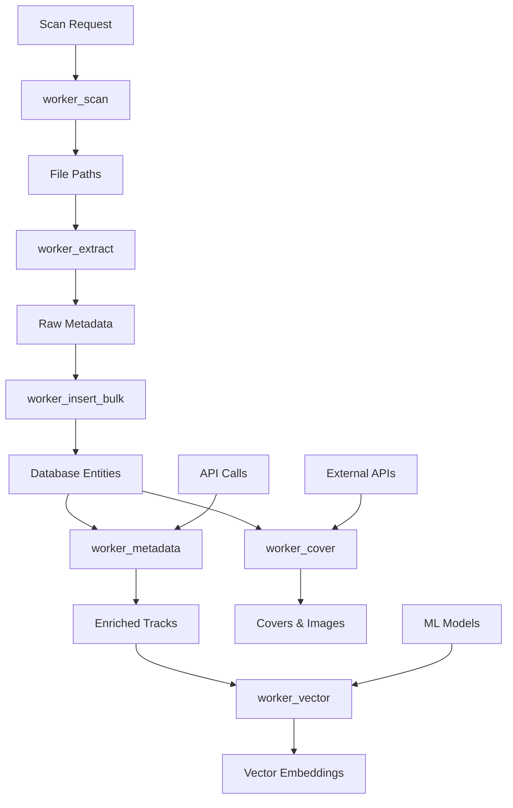
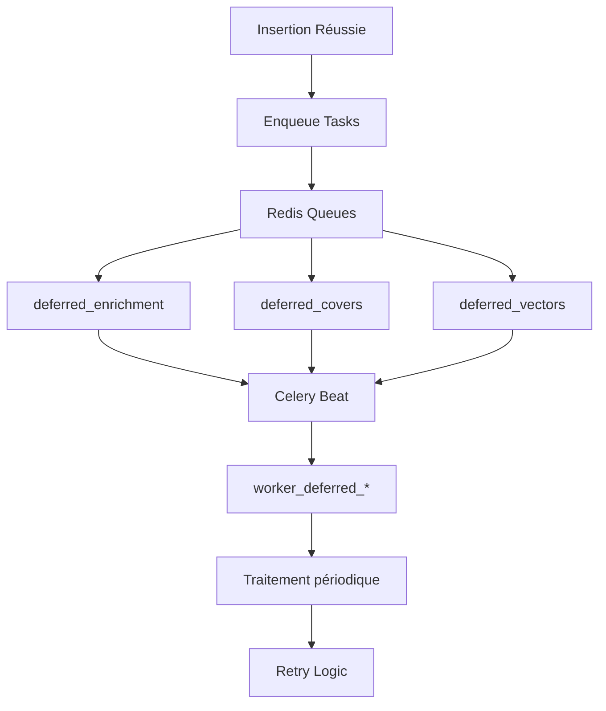

# Architecture des Workers Celery - SoniqueBay

## Vue d'ensemble

Le système backend_worker a été réorganisé autour de **6 workers spécialisés** utilisant Celery avec des queues dédiées pour optimiser la parallélisation et la scalabilité du traitement musical.

## Architecture Générale



## Système de Queues Différées

### Vue d'ensemble

Pour éviter la surcharge lors des scans initiaux, un système de **queues différées** a été implémenté. Les tâches lourdes (enrichissement, calculs de vecteurs, recherche de covers) sont mises en attente dans Redis et traitées périodiquement par des workers spécialisés.

### Architecture des Queues Différées



### Queues Différées

- **`deferred_enrichment`**: Analyse audio et enrichissement metadata
- **`deferred_covers`**: Recherche de covers via APIs externes
- **`deferred_vectors`**: Calcul de vecteurs pour le ML

### Service DeferredQueueService

**Fichier :** `backend_worker/services/deferred_queue_service.py`

**Fonctionnalités :**
- Stockage des tâches dans Redis avec priorité et délai
- Retry automatique des échecs
- Métriques et monitoring des queues
- Nettoyage automatique des tâches expirées

### Tâches Celery Beat

**Fichier :** `backend_worker/celery_beat_config.py`

**Planification :**
- Traitement enrichment : Toutes les 2 minutes
- Traitement covers : Toutes les 5 minutes
- Traitement vecteurs : Toutes les 3 minutes
- Retry échecs : Toutes les 10-15 minutes
- Maintenance : Quotidienne

## Workers Spécialisés

### 1. Worker Scan (`worker_scan`)
**Queue:** `worker_scan`
**Responsabilités:**
- Détection des fichiers musicaux dans les répertoires
- Extraction des métadonnées brutes (titre, artiste, album, durée, etc.)
- Validation et normalisation des chemins de fichiers
- Collecte des informations de base sans traitement lourd

**Tâches principales:**
- `scan_directory`: Scan complet d'un répertoire
- `extract_file_metadata`: Extraction pour un fichier spécifique
- `validate_and_process_batch`: Validation par lots

**Optimisations:**
- Validation de sécurité des chemins
- Traitement asynchrone pour éviter les blocages I/O
- Support du progress callback pour l'interface utilisateur

---

### 1.1. Worker Extract (`worker_extract`)
**Queue:** `worker_extract`
**Responsabilités:**
- Extraction des métadonnées brutes des fichiers musicaux individuels
- Analyse détaillée des tags audio (ID3, FLAC, etc.)
- Validation et normalisation des métadonnées extraites
- Calcul de scores de qualité pour les extractions

**Tâches principales:**
- `extract_file_metadata`: Extraction pour un fichier spécifique
- `extract_batch_metadata`: Extraction par lots avec parallélisation
- `validate_extraction_quality`: Validation de la qualité des métadonnées

**Optimisations:**
- Traitement CPU-intensive avec ThreadPoolExecutor
- Validation de sécurité renforcée des chemins
- Calcul automatique de scores de qualité
- Support des différents formats audio (MP3, FLAC, M4A, etc.)

---

### 2. Worker Insert Bulk (`worker_insert_bulk`)
**Queue:** `worker_insert_bulk`
**Responsabilités:**
- Insertion en masse des tracks (lots de 100-500)
- Gestion des relations artiste/album/track
- Utilisation des mutations GraphQL pour upsert
- Optimisation des insertions liées

**Tâches principales:**
- `insert_tracks_batch`: Insertion bulk de tracks
- `upsert_entities_batch`: Upsert d'entités liées
- `process_scan_results`: Traitement des résultats de scan

**Optimisations:**
- Découpage automatique des gros batches (>500)
- Gestion des contraintes de clés étrangères
- Utilisation des capacités upsert de GraphQL

---

### 3. Worker Cover (`worker_cover`)
**Queue:** `worker_cover`
**Responsabilités:**
- Gestion asynchrone des covers d'albums
- Récupération des images d'artistes
- Intégration avec APIs externes (Last.fm, Cover Art Archive)
- Traitement selon disponibilité des ressources

**Tâches principales:**
- `process_album_covers`: Traitement des covers d'albums
- `process_artist_images`: Traitement des images d'artistes
- `refresh_missing_covers`: Actualisation des covers manquantes
- `process_track_covers_batch`: Traitement batch depuis métadonnées

**Optimisations:**
- Rate limiting pour éviter la surcharge des APIs
- Cache des résultats pour éviter les requêtes répétées
- Traitement par priorité (high/normal/low)

---

### 4. Worker Metadata (`worker_metadata`)
**Queue:** `worker_metadata`
**Responsabilités:**
- Enrichissement des tracks avec caractéristiques audio (BPM, clé, etc.)
- Extraction et normalisation des genres et tags
- Intégration avec APIs d'analyse musicale
- Mise à jour des métadonnées existantes

**Tâches principales:**
- `enrich_tracks_batch`: Enrichissement par lots
- `analyze_audio_features`: Analyse des caractéristiques audio
- `enrich_artists_albums`: Enrichissement artistes/albums
- `update_track_metadata`: Mise à jour individuelle
- `bulk_update_genres_tags`: Mise à jour bulk genres/tags

**Optimisations:**
- Analyse audio en parallèle avec ThreadPoolExecutor
- Mise à jour sélective (évite les retraitements)
- Gestion des échecs avec retry logic

---

### 5. Worker Vector (`worker_vector`)
**Queue:** `worker_vector`
**Responsabilités:**
- Calcul des vecteurs d'embedding pour le système de recommandation
- Génération de représentations vectorielles des tracks
- Stockage dans la base vectorielle (sqlite-vec)
- Recherche de similarité

**Tâches principales:**
- `vectorize_tracks_batch`: Vectorisation par lots
- `vectorize_single_track`: Vectorisation individuelle
- `update_tracks_vectors`: Mise à jour sélective
- `rebuild_index`: Reconstruction complète de l'index
- `search_similar`: Recherche de tracks similaires
- `validate_vectors`: Validation de l'intégrité

**Optimisations:**
- Utilisation de sentence-transformers pour les embeddings textuels
- Normalisation des features numériques
- Combinaison texte + audio pour de meilleurs embeddings
- Traitement par batches pour la performance

## Configuration Celery

### Queues Dédiées
```python
celery.conf.task_queues = {
    # Workers synchrones
    'worker_scan': {'exchange': 'worker_scan', 'routing_key': 'worker_scan'},
    'worker_extract': {'exchange': 'worker_extract', 'routing_key': 'worker_extract'},
    'worker_insert_bulk': {'exchange': 'worker_insert_bulk', 'routing_key': 'worker_insert_bulk'},
    'worker_cover': {'exchange': 'worker_cover', 'routing_key': 'worker_cover'},
    'worker_metadata': {'exchange': 'worker_metadata', 'routing_key': 'worker_metadata'},
    'worker_vector': {'exchange': 'worker_vector', 'routing_key': 'worker_vector'},

    # Queue différée consolidée (déploiement simplifié)
    'worker_deferred': {'exchange': 'worker_deferred', 'routing_key': 'worker_deferred'},
}
```

### Routage des Tâches
Chaque tâche est automatiquement routée vers sa queue dédiée via les noms de tâches préfixés.

### Paramètres de Performance
- **worker_scan**: Prefetch 4 (I/O bound - découverte rapide)
- **worker_extract**: Prefetch 2 (CPU bound - extraction intensive)
- **worker_insert_bulk**: Prefetch 2 (DB bound)
- **worker_cover**: Prefetch 1 (API rate limited)
- **worker_metadata**: Prefetch 2 (mix I/O + CPU)
- **worker_vector**: Prefetch 1 (CPU intensive)
- **worker_deferred**: Prefetch 2 (mix de tous les types de charges différées)

## Flux de Traitement

### Scan Initial
1. `worker_scan.discover_files` → liste des fichiers
2. `worker_extract.extract_batch_metadata` → métadonnées brutes
3. `worker_insert_bulk.process_scan_results` → entités en DB
4. `worker_metadata.enrich_tracks_batch` → enrichissement audio
5. `worker_vector.vectorize_tracks_batch` → vecteurs pour reco
6. `worker_cover.process_album_covers` → covers asynchrones

### Mise à Jour
- `worker_metadata.analyze_audio_features` pour nouvelles analyses
- `worker_vector.update_tracks_vectors` pour vecteurs manquants
- `worker_cover.refresh_missing_covers` pour covers manquantes

## Avantages de l'Architecture

### ✅ Scalabilité
- Chaque worker peut être scalé indépendamment
- Queues dédiées évitent les conflits de ressources
- Traitement parallèle optimisé par type de charge

### ✅ Résilience
- Échecs isolés par worker
- Retry logic intégré
- Validation à chaque étape

### ✅ Maintenabilité
- Responsabilités claires et séparées
- Tests unitaires par worker
- Monitoring granulaire possible

### ✅ Performance
- Optimisations spécifiques par type de traitement
- Traitement asynchrone des opérations lourdes
- Utilisation des capacités bulk des APIs

## Monitoring et Observabilité

### Métriques Clés
- Taux de succès par worker
- Temps de traitement moyen
- Taille des queues
- Erreurs par type

### Logs Structurés
Chaque worker utilise des préfixes spécifiques :
- `[WORKER_SCAN]`
- `[WORKER_EXTRACT]`
- `[WORKER_INSERT_BULK]`
- `[WORKER_COVER]`
- `[WORKER_METADATA]`
- `[WORKER_VECTOR]`
- `[WORKER_DEFERRED_ENRICHMENT]`
- `[WORKER_DEFERRED_COVERS]`
- `[WORKER_DEFERRED_VECTORS]`
- `[DEFERRED_QUEUE]`

## Tests

### Couverture
- Tests unitaires pour chaque worker
- Mocks des dépendances externes
- Tests d'intégration pour les workflows complets
- Benchmarks de performance

### Commandes de Test
```bash
# Tests spécifiques à un worker
pytest tests/worker/test_worker_scan.py -v
pytest tests/worker/test_worker_extract.py -v
pytest tests/worker/test_worker_insert_bulk.py -v
pytest tests/worker/test_worker_cover.py -v
pytest tests/worker/test_worker_metadata.py -v
pytest tests/worker/test_worker_vector.py -v

# Tests de performance
pytest tests/benchmark/ -k "worker"
```

## Déploiement

### Architecture Docker Consolidée

Pour simplifier le déploiement, les workers différés sont consolidés dans une seule queue :

```yaml
# docker-compose.yml
services:
  worker:  # Workers synchrones (scan, extract, insert)
    command: celery -A backend_worker.celery_app worker -Q worker_scan,worker_extract,worker_insert_bulk -c 4

  worker_deferred:  # Worker différé unique
    command: celery -A backend_worker.celery_app worker -Q worker_deferred -c 2

  celery_beat:  # Planificateur des tâches différées
    command: celery -A backend_worker.celery_beat_config beat
```

### Workers Indépendants (Option Avancée)
Chaque worker peut être déployé sur des instances séparées selon les besoins de charge :

```bash
# Workers synchrones
celery -A backend_worker.celery_app worker -Q worker_scan,worker_extract,worker_insert_bulk -c 4

# Worker différé consolidé
celery -A backend_worker.celery_app worker -Q worker_deferred -c 2

# Planificateur
celery -A backend_worker.celery_beat_config beat
```

### Auto-scaling
- Monitoring des tailles de queues
- Scaling automatique basé sur la charge
- Ressources dédiées par type de traitement

Cette architecture permet une scalabilité horizontale optimale et une séparation claire des responsabilités pour le traitement musical dans SoniqueBay.